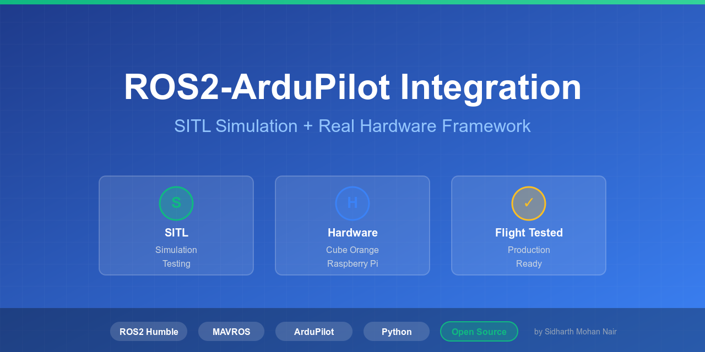

# ROS2-ArduPilot SITL & Hardware Integration



[](https://docs.ros.org/en/humble/)
[](LICENSE)
[](https://ardupilot.org/)

 > Open-source framework to control ArduPilot drones with ROS2. Test missions in SITL simulation, then deploy to real hardware.


**Battle-tested** on real flights with Cube Orange flight controller and Raspberry Pi 4.

---

## ✨ Key Features

- 🎮 **Companion Computer Control** - Command drone autonomously from Raspberry Pi in GUIDED mode (no Mission Planner required)
- 🔄 **SITL & Hardware Testing** - Test missions in simulation on same Raspberry Pi, then deploy to real drone
- ✅ **Flight Validated** - Tested on [FuryVision AAV](https://github.com/sidharthmohannair/Fury-Drone-Project) in actual autonomous flight
- 🛡️ **Safety First** - Comprehensive pre-flight checks and emergency procedures
- 📡 **Ground Station Optional** - Mission Planner/QGroundControl for monitoring (may or may not be required depending on application)
- 📚 **Complete Workflow** - SITL testing → Bench testing → Flight testing documented
- 🔧 **Open Hardware Reference** - Test platform fully documented (CAD, assembly, wiring)
- 🔄 **Iterative Development** - Actively maintained with community feedback and new examples

---

## 🚀 Quick Start

### Prerequisites
- **ROS2 Humble** on Ubuntu 22.04
- **ArduPilot SITL** (for simulation)
- **MAVROS** installed

**Don't have these?** See [Installation Guide](docs/installation/installation-README.md)

---

### Test in Simulation (5 minutes)
```bash
# 1. Clone this repository
git clone https://github.com/sidharthmohannair/ros2-ardupilot-sitl-hardware.git
cd ros2-ardupilot-sitl-hardware

# 2. Build packages
colcon build
source install/setup.bash

# 3. Start SITL (Terminal 1)
./launch/start_sitl.sh

# 4. Start MAVROS (Terminal 2)
./launch/start_mavros.sh

# 5. Run autonomous mission (Terminal 3)
source install/setup.bash
python3 scripts/missions/mission_simple.py

# 6. Stop cleanly when done
./launch/stop_all.sh
```

**Watch your drone takeoff in the SITL map!** 🎉

---

### Deploy to Real Hardware

**After SITL testing succeeds:**
```bash
# 1. Stop SITL completely
./launch/stop_all.sh

# 2. Connect Cube Orange via USB to Raspberry Pi

# 3. Start MAVROS for hardware (Terminal 1)
./launch/start_mavros_real.sh
# Answer safety prompts

# 4. Run SAME mission (Terminal 2)
source install/setup.bash
python3 scripts/missions/mission_simple.py
```

**⚠️ CRITICAL:** Remove propellers for bench testing!

---

### Complete Workflow Guide

See **[WORKFLOW.md](docs/WORKFLOW.md)** for:
- Detailed SITL testing procedure
- Hardware transition steps
- Helper script reference
- Troubleshooting common issues
- Best practices

---

## 📂 Repository Structure

```
├── src/                          # ROS2 packages
│   ├── simtofly_mavros_sitl/    # SITL simulation configuration
│   └── simtofly_mavros_real/    # Real hardware configuration
├── scripts/missions/             # Autonomous mission examples
├── launch/                       # Helper scripts (start/stop)
├── docs/                         # Complete documentation
└── README.md                     # You are here
```

---

## 📖 Documentation

### Getting Started
- **[Installation Guide](docs/installation/installation-README.md)** - Install ROS2, MAVROS, ArduPilot SITL
- **[SITL Simulation](docs/guides/SITL_SETUP.md)** - Test missions safely in simulation

### Hardware Deployment  
- **[Complete Workflow](docs/WORKFLOW.md)** - SITL → Bench → Flight testing progression
- **[Real Hardware Setup](docs/guides/REAL_HARDWARE_SETUP.md)** - Deploy on Raspberry Pi + Flight Controller
- **[Mission Planner Connection](docs/guides/MISSION_PLANNER_SETUP.md)** - Ground station monitoring (optional)

### Reference
- **[Hardware Platform](docs/HARDWARE-REFERENCE.md)** - FuryVision AAV specifications and test data
- **[Mission Examples](scripts/missions/README.md)** - Write autonomous missions in Python
- **[Troubleshooting](docs/TROUBLESHOOTING.md)** - Common issues and solutions

---

## 🛠️ Tested Hardware

This framework has been validated on the following configuration:

### **Primary Test Platform: FuryVision AAV**

**Flight Controller:** Cube Orange+ (Pixhawk)  
**Companion Computer:** Raspberry Pi 4 (8GB)  
**Firmware:** ArduCopter v4.5.6  
**ROS2 Version:** Humble Hawksbill  
**OS:** Ubuntu 22.04 LTS


*FuryVision AAV hovering - Hardware platform used for framework testing*

**Complete Hardware Details:** [FuryVision AAV - Open Source Drone](https://github.com/sidharthmohannair/Fury-Drone-Project/tree/main/versions/2_furyvision_aav)

**Why This Platform:**
- ✅ **Fully open source** - CAD files, assembly guide, wiring diagrams available
- ✅ **Flight tested** - 8+ minutes flight time, stable autonomous performance
- ✅ **Well documented** - Complete build and test procedures

---

### **Compatible Hardware**

| Component | Validated | Notes |
|-----------|-----------|-------|
| **Flight Controllers** | | |
| Cube Orange+ | ✅ Tested | Primary platform |
| Cube Orange | ⚠️ Compatible | Should work with same setup |
| Pixhawk 4 | ⚠️ Compatible | Should work with same setup |
| Pixhawk 6C | ⚠️ Compatible | Should work with same setup |
| **Companion Computers** | | |
| Raspberry Pi 4 (4GB+) | ✅ Tested | Ubuntu 22.04 native |
| Raspberry Pi 5 | ⚠️ Compatible | May require Docker (Ubuntu 22.04 support) |
| Jetson Nano | ⚠️ Compatible | Different architecture, may need adjustments |

**Note:** "Compatible" means theoretically supported but not tested by maintainer. **Some hardware may work without changes, others may require minor modifications** such as serial port names, baud rates, or Docker setup for OS compatibility. Community testing and feedback welcome!

**For complete hardware specifications:** [Hardware Reference](docs/HARDWARE-REFERENCE.md)

---

## ⚠️ Safety Notice

**Before testing on real hardware:**
- ✅ Remove all propellers during bench testing
- ✅ Secure drone on stable surface
- ✅ Have RC transmitter ready for manual override
- ✅ Read the [Real Hardware Setup Guide](docs/guides/REAL_HARDWARE_SETUP.md)
- ✅ Follow local drone regulations

**Motors WILL spin when armed - propellers off = safe testing!**

---

## 🤝 Contributing

**This project is actively maintained and welcomes contributions!**

We're building this based on community feedback and real-world usage. Your input helps make this better for everyone.

**Ways to contribute:**
- 🐛 Report bugs or hardware compatibility issues
- 💡 Suggest features or improvements
- 📝 Improve documentation
- 🔧 Test on different hardware configurations
- 🚁 Share your mission examples
- 📊 Provide performance data from your setup

**See [CONTRIBUTING.md](CONTRIBUTING.md) for guidelines.**

### **Roadmap (Community-Driven)**

Planned improvements based on feedback:
- 🔄 More mission examples (waypoint patterns, search patterns)
- 🔧 Additional hardware configurations (Jetson, RPi5)
- 📹 Computer vision integration examples
- 🌐 Multi-drone coordination examples
- 📚 Video tutorials

**Your suggestions welcome in [Discussions](https://github.com/sidharthmohannair/ros2-ardupilot-sitl-hardware/discussions)!**

---

## 📜 License

This project is licensed under the Apache License 2.0 - see [LICENSE](LICENSE) file.

**When using this work, please credit:**
```
Based on work by Sidharth Mohan Nair
https://github.com/sidharthmohannair/ros2-ardupilot-sitl-hardware
```

---

## 🙏 Acknowledgments

- ROS2 community
- ArduPilot developers  
- MAVROS maintainers

---

## 📞 Support

- **Issues:** [GitHub Issues](https://github.com/sidharthmohannair/ros2-ardupilot-sitl-hardware/issues)
- **Discussions:** [GitHub Discussions](https://github.com/sidharthmohannair/ros2-ardupilot-sitl-hardware/discussions)
- **Author:** [Sidharth Mohan Nair](https://github.com/sidharthmohannair)

---

**Star ⭐ this repository if it helps your project!**
