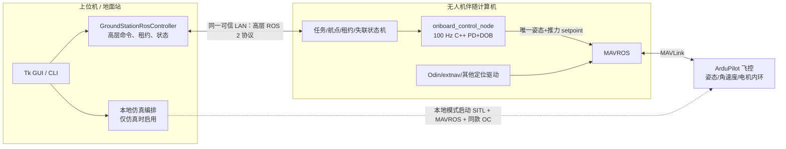

# task/01-init.md 执行情况详细报告

日期：2026-08-06
项目：`ros2-ardupilot-sitl-hardware`
环境：Ubuntu 24.04、ROS 2 Jazzy、MAVROS、ArduPilot SITL
任务来源：`agent/task/01-init.md`

## 1. 任务理解与执行边界

本次任务的核心目标是把原本耦合在 `ground_station.py` 和 `test_takeoff5.py` 中的 GUI、ROS、飞行控制及外部进程逻辑拆分，并将 shell 启停流程完整迁入 Python GUI。执行时遵循了以下边界：

- 未修改任何 C/C++ 源码、头文件或控制器算法源码。
- 保留原地面站的速度累加、PD+DOB 悬停、本地 ENU 航点和 GPS 原点等主要行为。
- 对明确的低级或安全问题进行了修复，没有用关闭检查、降低指标或伪造输出来换取“成功”。
- `task/01-init.md` 的第 2.2 条为空，因此未自行补造额外验收需求；其余条目均逐项落实。
- 工作区开始时已有用户未提交修改和多项仿真运行产物；本次没有删除或覆盖无关运行数据。

## 2. 重构前确认的问题

重构前的地面站约 1500 行，主要问题如下：

1. GUI、rclpy 节点、DOB 控制、航点状态、起飞子进程、shell 拼接和进程清理集中在单文件。
2. 起飞按钮会启动另一个 Python 进程执行 `test_takeoff5.py`，相同功能存在两套实现和两套 ROS 生命周期。
3. 三类飞行控制依靠多个私有布尔量互相覆盖，没有统一模式仲裁；旧命令还可能在队列中晚于新按键执行。
4. 键盘快捷键在输入框聚焦时仍会触发，编辑参数可能误发飞行命令。
5. 原起飞测试在飞行器已武装时先执行 disarm，再重新起飞，属于不安全行为。
6. “关闭所有进程”只对记录的进程组发送一次 SIGTERM，不等待、不升级信号、不扫描历史残留，也不验证结果。
7. 仿真、实机、MAVROS、RViz 仍依赖 shell 脚本或散落的 shell 命令，无法保证失败回滚和再次初始化。
8. 原 RViz TF 桥在 `ros2 launch` 的 SIGINT 清理阶段可能打印 `KeyboardInterrupt` 堆栈并以错误码退出。

## 3. 最终模块结构

| 文件 | 责任 |
|---|---|
| `ground_station.py` | 19 行 GUI 入口，只创建窗口和应用 |
| `ground_station_core/gui.py` | Tk 布局、输入校验、主线程事件消费 |
| `ground_station_core/ros_controller.py` | 常驻 rclpy 线程、MAVROS 状态/服务、命令票据、模式输出调度 |
| `ground_station_core/mode_manager.py` | 互斥飞行模式和模式退出回调 |
| `ground_station_core/flight_modes/takeoff_land.py` | GUIDED、武装、起飞、高度确认、LAND |
| `ground_station_core/flight_modes/keyboard_control.py` | 方向速度累加和 PD+DOB 定点悬停 |
| `ground_station_core/flight_modes/waypoint_flight.py` | 航点任务、到达保持、终点悬停 |
| `ground_station_core/dob_controller.py` | 键盘悬停和航点共用的 PD+DOB 算法 |
| `ground_station_core/ros_services.py` | MAVROS future、模式和武装状态等待 |
| `ground_station_core/environment.py` | 仿真/实机一键初始化、取消和失败回滚 |
| `ground_station_core/process_manager.py` | 外部进程、环境 source、日志、清理和残留验证 |
| `ground_station_core/config.py` | 路径、频率、GPS、串口和 DOB 参数 |
| `test_takeoff5.py` | 共享起飞模式 CLI 测试入口 |

所有新增 Python 文件均带文件级说明；重要类、函数、控制块和常量均维护了简要注释或 docstring。

## 4. 逐项完成情况

### 4.1 项目理解与 MEMORY.md

- 已阅读任务、仓库结构、ROS 包、启动文件、参数文件、旧脚本及原地面站实现。
- 已建立并填写 `MEMORY.md`，记录长期有效的入口、架构、初始化流程、环境覆盖项、清理约束和验证基线。

状态：完成。

### 4.2 三种飞行模式拆分与选择性覆盖

三个模式分别由单个 Python 文件实现：

- 起飞/降落：`flight_modes/takeoff_land.py`
- 键盘控制：`flight_modes/keyboard_control.py`
- 航点飞行：`flight_modes/waypoint_flight.py`

覆盖规则：

- 方向键或悬停键立即选择键盘模式。
- 起飞/降落命令选择起降模式。
- “发送航点”选择航点模式。
- 被覆盖的键盘模式清空历史累加速度；被覆盖的未完成航点任务会取消并返回终态消息。
- 所有飞行输入带单调递增序号。即使旧起飞/航点命令仍在 ROS 队列中，也不能在之后反向覆盖更新的方向/悬停/降落输入。
- 从航点或键盘速度模式切出时会补发一次零速度帧，减少旧 setpoint 残留。

状态：完成，并有单元测试和 SITL 运行证据。

### 4.3 一键仿真初始化

“初始化仿真环境”按钮执行以下流程：

1. 预检 `sim_vehicle.py`、MAVROS 参数、`mavros` 和 `guided_sim` 包。
2. 清理旧环境并验证无残留。
3. 在 ArduPilot 根目录直接启动 `sim_vehicle.py -v ArduCopter`。
4. 等待 SITL TCP 5762 端口。
5. 用 Jazzy 的 `apm_config.yaml` 启动 `mavros_node`。
6. 等待新鲜 `/mavros/state` 连接。
7. 设置 MAVLink 消息 32、31、105 为 100 Hz。
8. 等待新鲜 `/mavros/local_position/pose`，避免 EKF/Home 尚未就绪时 GUI 提前宣告完成。
9. 启动 `guided_sim visualize.launch.py`，自动加载项目 RViz 配置。

SITL 使用保持打开的 stdin 管道。这一点是实际调试得到的必要条件：若使用 `/dev/null`，MAVProxy 读到 EOF 后会主动退出，并使 `sim_vehicle.py` 清理 ArduCopter。

状态：完成并多次端到端验证。

### 4.4 一键实机初始化

“初始化实机环境”按钮迁移了原 `odin1.sh` 的全部步骤：

1. 在 Odin overlay 中启动 `odin_ros_driver/odin1_ros2.launch.py`。
2. 启动 MAVROS `apm.launch`，默认 `fcu_url:=/dev/ttyTHS1:460800`。
3. 启动 `extnav_bridge/extnav_to_vision_pose`，保留原脚本的频率、话题和安装偏置参数。
4. 设置 MAVLink 消息频率。
5. 读取 GUI 中的经纬高并发布 GPS 原点。

支持以下部署覆盖环境变量：

- `GROUND_STATION_ODIN_SETUP`
- `GROUND_STATION_EXTNAV_SETUP`
- `GROUND_STATION_REAL_FCU_URL`

本机实际缺少：

- `/home/nvidia/ws/install/setup.bash`
- `/home/nvidia/vrpn_mavros/install/setup.bash`
- `odin_ros_driver`
- `extnav_bridge`
- 对应实机硬件

因此实机端到端无法在本机诚实完成。当前按钮会在改变现有环境前进行依赖预检，明确报告缺失项；本机验证中未启动任何外部进程，清理结果为空。

状态：代码迁移完成；实机联调未验证，原因是本机缺少外部工作空间和硬件。

### 4.5 彻底关闭与不退出 GUI 再次初始化

新的进程管理策略：

1. 每个外部组件以独立 session/process group 启动。
2. 首先向受管进程组发送 SIGINT，并等待 2 秒进行 ROS/SITL 自清理。
3. 仍运行时升级为 SIGTERM，再升级为 SIGKILL。
4. 对每个领头进程执行 `wait()`，关闭 stdin 和日志句柄。
5. 扫描 `/proc/*/cmdline`，查找历史遗留的 sim_vehicle、arducopter、MAVProxy、mavros、RViz、Odin、extnav、ros2 launch/run 等进程。
6. 展开历史残留的全部后代 PID，避免只杀 launch 父进程而留下未知子节点。
7. 对历史 PID 执行 TERM→KILL，并把非僵尸残留记为清理错误。
8. 执行 `ros2 daemon stop`。
9. 再次扫描；只有剩余列表和错误列表均为空才返回成功。

常驻 GUI 内的 rclpy 节点不会被外部进程扫描误杀；清理时会复位模式、命令队列和连接新鲜度，使同一 GUI 可以再次初始化。

状态：完成；最终双周期实测通过。

### 4.6 shell 脚本删除

功能迁移后，以下脚本已删除：

- `odin1.sh`
- `shfiles/start_sitl.sh`
- `shfiles/start_mavros.sh`
- `shfiles/start_keyboard.sh`
- `shfiles/start_mavros_real.sh`
- `shfiles/stop_sitl.sh`
- `shfiles/stop_mavros.sh`
- `shfiles/stop_all.sh`

`start_keyboard.sh` 原有的频率设置和 RViz 步骤已纳入初始化流程；键盘控制本身由 GUI 的 Python 键盘模式接管，避免同时启动 C++ 控制器形成两个 setpoint 发布源。

状态：完成；仓库源码范围内已无 `.sh` 文件。

### 4.7 原功能复刻及严重错误修复

保留：

- 速度按键累加模型和 0.2 步长。
- 100 Hz setpoint 发布。
- YAML 参数复用的 PD+DOB 悬停。
- 航点增删、排序、发送、到达保持和终点悬停。
- GPS 原点手动设置。
- ROS、飞控、位置、速度和当前模式状态显示。

修复：

- 起飞不再启动 `test_takeoff5.py` 子进程，而是复用同一模式实现。
- 已武装状态不再先 disarm。
- 武装保留完整 PreArm 检查，不修改 `ARMING_CHECK`；只在有限时间内等待 GPS/EKF 并重试。
- 输入框聚焦时屏蔽飞行快捷键。
- 飞控连接和本地位置增加新鲜度，MAVROS 被杀后不会继续显示旧连接。
- 删除会与动态 TF 冲突的地面站静态 `map → base_link` 兜底，统一由 `pose_to_tf.py` 发布。
- RViz 自动加载 `quadcopter.rviz`。
- `pose_to_tf.py` 正常响应 launch SIGINT，不再在清理阶段打印堆栈。
- GUI 工作线程只投递线程安全队列，所有 Tk 更新由主线程执行。

状态：完成。

## 5. 验证记录

### 5.1 静态、构建与单元测试

| 命令 | 结果 |
|---|---|
| `python3 -m compileall -q ...` | 通过 |
| `flake8 ... --select=E,F,W --max-line-length=100` | 通过，无输出 |
| `git diff --check` | 通过，无空白错误 |
| `pytest -q tests` | `8 passed` |
| `colcon build --packages-select guided_sim` | `1 package finished` |
| `python3 test_takeoff5.py --help` | 正常显示共享 CLI 参数 |
| `python3 test_takeoff5.py 0` | 退出码 2，正确拒绝非正高度 |

单元测试覆盖：

- 最后按键模式覆盖。
- 覆盖后速度清零和航点取消。
- 悬停抓取位置并清零速度。
- 航点完成只报告一次。
- 旧队列命令不能覆盖新键盘输入。
- 未连接飞控时起飞明确失败。
- 受管进程回收。
- 未受管历史 ROS 进程扫描清理。
- shell 文本关键字不会造成误杀，真实 argv 会被识别。

### 5.2 GUI 验证

- 在 `DISPLAY=:0` 创建完整 GUI，运行 1 秒后通过正常关闭路径退出：通过。
- 对最终 GUI 进行桌面截图视觉检查：两列布局完整，仿真/实机按钮、GPS、起降、方向、模式状态、关闭按钮、航点列表和发送按钮均在默认窗口内可见。
- GUI 正常关闭后无外部 ROS/SITL 残留。

### 5.3 仿真初始化与实际起降

最终起降回归记录：

- 仿真初始化约 49.7 秒完成；等待时间主要用于 GPS/EKF 本地位置建立。
- MAVROS 状态：connected=true，初始模式 STABILIZE。
- 起飞目标：0.3 m。
- 起飞结果：成功；返回时确认高度约 0.24 m。
- 切换键盘 DOB 悬停：成功；当前模式为 KEYBOARD。
- LAND 服务：成功。
- 着陆后：armed=false，高度约 0.0048 m。
- 清理：受管进程 3 个，历史残留 0，最终残留 0，错误 0。

### 5.4 实际航点飞行

在 SITL 起飞后发送单航点：

- 起点 x 约 0.001 m。
- 目标 x 约 0.801 m，即明显水平位移 0.8 m。
- 航点完成时 x 约 0.619 m，三维位置误差在 0.3 m 到达容差内，并已满足 1 秒保持规则。
- 收到唯一终态：`航点任务完成 — 已到达全部 1 个航点，悬停中`。
- 随后切换 LAND，最终 armed=false，高度约 0.0127 m。
- 清理：受管进程 3 个，最终残留 0。

### 5.5 同一地面站实例双周期重启

使用同一个 `GroundStationRosController` 和 `EnvironmentInitializer` 连续执行：

1. 初始化仿真 → 确认 MAVROS connected 和 local_position_valid → 关闭所有进程。
2. 不退出地面站 ROS 实例，再次初始化仿真 → 再次确认连接/定位 → 再次关闭。

最终结果：

- 周期 1：成功；清理 3 个受管进程；残留扫描 `[]`。
- 周期 2：成功；清理 3 个受管进程；残留扫描 `[]`。
- 汇总：`first=True second=True`。
- 额外 `ros2 daemon status`：`The daemon is not running`。
- 最终兜底清理：0 个受管进程、0 个历史进程、0 个残留、0 个错误。

### 5.6 历史父子进程残留测试

额外构造一个不在受管表内、argv 标记为 `mavros_node` 且带未知 `sleep` 子进程的历史进程树：

- 扫描识别父 PID。
- 清理展开并结束子 PID。
- 父、子均不再存活。
- `CleanupReport.remaining=()`、`errors=()`。

### 5.7 实机预检

调用最终实机工作流：

- 返回：`初始化前检查失败: 缺少环境 setup 文件: /home/nvidia/ws/install/setup.bash`。
- 未启动 Odin、MAVROS 或 extnav。
- 清理结果：0 个受管进程、0 个历史残留、0 个错误。

此项证明失败路径明确且干净，但不能替代真实硬件联调。

## 6. 调试中发现并修复的真实失败

为避免美化结果，记录本次迭代中实际出现的失败：

1. 首次 ROS 生命周期自检失败：自建 `rclpy.Context` 与默认 `spin_once` 执行器上下文不一致。改为本进程唯一默认上下文后通过。
2. 首次一键 SITL 失败：MAVProxy 因 stdin 为 `/dev/null` 读到 EOF，正常退出并带停 SITL。为 SITL 单独保留 stdin 管道后修复。
3. 首次立即起飞失败：ArduPilot 报 `Need Alt Estimate`、`Accels inconsistent`、`EKF attitude is bad`、`AHRS: waiting for home`。没有禁用安全检查；改为初始化等待新鲜本地位置并有限重试武装后，实际起飞成功。
4. 旧 TF 桥清理时出现 `KeyboardInterrupt` 堆栈。修正 shutdown 路径并重新构建后，后续多次 RViz 关闭均为 clean exit。
5. pytest 首次收集受 ROS `launch_testing` 插件影响，仓库根目录不在导入路径。增加 `tests/conftest.py` 后全部通过。

## 7. 未完成或受限指标

唯一未能在本机完成的指标是实机端到端联调。原因不是代码降级，而是缺少明确的外部依赖和硬件：Odin 工作空间、extnav 工作空间、对应 ROS 包、串口飞控和实机定位数据源。

建议在实机部署机上按以下顺序补验：

1. 确认两个 setup 路径或设置三个 `GROUND_STATION_*` 环境变量。
2. 使用拆桨/固定机体的安全条件启动 GUI。
3. 点击“初始化实机环境”，确认 Odin、MAVROS、extnav 和 GPS 原点五步均完成。
4. 检查 `/mavros/state`、`/odin1/odometry_highfreq` 和外部导航输入频率。
5. 点击“关闭所有进程”，确认 GUI 报告无残留；不退出 GUI 再初始化一次。

## 8. 文件变更汇总

新增：

- `ground_station_core/` 全部 Python 模块。
- `tests/conftest.py`
- `tests/test_flight_modes.py`
- `tests/test_process_manager.py`
- `tests/test_ros_controller.py`
- 本报告。

重构/修复：

- `ground_station.py`
- `test_takeoff5.py`
- `src/guided_sim/launch/visualize.launch.py`
- `src/guided_sim/scripts/pose_to_tf.py`
- `MEMORY.md`

删除：第 4.6 节列出的 8 个 shell 脚本。

未修改：所有 `.cpp`、`.hpp`、`.h` 文件。

## 9. 最终结论

本次重构已经完成明确任务范围内的 Python 架构拆分、三模式仲裁、仿真一键初始化、实机流程迁移、shell 删除和彻底进程清理。仿真环境中已验证起飞、键盘 DOB 悬停、实际航点位移、降落、无残留清理及同一地面站实例二次初始化。实机流程因本机缺少外部工作空间与硬件未做虚假成功声明，现状和补验步骤已明确记录。

## 10. 仓库清理与发布补充

本日后续任务对版本库生成物进行了清理：

- 重写 `.gitignore`，覆盖 Python 字节码/测试缓存/虚拟环境、ROS 2 与 colcon 构建产物、rosbag、ArduPilot DataFlash、MAVLink/MAVProxy 日志、terrain、EEPROM、参数快照、飞行 CSV、通用日志/崩溃文件，以及 Deep Copilot 的常见目录名。
- 删除仓库根目录 `README.md`。
- 将 3 个此前已跟踪的 `.deep-copilot/logs/*.log` 文件从 Git 索引移除；本地副本保留，提交推送后远端当前分支不再包含这些文件。
- 本机专用 `AGENTS.md` 含机器环境信息，因此通过根目录规则保持本地、不纳入远端提交；临时 FishROS 安装脚本也保持本地。
- 保留并一并纳入上一项重构产生的源代码、自动化测试、任务记录、记忆文件和原有脚本删除。

清理后的回归验证结果：

- `pytest -q tests`：8 passed。
- `source /opt/ros/jazzy/setup.bash && colcon build --packages-select guided_sim`：成功，1 个包完成。
- `git diff --check`：通过，无空白错误。

---

# 任务 03：地面站职责分离与机载 PD+DOB 重构执行报告

> 本章节记录 `agent/task/03-refine.md` 的最终实现。本文前半部分是任务 01 完成时的历史快照；其中“控制逻辑仍在 Python 地面站”“实机流程由地面站启动驱动/MAVROS”等描述，已被本章节所述架构取代。

## 11. 执行结论

任务 03 已在无真机条件下完成以下目标：

1. 修改前完成仓库本地备份并校验；
2. 将持续飞行控制、任务推进、MAVROS setpoint、控制权和失联保护移到独立机载 C++ 服务；
3. 将地面站改为只发送高层意图、接收状态与结果的薄客户端；
4. 保留一键本地完整闭环仿真：SITL、MAVROS、同款机载节点和 RViz；
5. 新建带版本的上位机—机载机高层 ROS 2 接口，预留同局域网真机连接；
6. 完成任务 02：前、后、左、右、上、下、偏航、悬停和航点均走同一 C++ PD+DOB，并向飞控发送期望姿态与推力；
7. 删除 Python 控制算法及仓库中未实际启用的第二份旧 C++ 控制器，消除双实现；
8. 修复研究报告指出的控制生命周期、单一发布者、命令新鲜度、失联、进程误杀等严重问题；
9. 通过构建、单元测试、在线协议故障注入、完整 SITL 飞行和 10 秒失联自主降落试验。

本机没有物理无人机、伴随计算机、Odin/extnav 数据源和真实无线链路，因此没有把“真机联调”伪报为完成。局域网接口、启动文件和诊断步骤已经预留，后续仍需拆桨条件下执行实机验收。

## 12. 修改前备份

在任何任务 03 源码修改前创建：

```text
/home/nvidia/scq/projects/backups/ros2-ardupilot-sitl-hardware-pre-task03-20260806-175032.tar.gz
```

备份策略：

- 包含仓库源码、配置、任务、报告和当时未提交修改；
- 排除可重建的 `build/`、`install/`、`log/`，以及 Python 缓存、MAVProxy/SITL 日志、tlog、EEPROM 等运行产物；
- gzip 完整性检查通过；
- 文件大小约 202 MB；
- SHA-256：

```text
1ae274af2a8ec5e8a41e92527f2863583b86c39a686a0b79cb285648bedf7add
```

## 13. 技术路线评估与取舍

### 13.1 采用的路线

采用研究报告的“策略 1：保留项目自定义 PD+DOB”，但对职责边界作了硬约束：

- 项目级位置/速度外环及 DOB：无人机伴随计算机上的 ROS 2 C++ 节点；
- 姿态、角速度、电机混控和 EKF：ArduPilot；
- MAVLink/ROS 转换：无人机上的 MAVROS；
- 操作者输入、航点编辑、状态展示和本机仿真启动：上位机地面站；
- 无线链路只承载低频高层意图、任务、心跳、状态和结果，不承载 100 Hz setpoint 闭环。

这样保留了实验所需的 PD+DOB，同时使 GUI 退出、上位机重启或 Wi-Fi 短时中断不会立即停止飞行控制输出。

### 13.2 本轮明确不做的内容

- 未引入 PyQt；保留现有 Tk GUI；
- 未实现浏览器/WebSocket/后端网关；
- 未实现跨网段 DDS Router、VPN 或公网穿透；
- 未侵入或修改 ArduPilot 固件；
- 未假设地面站有权远程启动/停止真机 MAVROS、定位驱动或机载控制服务；
- 未声称普通 Ubuntu/RCLCPP timer 是硬实时控制环境。

## 14. 重构后的运行框架



### 14.1 `guided_interfaces`

新增共享接口包，接口版本为 `1.0`：

| 接口 | 用途 |
|---|---|
| `ControlHeartbeat.msg` | 当前持有者 5 Hz 续租心跳 |
| `MotionIntent.msg` | 带来源、序号、时间戳、TTL 的速度/偏航增量 |
| `ControlStatus.msg` | 飞控、控制模式、目标、航点、租约、推力和频率诊断 |
| `CommandResult.msg` | 可靠发布命令运行中、成功、失败、取消等结果 |
| `Waypoint.msg` | 本地 ENU 三维位置与偏航 |
| `AcquireControl.srv` | 申请、续租或释放唯一控制权 |
| `FlightCommand.srv` | 起飞、降落、悬停、取消、配置消息频率 |
| `ExecuteWaypoints.srv` | 上传由机载端独立执行的航点副本 |
| `SetGpsOrigin.srv` | 由机载端向本机 MAVROS 转发 GPS 原点 |

接口不是直接 MAVROS 透传。所有请求都在机载状态机中重新校验和裁决。

### 14.2 `onboard_control`

新增无图形 C++ 包，包含：

- `DobController`：与 ROS 无关的纯计算 PD+DOB 库；
- `OnboardControlNode`：协议、MAVROS 适配、任务与安全状态机；
- 独立 100 Hz wall timer 和 10 Hz 聚合状态 timer；
- 四线程 `MultiThreadedExecutor`，控制 timer 使用独立互斥回调组；
- C++ gtest；
- SITL/实机共用参数文件；
- launch、systemd 和同局域网环境示例。

机载节点是 `/mavros/setpoint_raw/attitude` 的唯一项目发布者。地面站、RViz 和可视化包不再拥有该话题发布权限。

### 14.3 地面站薄客户端

`ground_station_core/ros_controller.py` 现在只执行：

- 创建每次进程唯一的 `source_id`；
- 申请/释放单一租约并周期发送心跳；
- 为所有高层飞行输入分配同一个单调票据序号；
- 发布一次性 `MotionIntent`；
- 调用起降、悬停、航点、消息频率和 GPS 原点服务；
- 订阅机载权威状态与可靠命令结果；
- 将状态桥接到 Tk 主线程。

它不再包含 PD、DOB、姿态四元数、推力映射、100 Hz 飞行循环、航点到达判断或 MAVROS 服务/话题发布器。

### 14.4 两条环境工作流

本地仿真：

1. 验证依赖包和参数文件；
2. 清理本项目旧仿真并释放旧租约；
3. 启动 `sim_vehicle.py -v ArduCopter --param GUID_OPTIONS=8`；
4. 启动连接 `tcp://127.0.0.1:5762` 的 MAVROS；
5. 启动与实机完全相同的 `onboard_control_node`；
6. 等待接口、飞控、真实推力语义、唯一租约；
7. 由机载端配置 MAVLink 消息 32/31/105 为 100 Hz；
8. 等待 EKF 本地位姿；
9. 启动 RViz。

实机连接：

1. 地面站只停止自己的本地仿真；
2. 等待局域网远端 `/onboard_control/status`；
3. 检查接口版本并申请租约；
4. 等待远端 MAVROS/飞控和推力参数验证；
5. 请求机载端配置消息频率、发布 GPS 原点；
6. 等待远端本地位置有效；
7. 进入可操作状态。

该流程不会通过 SSH 或进程扫描控制远端无人机，也不会因关闭地面站而停止机载服务。

## 15. PD+DOB 控制逻辑

### 15.1 统一输入路径

所有持续模式使用同一 `DobController::compute()`：

```text
键盘速度增量 / 悬停 / 航点
        ↓
机载参考生成器（位置、速度、偏航）
        ↓
位置/速度 PD
        ↓
三轴一阶 DOB 扰动估计与补偿
        ↓
总加速度 = 运动加速度 + 重力
        ↓
期望姿态四元数 + 归一化推力
        ↓
/mavros/setpoint_raw/attitude @ 100 Hz
```

这完成了任务 02，方向键不再绕过项目算法直接发布 `Twist`。

### 15.2 参考生成与模式切换

- 每次按键发送速度/偏航速率增量，机载端累加并限幅；
- 100 Hz 循环把速度参考积分为虚拟位置参考；
- 水平、垂直虚拟目标与机体距离有限幅，避免链路抖动后无限追赶；
- 进入运动、悬停或新航点时明确继承/抓取目标，并重置 DOB；
- 悬停抓取当前位置；
- 航点队列、当前索引、到达容差、保持时间和最终保持均在机载端；
- 起飞接近目标高度后，由 PD+DOB 接管并把 Z 参考设为请求高度，而不是在较低高度直接“成功”。

### 15.3 控制安全边界

- 控制器使用真实调度 `dt`，内部限制到 `[1 ms, 50 ms]`；
- DOB 扰动估计限幅；
- 水平/垂直加速度限幅；
- 最大倾角默认 25°；
- 总竖直加速度设置正下限，禁止翻转目标；
- 推力限制到 `[0, 1]`；
- 所有状态、参考、四元数和推力执行有限数检查；
- 输出异常不继续发布随机值，而是进入机载 LAND 保护。

### 15.4 `GUID_OPTIONS` 与悬停推力关键修复

ArduPilot 默认 `GUID_OPTIONS=0` 时，`SET_ATTITUDE_TARGET.thrust` 被解释为以 `0.5` 为中点的升降率语义，不是本项目计算的真实归一化推力。这会让数学上合法的 PD+DOB 输出产生完全错误的高度行为。

最终实现要求：

- `GUID_OPTIONS` 必须包含 bit 3，即至少为 `8`；
- 机载端通过 `/mavros/param` 周期读取并验证；
- 未验证时拒绝起飞后切入姿态/推力、运动、悬停和航点；
- 验证在飞行中明确失效时进入 LAND；
- 单次参数服务瞬时读取失败不会制造伪故障，FCU 断开仍会撤销验证。

第二个实际问题是旧项目硬编码 `hover_throttle=0.2`。SITL 飞控实际学习值约为 `0.3744`，在真实推力模式下使用 `0.2` 会持续下降。机载节点现在同时读取 `MOT_THST_HOVER`，在允许控制前同步到唯一 C++ 控制器。这样本地 SITL 和未来不同实机使用各自飞控标定值，不需要把某一架飞机的油门常量写死在地面站。

## 16. 协议、安全与严重问题修复

### 16.1 唯一控制权

- 单一 `source_id` 租约，默认 1500 ms；
- 当前地面站以 5 Hz 续租；
- 第二客户端只能只读状态，控制申请会返回当前持有者；
- 主动断开先释放租约；
- 来源、租约和飞行输入序号分别防重放；
- 所有飞行输入共用单调命令序号，避免不同 GUI 队列相互逆序覆盖。

### 16.2 时间戳与网络输入

- 命令含发送时间和 TTL，默认 1500 ms；
- 机载端拒绝来源为空、TTL 越界、过期、未来时钟偏差过大、重复和乱序输入；
- 航点数量上限 256，数值必须有限，Z 必须在安全范围；
- 速度、偏航率、参考误差均由机载端再次限幅，不能信任 GUI 输入。

跨机使用时两台计算机必须进行 NTP/chrony 时钟同步；默认最大时钟偏差为 2 秒。

### 16.3 地面站失联

租约超时后的状态机：

1. 立即取消未完成任务；
2. 抓取最新位置，机载独立 PD+DOB 悬停；
3. 状态报告 `MODE_FAILSAFE_HOLD` 和原因；
4. 10 秒内恢复租约后，等待新的悬停/任务命令；
5. 10 秒仍未恢复，机载自主切换 ArduPilot LAND；
6. 不依赖 GUI、上位机或无线链路继续运行。

### 16.4 其他机载保护

- 飞控状态超过 2 秒未更新或 FCU 连接中断：LAND/停止自定义输出；
- 本地位姿或速度任一超过 0.30 秒未更新、或出现非有限值：LAND；
- 检测到两个以上姿态 setpoint 发布者连续 3 次：LAND；
- 控制输出非有限：LAND；
- 推力语义明确失效：LAND；
- 操作者/其他系统把飞控切离 GUIDED：停止 setpoint，回到 IDLE，避免与外部模式争夺；
- LAND 状态不再继续发布自定义姿态 setpoint。

### 16.5 生命周期与进程清理

旧实现会广泛匹配任意 `ros2 run/launch`、ROS 安装目录进程并停止全局 ROS daemon，存在误杀同机其他项目的风险。现在：

- 当前启动的仿真使用独立进程组，按 SIGINT → SIGTERM → SIGKILL 分级回收并 `wait()`；
- 真机连接清理只释放租约，不终止远端服务；
- 不再停止 ROS daemon；
- 历史残留只匹配项目独有节点，或明确携带本项目 SITL 端点 `tcp://127.0.0.1:5762`、`GUID_OPTIONS=8`、`guided_sim` 资源的通用进程；
- 任意其他 MAVROS、RViz、Nav2 或 ROS 2 工作负载不被视为本项目残留。

## 17. 文件变更

### 17.1 新增

共享协议：

- `src/guided_interfaces/CMakeLists.txt`
- `src/guided_interfaces/package.xml`
- `src/guided_interfaces/msg/{CommandResult,ControlHeartbeat,ControlStatus,MotionIntent,Waypoint}.msg`
- `src/guided_interfaces/srv/{AcquireControl,ExecuteWaypoints,FlightCommand,SetGpsOrigin}.srv`

机载控制：

- `src/onboard_control/CMakeLists.txt`
- `src/onboard_control/package.xml`
- `src/onboard_control/include/onboard_control/dob_controller.hpp`
- `src/onboard_control/include/onboard_control/onboard_control_node.hpp`
- `src/onboard_control/src/dob_controller.cpp`
- `src/onboard_control/src/onboard_control_node.cpp`
- `src/onboard_control/src/main.cpp`
- `src/onboard_control/config/control.yaml`
- `src/onboard_control/launch/control.launch.py`
- `src/onboard_control/test/test_dob_controller.cpp`
- `src/onboard_control/deploy/onboard-control.service.example`
- `src/onboard_control/deploy/onboard.env.example`

上位机部署：

- `ground_station.env.example`

### 17.2 重构

- `ground_station_core/config.py`：只保留上位机、高层协议和仿真路径配置；
- `ground_station_core/models.py`：机载状态、目标、租约和诊断快照；
- `ground_station_core/ros_controller.py`：改为高层协议薄客户端；
- `ground_station_core/environment.py`：分为本地完整仿真与远端只连接两条工作流；
- `ground_station_core/gui.py`：按钮/提示改为机载高层意图和权威状态；
- `ground_station_core/process_manager.py`：缩小清理权限与残留匹配；
- `ground_station_core/__init__.py`：更新包职责说明；
- `src/guided_sim/CMakeLists.txt`、`package.xml`：改为纯可视化包；
- `test_takeoff5.py`：使用机载高层起飞服务；
- `tests/test_process_manager.py`、`tests/test_ros_controller.py`：覆盖新边界和安全匹配；
- `MEMORY.md`：用新架构、约束和验证基线替换旧记忆。

### 17.3 删除

删除地面站内的控制算法和模式状态机：

- `ground_station_core/dob_controller.py`
- `ground_station_core/mode_manager.py`
- `ground_station_core/ros_services.py`
- `ground_station_core/flight_modes/` 下全部旧模块
- `tests/test_flight_modes.py`

删除未被生产流程启动、与新唯一实现重复的旧控制代码：

- `src/guided_sim/src/keyboard_vel_controller.cpp`
- `src/guided_sim/src/ButterWorthFIlter.cpp`
- `src/guided_sim/src/PIDControl.cpp`
- `src/guided_sim/include/ButterWorthFIlter.hpp`
- `src/guided_sim/include/PIDControl.h`
- `src/guided_sim/msg/Target.msg`
- `src/guided_sim/params/keyboard_vel_controller.yaml`

删除这些文件不是降低功能：它们的有效职责已经由新机载包的唯一生产实现和测试取代。

## 18. 完整使用方法

### 18.1 一次性构建

在仓库根目录：

```bash
source /opt/ros/jazzy/setup.bash
colcon build --packages-select guided_interfaces onboard_control guided_sim
source install/setup.bash
```

每次新终端都需要 source ROS 和工作空间 overlay。

### 18.2 本机完整仿真

确认 `sim_vehicle.py` 在 `PATH`，或设置：

```bash
export GROUND_STATION_SIM_VEHICLE=/绝对路径/ArduPilot/Tools/autotest/sim_vehicle.py
```

启动：

```bash
source /opt/ros/jazzy/setup.bash
source install/setup.bash
python3 ground_station.py
```

在 GUI 点击“初始化本地完整仿真”。等待五步完成后再起飞。正常状态应同时满足：

- 机载服务已连接并持有控制权；
- 飞控已连接；
- 本地位置有效；
- `GUID_OPTIONS`/真实推力已验证；
- 消息频率配置成功；
- setpoint 冲突为 false。

方向键语义保持：

- `I/K`：前/后；
- `J/L`：左/右；
- `W/S`：上/下；
- `A/D`：左转/右转；
- `Space`：机载 PD+DOB 悬停。

“断开并关闭本地仿真”会释放租约并只结束本项目本地 SITL/MAVROS/机载/RViz，不退出 GUI ROS 客户端，也不影响任何远端机载服务。

### 18.3 机载计算机部署

机载机需要 Ubuntu 24.04、ROS 2 Jazzy、MAVROS、`guided_interfaces`、`onboard_control`，以及实际定位驱动。只需构建机载相关包：

```bash
source /opt/ros/jazzy/setup.bash
colcon build --packages-select guided_interfaces onboard_control
source install/setup.bash
```

飞控必须先完成：

1. 设置 `GUID_OPTIONS` 包含 bit 3，例如 `GUID_OPTIONS=8`；
2. 在安全条件下完成 `MOT_THST_HOVER` 标定/学习；
3. 配置合适的 EKF 与外部定位源；
4. 确认 GUIDED、arm、takeoff、LAND 原生流程可用。

然后在机载机启动实际 MAVROS 和定位驱动。串口仅作示例，必须按真机修改：

```bash
ros2 run mavros mavros_node --ros-args \
  -p fcu_url:=serial:///dev/ttyTHS1:460800 \
  --params-file /opt/ros/jazzy/share/mavros/launch/apm_config.yaml
```

启动机载服务：

```bash
ros2 launch onboard_control control.launch.py
```

生产环境可参考：

- `src/onboard_control/deploy/onboard-control.service.example`
- `src/onboard_control/deploy/onboard.env.example`

安装 systemd 单元前必须替换 `WORKSPACE`、用户、MAVROS unit 名和环境文件路径。建议让 MAVROS、定位驱动和 onboard control 分别由 systemd 管理，机载服务 `Restart=on-failure`，不要依赖地面站远程拉起。

### 18.4 同一局域网连接

两端使用相同域号。在上位机可复制/调整 `ground_station.env.example`：

```bash
export ROS_DOMAIN_ID=42
export ROS_AUTOMATIC_DISCOVERY_RANGE=SUBNET
```

机载 `/etc/ros2-ardupilot/onboard.env` 使用匹配值。若局域网多播发现不可靠，在两端通过 `ROS_STATIC_PEERS` 指定对端 IP。还需：

- 两端时间由 chrony/NTP 同步；
- 防火墙允许所用 DDS 实现的发现和数据 UDP；
- 不要让不同机器使用重复 ROS node 名或相同固定控制来源；
- 当前设计假设可信 LAN；不应直接暴露到不可信 Wi-Fi 或公网。

上位机完成接口包构建并 source overlay 后启动 GUI，点击“连接实机机载服务”。此按钮只连接、验证和申请租约，不启动/停止无人机上的任何进程。

### 18.5 CLI 起飞回归

在机载服务已经可用、飞控和位姿已经就绪时：

```bash
source /opt/ros/jazzy/setup.bash
source install/setup.bash
python3 test_takeoff5.py 0.8
```

该脚本会等待机载状态和租约，通过同一高层协议起飞，不含备用控制路径。

## 19. 调试与现场检查

### 19.1 检查服务和权威状态

```bash
ros2 service list | grep /onboard_control
ros2 topic echo /onboard_control/status --once
ros2 topic hz /onboard_control/status
```

重点字段：

- `interface_version: '1.0'`
- `fcu_connected: true`
- `local_position_valid: true`
- `lease_owner` 与 `lease_active`
- `thrust_mode_verified: true`
- `hover_throttle` 是否接近飞控标定值
- `message_rates_configured: true`
- `setpoint_conflict: false`
- `control_rate_hz`、`max_jitter_ms`、`deadline_miss_count`
- `failsafe_reason`

### 19.2 检查飞控推力参数

MAVROS 参数插件就绪后：

```bash
ros2 param get /mavros/param GUID_OPTIONS
ros2 param get /mavros/param MOT_THST_HOVER
```

若 `thrust_mode_verified` 一直为 false：

1. 确认 `/mavros/param` 节点和参数服务存在；
2. 确认 `GUID_OPTIONS` 的整数值包含 `8`；
3. 确认 `MOT_THST_HOVER` 是 `(0, 1)` 内的浮点值；
4. 查看机载日志中的参数读取错误；
5. 不要通过删除校验来“让起飞按钮可用”。

### 19.3 检查唯一 setpoint 发布者

```bash
ros2 topic info /mavros/setpoint_raw/attitude --verbose
```

正常应只有 `onboard_control_node` 一个发布者。若出现第二发布者，先停止旧键盘节点、脚本或其他外部控制器；机载端会把持续冲突视为安全故障并 LAND。

### 19.4 检查 100 Hz 状态输入/输出

```bash
ros2 topic hz /mavros/local_position/pose
ros2 topic hz /mavros/local_position/velocity_local
ros2 topic hz /mavros/setpoint_raw/attitude
```

不要只看平均值。应同时观察 `max_jitter_ms` 和 `deadline_miss_count`，在实机上至少做长时间、不同 CPU/网络负载的统计。

### 19.5 日志

本地仿真日志：

```text
/tmp/ros2_ardupilot_ground_station/sitl.log
/tmp/ros2_ardupilot_ground_station/mavros_sim.log
/tmp/ros2_ardupilot_ground_station/onboard_control.log
/tmp/ros2_ardupilot_ground_station/rviz.log
```

systemd 部署建议：

```bash
journalctl -u onboard-control.service -f
```

### 19.6 常见失败解释

| 现象 | 含义与处理 |
|---|---|
| “机载控制服务不可用” | DDS 未发现、overlay 未 source、域号/IP/防火墙不匹配 |
| “接口版本不兼容” | 两端源码/接口包版本不同，必须同步部署 |
| “当前持有者…” | 另一地面站持有唯一租约，先由原持有者释放或等其过期 |
| “命令已过期” | 链路延迟过大或两机时钟未同步 |
| “GUID_OPTIONS bit 3 未启用” | 飞控推力字段仍是升降率语义，必须正确设置参数 |
| “本地位置遥测超时” | 定位源、MAVROS 或消息频率中断；机载会请求 LAND |
| “多个姿态 setpoint 发布者” | 存在双控制器，必须消除第二发布者 |
| 失联保护 | 心跳租约已过期；10 秒内恢复并发新命令，否则自主 LAND |

## 20. 测试与证据

### 20.1 构建与静态检查

执行：

```bash
source /opt/ros/jazzy/setup.bash
colcon build --packages-select guided_interfaces onboard_control guided_sim
source install/setup.bash
colcon test --packages-select guided_interfaces onboard_control guided_sim
colcon test-result --verbose
python3 -m pytest -q
python3 -m compileall -q ground_station.py ground_station_core tests test_takeoff5.py
git diff --check
```

结果：

- 3 个 ROS 包构建成功；
- `colcon test-result`：5 tests、0 errors、0 failures、0 skipped；
- C++ `DobController` 4 个 gtest 全部通过；
- Python：7 passed（含后续增加的未 source 直接启动回归）；
- Python 语法编译通过；
- flake8 致命/未定义名检查通过，项目 E/F 风格检查通过；
- cppcheck 在屏蔽 Eigen 三方宏解析误报后无项目源码 warning/performance/portability 问题；
- 3 个 package.xml 通过 `xmllint`；
- YAML 可解析；
- `git diff --check` 通过。

### 20.2 在线协议故障注入

只启动机载节点，不启动 MAVROS，直接调用真实 ROS 2 服务：

| 检查 | 实际结果 |
|---|---|
| 客户端 A 首次申请 | `granted=True`，owner=`probe-a` |
| 客户端 B 并发申请 | `granted=False`，提示另一客户端持有 |
| A 重复使用序号 1 | 拒绝，提示重复或乱序 |
| A 发送过期起飞命令 | `accepted=False`，提示命令已过期 |
| A 使用序号 2 释放 | `granted=True`，owner 清空 |

在线协议探针最终断言全部通过，节点正常 SIGINT 退出。

### 20.3 完整闭环 SITL 飞行

最终修正版依次执行：初始化、1.0 m 起飞、5 秒悬停、六向运动、双向偏航、航点、主动释放租约、失联悬停、重获租约、悬停恢复、LAND 和自动解锁。

初始化状态：

```text
onboard=True, fcu=True, authority=True
thrust_mode=True, hover_throttle=0.3744
rates=True, setpoint_conflict=False
control_rate=100.06 Hz, initial max jitter=3.425 ms, misses=0
```

运动实测：

| 输入（2 秒） | 位置增量（m） | 方向检查 | 高度安全 |
|---|---:|---|---|
| 前 `Vx=+0.30` | X `+0.556` | 通过 | 通过 |
| 后 `Vx=-0.30` | X `-0.552` | 通过 | 通过 |
| 左 `Vy=+0.30` | Y `+0.595` | 通过 | 通过 |
| 右 `Vy=-0.30` | Y `-0.543` | 通过 | 通过 |
| 上 `Vz=+0.25` | Z `+0.484` | 通过 | 通过 |
| 下 `Vz=-0.25` | Z `-0.485` | 通过 | 通过 |
| 左转 `+0.25 rad/s` | yaw `+0.444 rad` | 通过 | 通过 |
| 右转 `-0.25 rad/s` | yaw `-0.456 rad` | 通过 | 通过 |

其他指标：

- 5 秒悬停三维漂移：`0.039 m`，Z 变化 `+0.037 m`；
- 单航点三维最终误差：`0.089 m`；
- 航点结果：成功并保持末航点；
- 主动释放租约：机载进入失联悬停，仍保持武装；
- 重新申请租约并悬停：恢复成功；
- LAND：成功并自动解除武装；
- 最终平均控制频率：`100.03 Hz`；
- setpoint 冲突：false；
- 六向失败列表：空；偏航失败列表：空；
- 清理：4 个受管进程结束，remaining/errors 均为空。

### 20.4 失联超过宽限期

第二次独立 SITL 故障注入：

1. 起飞至约 0.8 m；
2. 地面站显式释放租约并停止续租；
3. 机载在数百毫秒内进入 `MODE_FAILSAFE_HOLD`；
4. 保持约 10 秒；
5. 自动切换 ArduPilot `LAND`；
6. 落地并解除武装；
7. `failsafe_reason='地面站控制租约超时，悬停等待期结束'`；
8. 本地清理 4 个进程，无残留、无错误。

该试验确认失联后的控制和降落由机载端完成，不依赖 GUI 继续运行。

### 20.5 遥测新鲜度补强后的最终回归

最终代码又增加了飞控状态、位姿和速度三类遥测新鲜度门控，随后重新构建并执行短程 SITL：0.6 m 起飞、4 秒 PD+DOB 悬停、LAND/解锁全部通过。悬停 Z=`0.591 m`、`local_position_valid=true`、failsafe 为空、控制频率 `100.04 Hz`；该轮 deadline miss 为 0，清理 4 个进程且无残留。

## 21. 调试中出现的真实失败与修复

为避免美化结果，记录本轮实际遇到的两次控制失败。

### 21.1 第一次完整 SITL：推力字段语义错误

最初沿用 ArduPilot 默认 `GUID_OPTIONS=0`，但控制器向 `AttitudeTarget.thrust` 写入的是物理归一化推力。ArduPilot 把它按升降率解释，导致：

- 0.5 m 起飞完成后切入 PD+DOB；
- 前进 2.5 秒高度下降约 0.466 m；
- 飞机接近地面后左右和航点无法有效执行。

没有把该结果计为通过。随后查阅本机 ArduPilot 源码并用 MAVProxy/MAVROS 参数实际确认语义，增加 `GUID_OPTIONS` bit 3 强制设置、读取和飞行门控。

### 21.2 第二次控制尝试：旧悬停油门不适用于 SITL

启用真实推力后，起飞和前进成立，但旧参数 `hover_throttle=0.2` 仍导致持续掉高。首轮数据中前进下降 0.284 m、随后后退下降 0.184 m，最终左右、下降和偏航因接近地面而失败。

ArduPilot SITL 默认参数和实际读取表明 `MOT_THST_HOVER` 约为 0.37～0.39。最终实现不再写死 SITL 常量，而是在机载端从飞控读取、验证并同步 `MOT_THST_HOVER`。修正后的完整飞行中所有方向通过，高度保持正常。

### 21.3 调度抖动

最终完整飞行的平均控制频率为 `100.03 Hz`，但在普通非实时 Ubuntu 上记录到：

```text
max_jitter_ms=203.404
deadline_miss_count=1
```

这次单点调度迟延没有造成姿态冲突、失控或验收失败，但不能忽略。代码已经把控制 timer 放入独立回调组，并把 ROS 图查询移出控制状态锁；剩余峰值更可能来自普通内核/CPU 调度、SITL、RViz 和 DDS 同机竞争。实机机载部署建议：

- 不运行 RViz/GUI；
- 使用性能 governor、CPU affinity/隔离；
- 评估 PREEMPT_RT 或实时优先级；
- 对 100 Hz 输入/输出做至少数小时统计；
- 根据实际硬件负载设置可接受的 deadline 监控阈值。

本报告不把当前结果描述为硬实时。

## 22. 未完成项、风险与真机验收建议

### 22.1 当前限制

1. 没有真机，无法验证实际串口、Odin/extnav、真实飞控参数、振动、气流和电池变化；
2. 没有两台物理计算机，未测真实 Wi-Fi 丢包、漫游、多播发现和防火墙；
3. 当前 ROS 2 通信仅适用于可信同一局域网，没有 SROS2 身份认证/加密；
4. 普通 Ubuntu 不是硬实时环境，已如实记录一次 deadline miss；
5. `thrust_ratio`、PD/DOB 增益、倾角和加速度上限仍需按真实机型在安全场地调参；
6. `MOT_THST_HOVER` 必须由真机正确标定，自动同步只能消除重复常量，不能替代物理标定；
7. 起飞/武装服务编排已在 SITL 通过，但不同 ArduPilot 版本和安全检查仍需实机验证。

### 22.2 真机首次联调顺序

必须拆桨或牢固固定机体，准备独立人工急停：

1. 单独验证飞控、MAVROS、定位驱动、EKF 和原生 GUIDED/LAND；
2. 设置并读取 `GUID_OPTIONS=8`、确认 `MOT_THST_HOVER` 合理；
3. 启动机载服务但不武装，确认状态、接口版本和 100 Hz 输入；
4. 两机同 LAN，只连接地面站，确认租约和命令 TTL；
5. 人工启动第二客户端，确认控制权被拒绝；
6. 检查姿态 setpoint 只有一个发布者；
7. 固定机体条件下检查期望姿态方向、推力范围和 failsafe；
8. 低高度短时悬停，先验证高度再逐轴小速度；
9. 人工断开地面站网络，验证机载悬停和 10 秒 LAND；
10. 最后再测试航点和较长时间运行。

若任一方向符号、高度趋势、控制频率或失联行为不符合预期，应立即停止，不得通过放宽安全校验继续飞行。

## 23. 最终验收判断

| 任务要求 | 状态 | 证据 |
|---|---|---|
| 修改前全量源码备份 | 完成 | tar.gz、gzip 校验、SHA-256 |
| 地面站职责剔除并放到机载 | 完成 | `onboard_control` 与薄 GCS 边界 |
| 分离机载/上位机并保留本地仿真 | 完成 | 两条环境工作流，完整 SITL 两轮通过 |
| 修复 research 严重问题 | 完成（可在无真机范围验证） | 唯一发布者、租约、TTL、失联、清理、参数门控 |
| 高频控制使用 C/C++ | 完成 | C++ 100 Hz timer，Python 无持续控制循环 |
| 同一局域网真机接口 | 已预留 | 共享接口、环境/systemd 示例；物理双机未测 |
| 策略 1 自定义 PD+DOB | 完成 | 唯一 C++ 控制库和 SITL 实测 |
| 任务 02 所有键盘方向走 PD+DOB | 完成 | 六向/双向偏航方向实测全部通过 |
| 详细使用与调试报告 | 完成 | 本章节第 18～22 节 |
| 真机端到端 | 未执行 | 本机无真机，已列出严格补验步骤 |

在本次明确的“无真机、地面站与自身仿真真机通讯”验收范围内，任务 03 已完成；真机指标仍保持为待后续物理联调，不作虚假完成声明。

## 24. 补充修复：未 source 时直接启动缺少 `guided_interfaces`

### 24.1 现象与结论

用户在仓库根目录直接执行：

```bash
python ground_station.py
```

GUI 能创建，但后台 ROS 线程报：

```text
ModuleNotFoundError: No module named 'guided_interfaces'
```

原因是 `guided_interfaces` 是本工作空间构建后生成的 Python ROS 2 接口，不是系统级 pip 包。原入口没有加载 `install/setup.bash`，所以当前 Python 的 `sys.path` 只包含系统 ROS 2，不包含：

```text
install/guided_interfaces/lib/python3.12/site-packages
```

按标准 ROS 2 使用习惯，先执行 `source install/setup.bash` 可以规避报错；但仓库既有入口就是根目录 Python 脚本，用户直接运行属于合理用法，不应把该问题归责于启动者。

### 24.2 为什么原验收没有发现

此前所有相关验证命令，包括 pytest、CLI 协议探针和完整 SITL，都显式执行了：

```bash
source /opt/ros/jazzy/setup.bash
source install/setup.bash
```

因此覆盖了“正确配置好的 ROS 开发终端”，却没有覆盖“刚打开普通终端后直接运行 GUI 入口”。这是测试矩阵缺失，不是用户操作错误。

### 24.3 修复

新增 `ground_station_core/bootstrap.py`，入口在导入 GUI 前：

1. 检查 `guided_interfaces.msg` 是否确实来自当前仓库的 `install/`，避免误用其他工作空间同名包；
2. 若尚未加载，按顺序读取 `/opt/ros/$ROS_DISTRO/setup.bash` 与本仓库 `install/setup.bash`；
3. 使用 source 后的完整环境和同一个 Python 解释器原位 `exec` 重启入口；
4. 通过环境 marker 防止损坏 install 空间造成无限重启；
5. ROS 未安装、工作空间未构建或接口仍不可导入时，直接给出构建命令，而不是让后台线程稍后抛出模糊异常。

入口新增只读诊断：

```bash
python ground_station.py --check-environment
```

该命令不创建 Tk 窗口，会实际启动并停止一次 `GroundStationRosController`，从而覆盖原报错所在的后台导入路径。

### 24.4 新增回归与结果

新增 `tests/test_bootstrap.py`，构造不含 `PYTHONPATH`、`AMENT_PREFIX_PATH`、`COLCON_PREFIX_PATH` 和 ROS 环境变量的干净子进程，然后直接运行根入口诊断。

最终验证：

```text
普通未 source shell：workspace environment OK
清空 ROS 环境的子进程：workspace environment OK
pytest：7 passed
compileall：通过
flake8 E/F：通过
git diff --check：通过
```

修复后，工作空间只需至少构建一次，用户可直接执行 `python ground_station.py`。手动 source 仍然有效，但不再是 GUI 启动的必要前置步骤。
