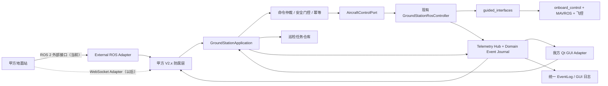

# 任务 14：甲方地面站对接架构调研报告

## 1. 报告信息与结论摘要

- 日期：2026-08-11
- 项目：`/home/nvidia/scq/projects/ros2-ardupilot-sitl-hardware`
- 代码基线：`main` 当前提交 `453b24a`，并按要求把工作树中正在执行的任务 13 修改视为后续实现基线；本任务没有覆盖、回退或修改任务 13 的任何文件
- 协议输入：`integration/无人机与上位机通信协议V2.0.docx`
- 文档核验：原文共 4 页，已完成逐页渲染和段落/表格提取；报告中的字段和状态编号均来自该文档
- 本任务性质：只做架构调研，只新增本报告，没有修改地面站、机载服务、ROS 接口、飞控参数或实机状态
- 安全边界：本轮没有连接、解锁或起飞实机。后续实现和自动测试同样不得自动解锁或起飞实机；实机解锁、起飞只能由用户手动执行

### 最终推荐

推荐采用：

> **端口与适配器（六边形架构） + 甲方协议防腐层 + 单一应用控制核心 + 领域事件/Outbox**。

第一阶段先以“模块化单体”落地：仍由一个地面站进程运行，但甲方对接功能必须是独立、无 Qt 依赖的后端模块，通过统一的 `GroundStationApplication` 应用服务访问现有机载 ROS 客户端。Qt GUI 和甲方 ROS 适配器共享：

1. 同一个机载控制租约和命令队列；
2. 同一份 `VehicleSnapshot` 权威状态；
3. 同一条带事件编号的领域事件流；
4. 同一套安全门控、命令仲裁、幂等和结果判定逻辑。

甲方协议不得写进 `qt_ui`，也不得新建第二套直接连接 `/onboard_control/*` 的控制客户端。甲方接口使用单独的外部接口包和独立 ROS context/domain，当前先实现 ROS 2 适配器；以后改成 WebSocket 时只替换传输适配器和 V2.0 编解码器，内部任务、安全和状态逻辑保持不变。

如果后续提出“关闭我方 GUI 后仍要 7×24 小时转发”的可靠性要求，再把同一应用核心提取为无界面网关进程，让 Qt 变成它的本地客户端。不能采用“另起一个网关进程也直接抢机载租约”的方式，否则会出现两个控制源竞争、状态重复订阅和日志不一致。

## 2. 甲方协议的实际内容

### 2.1 通信和媒体约定

甲方文档规定：

- 甲方上位机作为 WebSocket 服务端，无人机侧作为客户端；
- 命令主题为 `drone/{clientNo}/command`；
- 状态主题为 `drone/{clientNo}/status`；
- 巡检照片和视频通过 FTP 下载；
- 实时视频通过 `rtsp://192.168.80.xx/stream0` 拉流。

任务 14 已明确暂不实现原生 WebSocket，并指定两个地面站当前先使用 ROS 2 局域网通信；本轮又是纯架构调研，因此也没有实现 FTP 或 RTSP。建议在第一阶段保留媒体和 WebSocket 抽象接口，但暂不把它们列入可交付能力。

### 2.2 命令表

| 编号 | 甲方语义 | 文档要求的立即响应 | 长期业务结果 |
|---|---|---|---|
| `02` | 下发巡检任务/航线 | 回显 `clientNo`、`commandNo` | 航线已校验并保存，不应等同于已经飞行 |
| `03` | 执行已下发的巡检任务 | 回复已收到 | 运行、到点、完成或失败 |
| `05` | 一键返航 | 回复已收到 | 终止当前任务并返航 |
| `07` | 紧急停机 | 回复已收到 | 文档又描述为“立即停机降落”，语义存在安全冲突 |

`02` 的巡检点字段包括：`index`、`x`、`y`、`z`、`forwardAngle`、`cameraAngle` 和 `photoNo`。

### 2.3 状态表

| 编号 | 甲方语义 | 触发方式 |
|---|---|---|
| `01` | 待机 | 状态变化；异常恢复后至少发送一次 |
| `02` | 接收航线任务 | 航线收到并接受 |
| `03` | 巡检中 | 状态变化 |
| `05` | 返航 | 状态变化 |
| `07` | 降落 | 状态变化 |
| `08` | 任务执行完毕 | 事件；携带视频和照片目录 |
| `09` | 到达巡检点位 | 每点事件；携带点编号、名称和照片路径 |
| `0A` | 电量百分比 | 1 Hz 周期上报 |
| `0B` | 无人机位置 | 1 Hz 周期上报 |
| `0C` | 电量不足，暂停巡检并返航充电 | 异常事件 |

文档要求状态消息设置过期时间，避免离线后堆积。

### 2.4 必须先澄清的协议问题

当前文档还不能直接作为可执行接口规范，至少存在以下问题：

1. “原生 WebSocket + 主题订阅/发布”没有定义帧格式、订阅帧、心跳、重连、认证或子协议；文档 URL 中的 `s12-websocket` 也不足以证明具体实现。
2. 命令响应只是原命令的回显，没有 `requestId`、时间戳、错误码和“已收到/已接受/执行中/执行成功”的阶段区分。
3. 示例 JSON 多处缺少逗号，`uavStatus:09` 又未加引号，不能直接当作严格 JSON Schema。
4. `x/y/z` 没有定义坐标系、单位、原点、轴向和 `z` 是绝对局部高度还是相对高度。
5. `forwardAngle` 没有定义单位、零方向、正方向和范围；现有项目内部航向使用弧度。
6. `cameraAngle=1495` 看起来更像舵机 PWM 数值而不是角度，但文档没有说明，不能自行猜测。
7. `photoNo` 是照片数量、照片编号还是拍摄策略不明确；`pointName` 又没有出现在任务下发点中。
8. `07` 同时使用“紧急停机”“停机降落”，必须明确是安全 LAND、立即断桨，还是其他策略。任何实现都不得把含糊文字直接映射为飞行中强制 disarm。
9. 状态有效期被提出但未定义 TTL 字段、队列保留策略、离线重放、顺序和去重规则。
10. 文件中的 `/home/share/...` 是无人机本地路径，甲方机器通常不能直接访问；应返回媒体 ID、可下载 URI、大小、校验值和就绪状态，而不是把本地绝对路径当作远端地址。
11. 没有定义多无人机、重复 `clientNo`、多个上位机同时连接和控制权冲突时的行为。
12. 没有定义甲方链路断开后，正在执行的任务应继续、悬停、降落还是等待重连。

这些问题应在接口冻结前形成一份双方签字确认的“协议补充约定”。防腐层可以隔离变化，但不能替双方猜测安全语义。

## 3. 当前项目架构与可复用能力

### 3.1 当前数据流

当前工程已经形成清晰的机载边界：

- `ground_station.py`：Qt 地面站入口；
- `ground_station_core/qt_ui/main_window.py`：界面、确认框和会话生命周期；
- `ground_station_core/ros_controller.py`：地面站到机载服务的 ROS 2 薄客户端；
- `ground_station_core/models.py`：不可变 `VehicleSnapshot`、命令和结果模型；
- `ground_station_core/event_log.py`：线程安全、带序号的有界结构化日志；
- `src/guided_interfaces/`：我方地面站与机载端唯一共享的高层 ROS 2 协议；
- `src/onboard_control/`：控制租约、安全状态机、起降、航点执行和 PD+DOB 的权威实现。

机载端已经提供：

- `ControlStatus`：10 Hz 聚合状态，包括飞控连接、武装、模式、位置/速度、航点进度、控制租约、推力语义和控制诊断；
- `CommandResult`：可靠命令进度和终态，带 `source_id`、序号、状态、是否终态及航点进度；
- 高层服务：租约、起降/悬停/取消、航点和 GPS 原点；
- 命令时间戳、TTL、单调序号、重复/乱序拒绝；
- 单一控制租约和 5 Hz 心跳续租；
- 状态超时、链路丢失、setpoint 多发布者等故障关闭逻辑。

这些已经是对接最有价值的基础，不应绕过后重新实现一套飞行判断。

### 3.2 当前统一日志

`EventLog` 已经是我方 GUI、ROS 客户端、环境工作流和本地仿真进程共用的日志总线：

- 本地 SITL/MAVROS/onboard/RViz stdout 被实时 tee 到磁盘和 `EventLog`；
- 实机会话可以把远端 `/rosout` 写入同一个 `EventLog`；
- GUI 通过独立游标调用 `events_after()` 增量读取，筛选不会修改原始事件；
- 相同状态文本已经在产生处做了部分去重。

因此可以复用“一次产生、多处查看”的思路。但现有 `EventLog` 只有序号、时间、等级、来源和文本，且是内存有界队列，它适合人阅读，不足以承担关键业务状态的可靠传输。甲方状态不能靠匹配日志文本推导。

### 3.3 当前实现对外部对接的不足

1. `GroundStationWindow` 直接创建并调用 ROS 控制器，应用用例和 Qt 表现层尚未完全分开。
2. 部分飞行按钮门控位于 `qt_ui/state.py`；外部命令若直接调用 `GroundStationRosController`，会绕开 GUI 的确认和门控。
3. `GroundStationRosController` 同时承担 ROS 传输、命令队列、租约和结果模型转换，尚没有供 GUI/甲方适配器共同使用的应用服务层。
4. Python `CommandResult` 目前把机载端 `RUNNING/SUCCEEDED` 合并为 `success=True`，把 `FAILED/CANCELLED/REJECTED` 合并为 `False`，并丢失机载消息中的航点进度。GUI 当前够用，但对甲方协议的精确结果和到点事件不够。
5. `VehicleSnapshot` 没有保留机载消息时间戳、接收时间和状态年龄，外发时难以明确“值有效但已陈旧”。
6. 当前 GUI 的航点按钮是“上传并立即执行”，而甲方要求 `02` 保存、`03` 再执行，是两个不同用例。
7. 当前外部 `/rosout` 使用 `TRANSIENT_LOCAL`，机载服务重启或地面站重连时看到近期启动日志是 ROS 日志持久化语义，不是新的业务事件；不能把这些文本再次转发为甲方状态。

## 4. 需求与现有能力差距

| 甲方需求 | 当前可复用能力 | 缺口 | 是否必须改机载端 |
|---|---|---|---|
| `02` 保存巡检任务 | 现有航点模型和数值校验可参考 | 当前接口会立即执行；缺少任务 ID、版本、持久化、相机/照片元数据 | 第一阶段可只在地面站保存，不必改机载端 |
| `03` 执行巡检 | `request_waypoints()`、机载航点执行器、进度和终态 | 要把已保存任务转换为当前 ENU 航点；外部控制必须经过统一安全/控制权策略 | 只飞几何航点可不改；若要机载拍照/云台联动则要扩展 |
| `05` 一键返航 | 当前无 RTL 高层接口 | 不能用 LAND 冒充 RTL，也不能返回假成功 | 需要新增真实能力，具体飞控/算法不在本任务范围 |
| `07` 紧急停机/降落 | 当前有经过机载服务的 LAND | 文档语义冲突；取消任务、LAND 和强制 disarm 不是一回事 | 若双方确认等价于安全 LAND，可复用；否则需新能力和安全评审 |
| `01` 待机 | `ControlStatus` 有模式和全部就绪条件 | 不能只看 `MODE_IDLE`；需定义“可执行任务”的组合门控 | 地面站投影即可 |
| `02` 航线已接收状态 | 可由任务仓库结果产生 | 必须在校验和持久化成功后才发 | 地面站即可 |
| `03` 巡检中 | `MODE_WAYPOINT` 和命令 RUNNING | 需绑定具体外部任务和 request ID | 地面站即可 |
| `05` 返航 | 无 RTL 状态 | 不得伪造 | 与 RTL 能力一起实现 |
| `07` 降落 | `MODE_LAND`/ArduPilot LAND | 只能表示正在降落，不能等同于已经落地 | 可先复用；“落地完成”若需要则应补着陆状态 |
| `08` 任务完成 | 航点 `CommandResult.SUCCEEDED` | 当前没有视频/照片目录的媒体完成语义 | 飞行完成可地面站投影；完整媒体结果需媒体服务 |
| `09` 到点 | 机载进度在到点驻留后推进 | Python 当前丢失结果进度；没有点名、照片和拍照成功 | 纯到点事件可地面站修复；完整消息需相机/媒体能力 |
| `0A` 电量 | 当前 `ControlStatus` 无电池字段 | 需从 MAVROS/飞控电池遥测取得、校验并聚合 | 最好由机载聚合后上报，避免对接模块直接依赖 MAVROS |
| `0B` 位置 | `ControlStatus.position` 和有效标志 | 必须先确认甲方坐标系；外发要带时间和有效性 | 地面站即可，1 Hz 从已有 10 Hz 缓存采样 |
| `0C` 低电返航充电 | 当前无电池策略、RTL 和充电状态 | 属于多个新能力组合，不能只靠日志文本判断 | 需要后续机载/任务能力支持 |
| FTP/RTSP | 当前工程无对应媒体目录/服务 | 需要媒体目录、文件生命周期、鉴权和流地址提供者 | 视相机部署位置而定，非第一阶段 |

第一阶段若只做“ROS 2 对接骨架 + 航线保存/执行 + 基础状态”，可以主要修改地面站。只有真实新能力需要进入飞行器权威状态机时才修改 `guided_interfaces`/`onboard_control`，不能为了甲方字段变化频繁改动机载高层协议。

## 5. 方案比较

| 方案 | 优点 | 主要问题 | 结论 |
|---|---|---|---|
| 把甲方订阅、JSON 解析和状态发送直接写进 Qt 主窗口 | 初始代码量少 | GUI 生命周期、线程、确认框和协议耦合；难做无界面测试；窗口退出即链路退出 | 不推荐 |
| 新建一个独立桥接程序，直接创建第二个 `GroundStationRosController` 连接机载端 | 表面上隔离清晰 | 会和 GUI 竞争机载唯一租约；重复订阅状态/日志；两个源可能发出冲突命令 | 禁止作为当前方案 |
| 让甲方地面站直接使用 `guided_interfaces` 连接机载端 | 少一层转发 | 暴露内部协议和安全面；绕过我方业务、日志和兼容层；甲方变化会污染机载协议 | 不推荐 |
| 单一应用核心，Qt 和甲方适配器作为两个端口，共享机载控制器和事件源 | 无租约竞争；复用最多；协议变化局部化；可演进到 WebSocket/无界面 | 需要先做一次应用层抽取和命令仲裁 | **推荐** |

## 6. 推荐的目标架构



### 6.1 应用核心

建议新增一个不依赖 PySide6、WebSocket 或具体 ROS 消息类型的 `GroundStationApplication`。它负责：

- 会话状态和当前环境；
- 统一安全资格判断；
- GUI/甲方上位机命令来源仲裁；
- 外部命令幂等、超时、优先级和结果关联；
- 巡检任务的保存、版本和执行状态；
- 从机载快照/命令结果生成领域事件；
- 能力查询，例如 `waypoint=true`、`rtl=false`、`battery=false`。

Qt 主窗口以后只调用这个应用服务，而不是直接调用 `_ros.request_*()`。甲方适配器也只能调用同一应用服务，不能访问 Qt 控件或直接构造机载 ROS 消息。

### 6.2 协议防腐层

甲方字段必须先由版本化映射器转换为内部模型：

- `ClientProtocolV2Mapper`：解析当前命令号和字段；
- `ExternalCommand`、`InspectionTask`、`InspectionPoint`：内部稳定模型；
- `PartnerStatusProjector`：把内部事件投影为甲方状态码；
- `ProtocolProfile`：配置 `clientNo`、协议版本、ROS namespace、坐标约定、周期和能力开关。

处理器建议采用注册表而非在 GUI 中堆积 `if commandNo == ...`：

```text
02 -> StageInspectionTaskHandler
03 -> ExecuteInspectionTaskHandler
05 -> ReturnHomeHandler（未支持时明确返回 UNSUPPORTED）
07 -> EmergencyLandingHandler（语义确认前不启用）
```

未知命令和未实现能力必须返回带原因的拒绝，不能记录 INFO 后静默忽略，更不能回显命令后冒充已执行。

### 6.3 外部 ROS 2 接口包

建议新增独立的 `external_gcs_interfaces`（名称可在实施前确定），不要把甲方 DTO 塞进 `guided_interfaces`。两者职责不同：

- `guided_interfaces`：稳定的我方地面站 ↔ 机载安全/控制协议；
- `external_gcs_interfaces`：我方地面站 ↔ 甲方地面站的业务协议。

ROS 阶段建议使用类型化服务、Action 和主题：

- `GetGatewayCapabilities.srv`：版本/能力握手；
- `StageInspectionTask.srv`：`02`，校验并持久化任务，立即返回准确确认；
- `ExecuteInspection.action`：`03`，天然提供目标接受、进度、结果和取消；
- `ReturnHome.action`、`EmergencyLand.action`：先定义领域端口，能力未实现时不宣称可用；
- `GatewayHealth.msg`：网关、机载链路和控制权分层健康；
- `VehicleTelemetry.msg`：位置/未来电池的周期快照；
- `InspectionEvent.msg`：任务开始、到点、完成、失败等可靠事件；
- 可选 `OperatorLog.msg`：只发送经过白名单的可读日志，不代替业务事件。

若甲方坚持“命令主题 + 状态主题”，只需要再写一个 ROS topic 适配器，把相同应用用例包装为请求/ACK；内部核心不改变。对于当前新接口，服务和 Action 比裸 topic 更适合命令确认和长任务关联。

### 6.4 两个 ROS 域的隔离

甲方侧 ROS 适配器应使用独立 `rclpy.Context`、可配置的 ROS domain 和专用 namespace。推荐：

- 飞行器侧仍由现有 `GroundStationRosController` 使用我方硬件 domain；
- 甲方侧使用另一个配置化 domain，只暴露 `external_gcs_interfaces`；
- 地面站进程在内存应用层完成跨域桥接；
- 禁止甲方 domain 直接发现 `/onboard_control/*` 或 `/mavros/*`。

ROS domain ID 只提供发现隔离，不是身份认证。临时 ROS 方案至少应运行在受控 VLAN/防火墙范围，甲方客户端应与我方地面端统一 ROS 发行版和 RMW；当前工程已观察到 Humble/Jazzy Fast DDS 跨发行版兼容告警，不能把该风险再引入甲方接口域。正式安全方案仍需 SROS2、VPN 或未来 WebSocket 层的双向认证与 TLS。

## 7. 核心业务流程

### 7.1 `02` 下发巡检任务

1. 外部适配器验证握手会话、`clientNo`、协议版本、`requestId`、时间戳和 TTL；
2. V2 映射器解析并严格校验所有巡检点；
3. 坐标转换器按双方确认的坐标约定转换为内部 ENU/弧度，同时保留原始数据用于审计；
4. 任务仓库以 `taskId + revision + checksum` 幂等保存；
5. 只有数据库提交成功后才返回 `ACCEPTED` 并产生状态 `02`；
6. 此步骤不得调用现有 `request_waypoints()`，因此不会解锁、起飞或覆盖正在执行的任务。

建议用 SQLite 保存关键任务、命令幂等键和业务事件，普通 DEBUG 日志不入库。SQLite 已足够满足单机网关的原子提交、崩溃恢复和无外部服务部署；若甲方不要求进程重启后保留任务，也应明确写入合同，而不是默认靠内存。

### 7.2 `03` 执行巡检任务

1. 检查任务存在、版本未过期且尚未执行；
2. 检查外部控制会话、机载链路、接口版本、飞控连接、本地位置、推力语义、发布者冲突和当前任务互斥；
3. 取得“外部操作者控制权”，将 Qt 控制入口切为只读或按明确策略处理；
4. 将纯飞行字段转换为现有航点请求并通过唯一 `GroundStationRosController` 发送；
5. 服务接受只表示机载端收到，不能表示巡检成功；
6. 保留机载 `CommandResult` 的原始状态、航点进度和终态，生成外部 RUNNING/FAILED/CANCELLED/SUCCEEDED；
7. 最终 `08` 必须来自与本任务关联的 `SUCCEEDED`，若甲方要求视频/照片完整，则还要等待媒体目录完成，不能仅凭一条 INFO 日志宣布完成。

现有机载航点流程会自行进入 GUIDED 并请求武装，因此外部 `03` 是安全关键命令。临时 ROS 网络中不能只凭 `clientNo` 就转发；建议 GUI 增加明确的“允许甲方控制”会话开关和状态提示。是否要求每次外部执行仍由现场人员确认，应由双方安全流程决定，但无论如何都必须经过应用层安全门控，不能绕过。

### 7.3 外部链路失联

这是桥接架构中必须新增的关键策略。当前地面站只要仍在运行，就会持续向机载端续租；如果甲方地面站断线而网关仍继续心跳，机载端会误以为控制源仍健康，现有 10 秒失联保护不会触发。

因此外部控制会话必须有自己的租约/心跳：

- 甲方心跳过期后，应用核心停止接受其命令；
- 根据双方约定执行“悬停/取消并释放机载租约/继续当前任务/安全降落”之一；
- 默认不能由适配器偷偷继续续租并掩盖上游失联；
- GUI 本地接管必须是显式状态迁移，不得与甲方命令并发。

具体失联动作属于安全策略，需要在实施前确认；架构必须预留，不能把它留在 WebSocket 重连回调中临时处理。

## 8. 命令确认、幂等和握手

### 8.1 推荐的命令信封

每个外部命令至少包含：

- `protocolVersion`；
- `clientNo`；
- `gatewaySessionId`；
- 全局唯一 `requestId`；
- `sentAt` 和 `ttlMs`；
- `commandNo`；
- `taskId`、`revision`（任务相关命令）；
- 业务 payload。

回复至少包含 `requestId`、网关序号、阶段、错误码和可读说明。阶段应区分：

1. `RECEIVED`：传输和语法有效；
2. `ACCEPTED`：安全/业务校验通过并已持久化或送达机载服务；
3. `RUNNING`：飞行器正在执行；
4. `SUCCEEDED`；
5. `FAILED`；
6. `CANCELLED`；
7. `REJECTED`；
8. `UNSUPPORTED`。

重复 `requestId` 必须返回第一次的已有结果，禁止二次执行。甲方当前“回显命令”可以保留为兼容字段，但不能代替上述语义。

### 8.2 双层握手

现有机载链路已经有一层可靠握手：`ControlStatus.interface_version`、状态新鲜度、服务可用、控制租约和心跳。甲方链路还需要独立的应用握手：

1. 甲方发现网关并调用 `GetGatewayCapabilities`；
2. 网关返回实例 ID、协议版本、支持命令、坐标系、最大航点数、状态周期和分层就绪状态；
3. 甲方建立有期限的上游控制会话；
4. 命令必须携带该会话 ID；
5. 心跳停止后进入明确失联策略。

“能在 ROS 图里看到 topic”不等同于“网关、机载服务、飞控和控制权均已就绪”。健康状态至少要拆分为：外部传输、网关应用、机载服务、飞控链路、控制租约、飞行安全门控六层。

### 8.3 网关重启恢复边界

当前地面站进程每次启动默认生成新的 `source_id`，本地 ticket 也从 1 重新开始；机载 `CommandResult` 虽然使用可靠 QoS，但不是持久任务查询接口。若我方地面站在巡检中重启，新进程可以重新看到 `ControlStatus`，却可能收不到旧 `source_id` 对应的最终结果，也无法仅凭一条最新状态完整恢复“哪个甲方 request 正在执行”。

因此生产级恢复需要明确选择：

- 持久化网关身份、命令序号和任务关联，并保证序号跨进程单调；或
- 每次进程使用新会话身份，同时由机载状态提供可查询的稳定 `task_id`、任务阶段和最终结果；
- 外部 Outbox 只解决“地面站已经收到但尚未发给甲方”的消息，不能替代机载端的任务恢复事实。

如果合同要求飞行中网关重启后无损恢复，建议扩展机载高层协议增加任务查询/稳定任务 ID；这属于真正需要修改 `guided_interfaces`/`onboard_control` 的场景。若第一阶段不支持，应在能力握手和运维文档中明确，而不能把最新 `waypoint_index` 猜成完整恢复成功。

## 9. 状态与统一日志设计

### 9.1 一个权威事件，两种展示

推荐的共享方式不是让甲方解析我方 GUI 的自由文本日志，而是：

```text
ControlStatus / CommandResult / TaskRepository
                 ↓
DomainEvent(event_id, type, time, severity, correlation_id, payload)
                 ├─→ EventLogFormatter ─→ 我方 GUI 日志
                 └─→ PartnerStatusProjector ─→ 甲方状态/事件
```

同一个状态变化只产生一次领域事件，两个地面站各自做展示。这能保证“GUI 说成功”和“甲方收到成功”来自同一事实来源，同时避免无人机重复发布两套消息。

现有 `EventLog` 可继续作为人类日志接收器，并增加可选 `event_code`、`correlation_id` 或另建 `DomainEventJournal`。建议不要直接改变所有现有日志含义：

- 业务事件：可靠、带类型和关联 ID，必要时通过 SQLite Outbox 持久化；
- 周期遥测：只保存最新值，不持久化每个样本；
- DEBUG/ROS 启动日志：仅本地有界显示，默认不发甲方；
- WARN/ERROR：只有经过白名单且有业务含义的事件才外发，防止把 MAVROS 启动噪声当成飞行状态；
- 所有外发事件带 `origin` 和唯一 ID，避免两个地面站相互转发形成日志环路。

### 9.2 不增加无人机消息量

- 无人机继续按现有频率发布一份 `ControlStatus`；
- 我方地面站只订阅一次并缓存；
- GUI 读取缓存，甲方 `0B` 位置以 1 Hz 从同一缓存采样；
- 状态变化由本地状态投影器生成，不要求机载端再为甲方复制一份；
- 未来电池也应先进入统一机载健康状态，再由地面站 1 Hz 投影；
- 外部周期 topic 使用“只保留最新值 + lifespan”，断线时不堆积旧遥测。

这能减少机载发布源数量，但甲方链路本身仍会产生必要的网络流量，不能表述成“完全没有额外流量”。

### 9.3 甲方状态的可靠判定

| 状态 | 推荐事实来源 | 禁止的判定方式 |
|---|---|---|
| `01` 待机 | 统一 `ready_for_task` 门控从 false→true 的变化 | 仅看到节点启动日志或 `MODE_IDLE` |
| `02` 航线收到 | 任务校验、转换和持久化提交成功 | 收到 ROS 包即回成功 |
| `03` 巡检中 | 关联任务的机载 RUNNING + `MODE_WAYPOINT` | 日志包含“启动”二字 |
| `05` 返航 | 未来真实 RTL 状态/结果 | 用 LAND 或目标位置变化猜测 |
| `07` 降落 | `MODE_LAND`/飞控模式已确认 | 只因 LAND 请求已排队 |
| `08` 完成 | 关联 `CommandResult.SUCCEEDED`，必要时再等媒体就绪 | 航点列表已发出或状态文本不再变化 |
| `09` 到点 | 机载到点驻留后进度事件 + 照片成功 | 单次位置进入容差瞬间 |
| `0A` 电量 | 新鲜、有效的飞控电池遥测 | 从日志文本或默认值猜测 |
| `0B` 位置 | 新鲜且 `local_position_valid=true` 的带时间快照 | 继续发送超时缓存而不标无效 |
| `0C` 低电 | 经迟滞/驻留的电池策略 + 真实任务状态 | 一次瞬时低电压样本 |

## 10. 坐标和任务模型

建议内部 `InspectionPoint` 同时保存：

- 外部原始字段和协议版本；
- 规范化 ENU 米制位置；
- 规范化弧度航向；
- 原始 `cameraAngle`、`photoNo`、点名和扩展元数据；
- 每点校验结果。

在双方未明确坐标前，不得假定甲方 `x/y/z` 与当前本地 ENU 完全一致。至少要书面确认：

- 坐标系是 ENU、NED、机体系还是场地图；
- 原点如何建立，两台地面站如何共享；
- `z` 的正方向和基准；
- 角度单位和正方向；
- 航点范围、最大点数、重复 index、越界和 NaN 的处理；
- 飞行策略和速度是否属于任务字段。

当前机载接口最多 256 个航点，且 `z` 需在 `[0.1, 50] m`，这些限制应通过能力握手返回，不应散落硬编码在甲方适配器中。

## 11. 推荐代码边界

后续实施可按以下逻辑目录组织，名称可在编码前微调：

```text
ground_station_core/
  application/
    facade.py                 # GUI/甲方共同调用的应用服务
    command_broker.py         # 来源仲裁、优先级、幂等、结果关联
    safety_policy.py          # 从 Qt 层抽出的通用门控
    inspection_session.py     # STAGED/RUNNING/... 状态机
    task_repository.py        # SQLite 任务和命令日志
    telemetry_hub.py          # 权威快照及采样
    domain_events.py          # 类型化业务事件和 Outbox
  integration/
    domain.py                 # 外部无关的任务/命令 DTO
    service.py                # 对接模块生命周期
    protocol_v2.py            # 甲方 V2 映射/校验/状态投影
    ros2_adapter.py           # 当前外部传输
    websocket_adapter.py      # 以后实现，不在本阶段
    media_port.py             # FTP/RTSP/媒体目录预留接口
src/
  external_gcs_interfaces/    # 甲方侧 ROS 2 接口包
```

现有文件建议按最小方式调整：

- `ground_station.py` 成为组合根，创建 EventLog、机载适配器、应用服务、外部适配器和 Qt 窗口；
- `GroundStationWindow` 注入应用服务，不再自己拥有业务核心；
- `qt_ui/state.py` 只负责把通用安全资格转换为控件可用性；
- `ros_controller.py` 实现 `AircraftControlPort`，保留机载传输细节，并完整保留远端结果枚举/进度；
- `models.py` 增加状态时间/年龄和精确命令结果模型；
- `event_log.py` 继续做人类日志，不承担外部状态真值；
- `guided_interfaces` 只在真正需要机载新数据或动作时升级；
- 甲方协议变更只修改 `external_gcs_interfaces`、`protocol_v*.py` 和对应契约测试。

每个新文件和重要类/函数仍须遵守项目注释规范。

## 12. 实施阶段与难度

以下估算假设由一名熟悉 Python、ROS 2 和当前工程的开发者执行，且双方及时澄清协议；不含新飞行算法、相机驱动、FTP/RTSP 服务或真实 RTL 实现。

| 阶段 | 内容 | 难度 | 估算 |
|---|---|---:|---:|
| 0 | 协议补充约定、坐标/安全语义冻结、示例 JSON 修正 | 中 | 2–4 人日 |
| 1 | 抽取应用服务、安全门控、精确结果模型，保持现有 GUI 行为不变 | 中高 | 4–7 人日 |
| 2 | 外部 ROS 接口包、独立 context/domain、能力握手和链路健康 | 中高 | 4–7 人日 |
| 3 | `02/03`、任务仓库、幂等、控制来源仲裁、状态投影 | 高 | 5–8 人日 |
| 4 | 单一事件源、可靠 Outbox、断线/重启/背压和故障注入测试 | 高 | 4–7 人日 |
| 5 | SITL 端到端和甲方联调、文档/部署/回归 | 中高 | 4–7 人日 |

推荐 ROS-only、生产可维护版本合计约 **23–40 人日**。如果只做一个不持久化、无控制仲裁的演示桥，可能 3–7 人日可以看到消息流通，但它不能满足安全、重连和真实结果一致性要求，不应作为交付版本。

以后在协议已冻结的前提下增加 WebSocket 适配器，预计主要是传输、重连和 JSON Schema 工作，约 4–8 人日；完整的电池、低电返航、RTL、相机拍照、媒体目录、FTP/RTSP 工作量取决于尚未存在的底层能力，不能包含在上述估算中。

## 13. 测试和验收建议

### 13.1 单元/契约测试

- 甲方文档的每个 JSON 示例都转换为严格合法的固定 fixture；
- V2 编解码、未知字段、缺字段、NaN、越界、重复 index、坐标转换；
- 状态码投影和每个状态的正反例；
- `requestId` 重复、乱序、过期和跨重连幂等；
- 外部命令未通过门控时绝不调用 `AircraftControlPort`；
- 未实现 `05/07/0A/0C` 时返回明确 `UNSUPPORTED`；
- 领域事件只产生一次，GUI 日志和甲方状态引用相同 `event_id`。

### 13.2 组件测试

- 用 fake AircraftPort 验证 `02` 不发送飞行命令、`03` 才发送；
- 服务“accepted”与最终 `CommandResult` 分离；
- 取消、拒绝、失败和成功不会被压成同一个 bool；
- GUI 与甲方命令同时到达时只允许一个控制来源；
- 甲方心跳丢失时执行配置的上游失联策略；
- 外部遥测 1 Hz 来自同一缓存，机载订阅数不增加；
- 外部消费者阻塞时不会阻塞 ROS executor 或 Qt 主线程。

### 13.3 SITL 集成

- 使用隔离仿真 domain，不接触真机；
- `02` 保存后 SITL 保持未武装，且无航点命令；
- 在用户明确授权的仿真流程中验证 `03` 的接收、进度、到点和终态；
- 注入重复命令、旧 TTL、网络中断、网关重启、甲方重启和任务仓库恢复；
- 验证外部链路丢失不会被地面站心跳掩盖；
- 验证日志启动噪声不会生成甲方任务状态；
- 清理后无 ROS/SITL/RViz 受管进程残留。

### 13.4 真机台架边界

真机联调先只验证发现、握手、状态和命令拒绝，全程保持 `armed=false`，不得由测试自动发送执行巡检、解锁或起飞。只有协议、安全门控和 SITL 故障注入全部通过后，才由用户另行决定并手动执行实机解锁/起飞验证。

## 14. 主要风险和停止条件

1. 甲方未确认坐标系、角度和 `07` 语义前，不得实现实际飞行转发。
2. 外部 ROS domain 未隔离或甲方能直接调用 `/onboard_control/*` 时，应停止部署。
3. GUI 和甲方适配器各持一套机载控制器/租约时，应停止并重构为单一核心。
4. 外部链路失联仍由网关继续无条件续租时，不得进入实机阶段。
5. 任何状态由日志文本猜测、或“收到命令”被外发成“执行成功”时，不得验收。
6. `05`、媒体、电池或 `0C` 底层能力不存在时，必须如实返回不支持，不能填默认值或复用错误动作。
7. 跨 ROS 发行版/RMW 仍有类型发现异常时，应统一环境或使用受支持桥接，不能用增加缓存掩盖。
8. 外部命令没有身份认证、控制会话和幂等键时，不得在非隔离网络开放安全关键控制。

## 15. 建议的下一步

1. 先与甲方完成协议补充表，优先确认坐标、命令 ACK 阶段、`07`、外部失联和媒体 URI；
2. 确定第一阶段能力清单，建议只承诺：握手/健康、命令 `02` 任务保存、命令 `03` 纯航点执行、状态 `01/02/03/07/0B`，以及不带媒体成功含义的内部完成结果；命令 `07` 在语义澄清前仍标为不支持；
3. 对 `05/0A/0C/媒体/相机` 明确标注“接口预留、能力未实现”；
4. 先做应用层抽取和精确事件模型，再写甲方 ROS 适配器；
5. 甲方 ROS 适配器使用独立 domain 和 `external_gcs_interfaces`；
6. 完成任务仓库、幂等、上游控制租约和状态 Outbox；
7. 通过 fake、契约、隔离 SITL、断线和重启测试后，再安排只读真机台架联调。

综上，最合适的方案不是“在 GUI 中增加一组甲方通信回调”，而是把当前地面站提升为一个具有单一控制核心的网关应用。Qt 是本地操作者适配器，甲方 ROS/WebSocket 是外部适配器，机载 ROS 是飞行器适配器；三者通过稳定的应用端口、领域事件和能力声明解耦。这样既能最大限度复用现有安全状态、航点和统一日志，又能把甲方后续协议变化限制在防腐层内，并为一键返航、电池、相机和媒体等尚不存在的能力留下真实而不造假的扩展边界。
