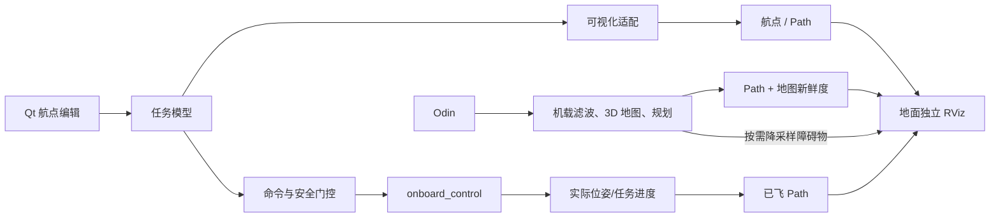

# 任务 15：航点与障碍物可视化方案调研

## 1. 结论摘要

- 日期：2026-08-11
- 仓库基线：`main` 当前提交 `7c1f8cc`，同时只读检查了现有工作树；没有覆盖或整理用户已有改动
- 输入：任务截图与 16.3 秒示例视频（796×664、30 FPS）
- 本任务只做调研：没有修改功能代码、ROS 接口、RViz 配置、Odin 配置或实机状态
- 安全边界：没有启动、连接、解锁或起飞实机，也没有发送控制命令

### 最终建议

> **不自行重写完整 3D 渲染器。保留 Qt 地面站作为任务编辑与飞行控制界面，在地面计算机运行一个独立的 RViz 伴随窗口；机载计算机只负责 Odin 数据、建图、障碍物表达和权威路径规划。**

项目仍需自行实现一层很薄但不可省略的“可视化数据适配”：把 Qt 中的航点、规划器输出、实际
轨迹和障碍物转换为 RViz 能直接消费的标准 ROS 消息。RViz 负责坐标变换、相机、3D 渲染、图层
开关、选取和插件生态，不负责替项目生成航线、建图或避障。

建议分两阶段：

1. **近期（高回报、低风险）**：在地面端 RViz 中显示输入航点、名义连线、无人机实时姿态、实际
   轨迹；先保持只读预览，不让 RViz 绕过 Qt 安全门控发飞行命令。
2. **后续（独立工程）**：Odin 点云在机载端完成滤波、坐标对齐、体素/占据表达和规划；只向地面端
   发布降采样障碍物与规划曲线供 RViz 显示。规划结果必须来自机载权威规划器，不能由地面端画一条
   “看起来会避障”的曲线冒充可执行路径。

不建议当前把 RViz 嵌入现有 PySide6 窗口：本机 ROS 2 Jazzy 的 RViz 2.14.1.20 链接 Qt 5.15，
而地面站使用 PySide6/Qt 6.11.1，同进程嵌入存在明确的 Qt ABI/事件循环边界，代价和风险远大于
独立窗口。

## 2. 示例功能到底包含什么

视频不是一个单一“航点预览”功能，而是四类数据叠加：

1. 绿色起点、红色任务终点；
2. 灰色完整规划路径；
3. 红色已飞轨迹；
4. 红点无人机实时位置。

后续加入障碍物和避障曲线后，还会新增：

5. 传感器点云或三维占据地图；
6. 未经碰撞检查的“名义航线”与规划器实际输出的“可执行路径”；
7. 路径状态（待规划、有效、过期、规划失败）和地图新鲜度。

这些对象应使用不同话题、颜色和图例。尤其不能把“航点间直线”标成“避障规划路径”，否则预览
会给操作者错误的安全暗示。

## 3. 当前工程的可复用基础与缺口

### 3.1 已经有的能力

当前 `guided_sim` 会启动：

- `robot_state_publisher`：发布无人机模型；
- `pose_to_tf.py`：把 `/mavros/local_position/pose` 转为 `map → base_link`；
- RViz：加载 `src/guided_sim/rviz/quadcopter.rviz`。

现有 RViz 配置已经包含 Grid、RobotModel、TF 和一个名为 `Trajectory` 的 Path 图层。因此机体实时
位置、姿态和坐标轴的基础设施可以直接复用，没有必要重画三维坐标系、相机和无人机模型。

### 3.2 现有轨迹图层实际不可用

`Trajectory` 使用 `rviz_default_plugins/Path`，却订阅
`/mavros/local_position/pose`。前者要求 `nav_msgs/msg/Path`，后者是
`geometry_msgs/msg/PoseStamped`，消息类型不匹配。ROS 官方定义中，`Path` 是一组
`PoseStamped[]`，不是单个 pose。因此必须新增轨迹累积发布者或改用与消息类型匹配的显示方式；
仅改 RViz 配置名称不能得到已飞轨迹。

### 3.3 当前没有的能力

- Qt 航点表没有发布 `MarkerArray` 或 `Path` 预览话题；
- 机载航点执行器只推进离散航点，没有发布几何规划曲线；
- `flight_strategy` 的“自动避障/遇障悬停”目前仍会告警并按直线执行；
- 工程没有三维占据地图、ESDF、障碍物膨胀或碰撞检查；
- 本机尚未安装 `octomap_server` 或 `octomap_rviz_plugins`；
- 当前 MAVROS `map`、Odin `odom/map` 与传感器安装外参尚未形成一棵经过验收的统一 TF 树。

所以“使用 RViz”能大幅减少显示工作，但不能消除数据模型、TF、建图和规划工作。

## 4. RViz 可以直接承担什么

ROS 2 Jazzy 的现成能力足够覆盖目标显示：

| 目标对象 | 推荐消息/显示器 | 说明 |
|---|---|---|
| 输入航点 | `visualization_msgs/MarkerArray` | 球体、序号文字、航向箭头、起终点颜色 |
| 名义航线 | `Marker.LINE_STRIP` 或 `nav_msgs/Path` | 明确标为“未碰撞检查” |
| 规划曲线 | `nav_msgs/Path` | 由规划器发布，可显示线与每个 pose 的方向 |
| 已飞轨迹 | `nav_msgs/Path` | 对权威位姿按距离/时间抽样累积，限制历史长度 |
| 实时机体 | TF + RobotModel | 当前工程已有 |
| 原始/SLAM 点云 | `sensor_msgs/PointCloud2` | RViz 原生支持颜色、强度、点大小和衰减时间 |
| 三维占据地图 | `octomap_msgs/Octomap` + OctoMap RViz 插件 | 需要新增并安装地图链和插件 |
| 可交互航点 | Interactive Marker | 支持 3D 移动、旋转和反馈，但首阶段不建议启用编辑 |

官方 `Marker/MarkerArray` 提供 LINE_STRIP、POINTS、SPHERE、ARROW、TEXT_VIEW_FACING 等基本图元，
足以复刻示例效果；Interactive Marker 也支持 3D 移动/旋转及反馈。也就是说，项目无需自行实现
OpenGL 相机、拾取、TF 变换和点云渲染。

RViz 是显示器，不是规划器。它只忠实显示发布者给出的路径和地图；路径是否无碰、动力学是否可达、
是否已过期，仍必须由机载规划与安全模块判断。

## 5. Odin 能否支撑后续障碍物显示和建图

### 5.1 官方能力

Odin 官方 ROS 2 驱动提供：

- `/odin1/cloud_raw`：原始深度点云；
- `/odin1/cloud_render`：RGB 着色点云；
- `/odin1/cloud_slam`：SLAM 点云；
- `/odin1/odometry`、高频里程计、`/odin1/path` 和 TF；
- `custom_map_mode=0/1/2`：里程计、带回环和保存的 SLAM、重定位模式。

官方自带 RViz 配置已经用 PointCloud2 显示上述点云，默认 Fixed Frame 为 `odom`；官方 ROS 2
launch 还会直接启动 RViz。Odin 因此完全可以作为三维感知和 SLAM 数据源。

### 5.2 不能据此直接宣称“已经能避障”

点云、SLAM 地图和可供无人机安全规划的障碍物模型是三件不同的事。仍需完成：

1. 机体到 Odin 的标定外参和统一 TF；
2. 时间同步、置信度/离群点过滤、运动畸变处理；
3. 体素化或三维占据/距离场；
4. 按无人机尺寸和定位误差做安全膨胀；
5. 地图更新、动态障碍物和过期策略；
6. 3D 路径规划、平滑、动力学约束、重规划及失败降级；
7. 仿真、回放、无桨台架和最后的人工实飞验收。

Odin 官方导航栈目前公开示例主要面向 ROS 1 地面机器人；其文档也把若干传统/自定义规划器标为
不推荐或 TODO。它能证明数据源和 SLAM 能力，不能直接证明现有无人机控制器可安全复用该导航栈。

### 5.3 当前实机配置仍需单独核验

仓库当前只明确使用 `/odin1/odometry_highfreq` 送入 extnav。Odin 驱动源码与实际
`control_command.yaml` 不在本仓库；本轮只读 SSH 因目标机认证失败，未能核实已部署设备的
`custom_map_mode`、`sendcloudslam` 和 `showpath`。官方默认配置目前是 `custom_map_mode: 0`，不能
把“设备支持 SLAM”误报为“当前实机已经在 3D 建图模式”。这应作为后续只读验收的第一项。

## 6. 用地面 RViz 还是机载 RViz

### 推荐：地面端 RViz 作为正式预览

原因：

- 操作者、Qt 航点编辑器和任务状态都在地面端；
- 不占用机载 GPU/桌面资源，不影响控制与规划进程调度；
- 地面端可同时看航点、规划曲线、实际轨迹和降采样障碍物；
- 可以由地面站管理独立 RViz 进程的启动/关闭，但 RViz 崩溃不得影响控制会话；
- 当前本地仿真已经采用这一路径，改造范围最小。

机载端负责发布权威数据：Odin 点云、地图、路径和有效性状态。地面 RViz 只观察，不成为新的控制
源，也不直接发布 `/onboard_control/*` 或 MAVROS setpoint。

### 机载 RViz：只保留为调试工具

Odin 官方 launch 自带 RViz，适合工程师在机载桌面旁调试原始点云、TF 和传感器。它不适合作为
正式地面站预览：

- 当前机载服务从 `multi-user.target` 无图形环境启动，历史实测中无 `DISPLAY` 时 RViz 会退出；
- 操作者在地面端看不到该窗口，远程桌面又引入部署、延迟和窗口控制成本；
- RViz/OpenGL 会与 SLAM、规划和 100 Hz 控制竞争机载资源；
- 把渲染画面远程传回地面不利于数据检查、图层选择和日志关联。

因此生产自启动最终应允许 Odin 驱动以 headless 方式运行，而不是把 RViz 成败纳入飞行栈就绪条件。

### 点云网络策略

Odin 产品规格最高约 70 万点/秒。按每点仅 16～32 字节粗估，未计 DDS/RTPS 开销时就约为
11～22 MB/s（约 90～180 Mbit/s）；这是基于公开点频与常见字段大小的工程估算，不是本机实测。
原始点云直接穿过 Wi-Fi 可能挤占状态和控制链路。

建议：

- 原始高频点云留在机载端，按需调试；
- 建图/规划也在机载端运行，链路中断后仍能执行安全策略；
- 地面端默认只收低带宽航点、路径和状态；
- 障碍物图层使用体素降采样、裁剪后的局部地图或低频占据更新，并与控制状态做网络优先级隔离；
- QoS 对传感器/可视化采用小队列、取最新，关键命令与结果继续走现有可靠高层协议。

## 7. 与自行实现相比的代价

以下工作量按 1 名熟悉 ROS 2/Qt 的工程师估算，包含实现、自动测试、SITL 验证和文档，不包含真正
的 3D 避障算法研发，也不包含实机飞行验收。

| 方案 | 首次可用工作量 | 优点 | 主要代价/风险 | 评价 |
|---|---:|---|---|---|
| **地面端独立 RViz + 标准消息适配** | 3～6 人日 | 复用最多；点云/TF/Marker/Path 现成；风险最低 | 多一个窗口；需做好话题、TF、QoS 和生命周期 | **推荐** |
| 地面 RViz + Odin 降采样障碍物联调 | 再加 5～10 人日 | 很快获得真实环境叠加 | 取决于实机配置、TF 和 Wi-Fi 压测 | 推荐为第二步 |
| 机载 RViz 正式使用 | 1～2 人日配置 | 原始点云不走 Wi-Fi | 地面不可用、headless 失败、抢机载资源 | 仅调试 |
| RViz 同进程嵌入现有 Qt | 3～6 周，且有返工风险 | 单窗口体验好 | PySide6/Qt6 与 RViz/Qt5 ABI 冲突；需 C++ 宿主、跨进程嵌入或 UI 重构 | 当前不推荐 |
| PySide6 自研简易 3D 航点视图 | 1～2 周 | 可完全贴合现有 UI | 只能先覆盖静态航点/线，已有 RViz 能力要重复开发 | 回报有限 |
| PySide6 自研生产级点云/地图/交互渲染 | 6～12 周以上 | 产品化单窗口、可深度定制 | 性能、GPU、拾取、TF、地图、兼容和测试成本最高 | 需求稳定后再评估 |

真正的“3D 建图 + 无人机避障规划 + 安全验收”应单独按约 3～8 周以上评估，且高度依赖算法选择、
机载算力、场景和验收标准；不能计入“加一个 RViz 图层”的 3～6 人日。

## 8. 推荐的数据与进程边界

建议话题按语义拆分，例如：

- `/mission/waypoints/markers`：输入航点、编号、航向；
- `/mission/nominal_path`：仅连接输入航点，不承诺无碰；
- `/planner/path`：机载规划器的权威可执行曲线；
- `/vehicle/executed_path`：实际轨迹；
- `/perception/obstacles_preview`：降采样可视化障碍物；
- `/planner/status`：地图/路径版本、时间戳、有效性和失败原因。

命名可在实现时按项目 namespace 调整。关键是规划路径必须带任务 ID、地图版本/时间和有效性，避免
RViz 在新任务或重规划失败后继续显示旧曲线。

## 9. 建议实施顺序与验收门槛

### 第 1 阶段：只读航点与轨迹预览

1. 修正现有 PoseStamped→Path 类型缺口；
2. Qt 航点变化时发布 MarkerArray 和“名义 Path”；
3. 规划、名义、实飞三条线使用固定不同颜色和文字图例；
4. 独立 RViz 由仿真/实机会话启动或用户手动打开，关闭 RViz 不影响控制；
5. 验证航点增删、清空、新任务、断线重连时没有旧 marker/旧 path 残留；
6. RViz 不提供能绕过 Qt 门控的飞行命令工具。

### 第 2 阶段：Odin 障碍物预览

1. 只读确认实机 Odin 版本、配置、话题类型/频率/QoS 和实际 TF；
2. 无桨条件下验证 Odin、MAVROS 和机体坐标对齐；
3. 先用录包/回放完成点云裁剪、降采样与地面端网络压测；
4. 把点云图层明确标成“感知预览”，不宣称已经用于规划；
5. 控制状态/命令链的延迟、丢包和 DDS 队列不得因点云订阅显著退化。

### 第 3 阶段：真正避障路径

1. 先冻结障碍物地图接口、无人机包络、安全余量和失败策略；
2. 在机载端实现地图与规划，发布权威 Path 和有效性；
3. 用静态/动态障碍物回放、SITL 和仿真故障注入验证；
4. 无桨台架验证后，所有解锁和起飞仍由用户手动执行；
5. 未达到安全指标时如实显示“规划不可用/已过期”，禁止退回直线却仍标为自动避障。

## 10. 风险—回报判断

| 决策 | 回报 | 风险 | 判断 |
|---|---|---|---|
| 复用地面 RViz 的 Marker/Path/PointCloud2 | 高 | 低～中 | 立即做最划算 |
| 先做只读预览、编辑仍留在 Qt | 高 | 低 | 避免双数据源和绕过门控 |
| 原始 Odin 点云全速经 Wi-Fi 到地面 | 中 | 高 | 默认禁止，按需和限流 |
| 机载运行建图与规划，地面只观察 | 高 | 中 | 符合失联安全边界 |
| 把 RViz 嵌入 PySide6/Qt6 | 中（主要是观感） | 高 | 当前不值得 |
| 自研完整渲染器 | 长期可能高 | 很高 | 只有产品化需求明确后才考虑 |

**总体风险—回报结论：** 先复用 RViz 能用明显更少的显示层工作覆盖大部分目标体验；剩余主要工作
并不是渲染，而是 TF、Odin 数据治理、三维地图、规划和安全验证。把预算花在后者比重写 3D 界面
更有价值。

## 11. 参考资料

- ROS 2 Jazzy：[Marker 显示类型](https://docs.ros.org/en/jazzy/Tutorials/Intermediate/RViz/Marker-Display-types/Marker-Display-types.html)
- ROS 2 Jazzy：[visualization_msgs（Marker/MarkerArray/InteractiveMarker）](https://docs.ros.org/en/jazzy/p/visualization_msgs/README.html)
- ROS 2 Jazzy：[nav_msgs（Path 定义）](https://docs.ros.org/en/jazzy/p/nav_msgs/README.html)
- ROS 2 Jazzy：[Interactive Marker 库](https://docs.ros.org/en/ros2_packages/jazzy/api/interactive_markers/index.html)
- ROS 2 Jazzy：[OctoMap](https://docs.ros.org/en/jazzy/p/octomap/)
- ROS 2 Jazzy：[OctoMap RViz 插件](https://docs.ros.org/en/ros2_packages/jazzy/api/octomap_rviz_plugins/)
- Odin 官方：[ROS 驱动 README 与话题/模式](https://github.com/manifoldsdk/odin_ros_driver)
- Odin 官方：[ROS 2 launch（包含 RViz）](https://github.com/manifoldsdk/odin_ros_driver/blob/main/launch_ROS2/odin1_ros2.launch.py)
- Odin 官方：[ROS 2 RViz 点云配置](https://github.com/manifoldsdk/odin_ros_driver/blob/main/config/odin_ros2.rviz)
- Odin 官方：[Odin Navigation Stack](https://github.com/ManifoldTechLtd/Odin-Nav-Stack)

## 12. 本轮未验证项

- 未登录实机，未核对其实际 Odin 驱动提交、固件和 `control_command.yaml`；
- 未启动 Odin 或采集真实点云，没有地面端点云吞吐量实测；
- 未验证 MAVROS `map` 与 Odin `odom/map` 的实机 TF 对齐；
- 未安装或测试 OctoMap；
- 没有修改代码，因此没有构建、GUI 回归或 SITL 飞行测试结果。

这些限制不影响“复用 RViz、正式预览放在地面端、建图规划留在机载端”的架构结论，但会影响第二、
第三阶段的精确工期。
