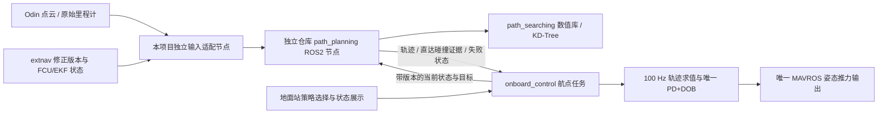

<!-- Task35：基于固定上游源码、本项目源码及 drone-new 只读检查的避障移植与集成评估；不代表实现或飞行验收。 -->
# Task35：避障算法 ROS2 移植与机载集成评估

日期：2026-09-23。任务来源：[35-obs-avoidance.md](../task/35-obs-avoidance.md)。
配套交付：[实施计划](report-2026-09-23-task35-obstacle-avoidance-implementation-plan.md)。

## 1. 结论与投入建议

**有条件可行，建议分阶段实施；不建议把上游原样转换为 ROS2 后直接接管飞机。**

| 评估对象 | 判断 | 难度 | 主要原因 |
| --- | --- | --- | --- |
| 仅提取 `path_searching`、`path_planning`，迁至 Jazzy | 可行 | 中 | 无必须连带迁移 FAST-LIO/Livox 的编译依赖；主要数值算法是 C++/Eigen/PCL |
| 独立、可复用的 ROS2 规划仓库 | 可行 | 中高 | 需要清理 MAVROS/PX4/演示节点耦合，并修复算法与接口缺陷 |
| 接入当前“自动避障” | 可行，但尚未验证 | 高 | 坐标与时钟一致性、带时间轨迹、重规划连续性、机载失败闭环是主要工作 |
| 接入“遇到障碍悬停” | 可行，但尚未验证 | 中高 | 可复用同一规划器，但必须另外输出直达通道的碰撞证据；不能用 A* 失败代替障碍检测 |
| Orin NX 上约 10 Hz 规划 | 值得验证的目标，不能承诺已达到 | 中高 | 当前未运行算法；输入点数、遮挡、无解搜索、双树维护和整机负载均影响最坏耗时 |
| 复现论文的动态细小障碍效果 | 当前证据不足 | 高 | Odin 点云可见性、滤波与时延尚未测量；不能把上游传感器/机体结果转移为本机能力 |

建议先完成 **3～5 人日的输入与坐标证据阶段**，再决定后续投入。完整可复用规划器约 **15～24 人日**，本项目接入与验证另约 **16～25 人日**，总计 **31～49 人日**；含约 25% 排障余量按 **39～62 人日、单人约 8～13 工作周**安排。此估算以熟悉 C++/ROS2 和当前控制链的工程师为前提，不含等待场地、硬件整改或新增动态目标预测算法的时间。

回报主要是形成可复用的局部运动学规划能力，以及把已有两个占位策略落实为机载闭环。风险主要在感知、轨迹执行和故障处理，**ROS 版本迁移本身不是最大成本**。

## 2. 本次实际完成的检查与证据边界

### 2.1 固定版本

| 对象 | 本次基线 |
| --- | --- |
| 本地主项目 | `3f529075960fe9681168adbfe2dd5c8ed7fb62db`，`main` |
| 上游 | `hku-mars/dyn_small_obs_avoidance`，`9d25dd6974e04518c892e5711c9be9082558e5eb` |
| 上游提交日期 | 2021-04-27；这是所检查 main 的 HEAD，不是对所有分支或第三方 fork 的判断 |
| 本次 SSH 目标 | `drone-new`，连接实际落在 `192.168.112.169` |
| 机载硬件 | NVIDIA Jetson Orin NX，aarch64，约 15 GiB 可见内存 |
| new 主项目 Git HEAD | `6a407133eb77de6fab0ddc63d5506170c64ef444`；不能用此 HEAD 代表所有现场未提交文件与 install |
| new Odin 仓库 HEAD | `6f993ccc4ccad9395bfc68bc3235f993d83c4fe6`；配置另有现场差异 |

上游完整检出保留在本地过程目录 `agent/codex/task35-upstream/`，未修改检出内容；只审查与任务相关的两包。new 只读检查摘录保留在 `agent/codex/task35-evidence/drone-new-readonly.txt`。关键发现已经写入本报告，不依赖过程目录才能理解结论。

### 2.2 本次没有进行的验证

本次没有移植、编译或运行上游规划器，没有运行 SITL，没有测量规划耗时、实际避障成功率或动态障碍检出率，也没有实机解锁、起飞、参数写入、部署或服务启停。因此下文的性能预算与验收阈值都是**后续建议值**，不是测试成绩。

2026-09-23 15:34～15:37 CST 检查时，new 飞控 unit 为 `failed`、退出码 130；日志显示此前 15:01～15:02 有停止过程，不能仅凭此状态认定程序崩溃。未发现所检查的 Odin、extnav、onboard、MAVROS 主进程；视频和修正 unit 为 inactive。本次保持原状，没有为了评估擅自启动硬件服务。因此未获得实时点云样本或当前 FCU 武装状态，亦不声称进行了未武装运行台架测试。

## 3. 上游究竟提供了什么

### 3.1 是 kinodynamic A*，不是普通栅格 A*

搜索状态包含位置与速度，运动原语按恒加速度积分；接近目标时尝试三次多项式直接连接。碰撞查询使用时间累积点云的两棵 KD-Tree。它适合用作局部无人机轨迹规划的起点，包含比几何折线更多的可执行信息。代码分别位于 [搜索实现](https://github.com/hku-mars/dyn_small_obs_avoidance/blob/9d25dd6974e04518c892e5711c9be9082558e5eb/path_searching/src/kinodynamic_astar.cpp) 与 [搜索接口](https://github.com/hku-mars/dyn_small_obs_avoidance/blob/9d25dd6974e04518c892e5711c9be9082558e5eb/path_searching/include/path_searching/kinodynamic_astar.h)。

上游论文报告了其整机 50 Hz 感知规划、2 m/s 飞行和 20 mm 杆状障碍实验。这些数字属于作者的平台与实验条件，不能作为 Odin、当前机体或当前控制器的性能承诺。[论文原文入口](https://arxiv.org/abs/2103.00406)

代码没有建立完整的动态障碍目标跟踪与未来运动预测模型。`dynamic` 参数提供时间维索引，但当前规划节点的调用使用默认 `false`；碰撞查询本身仍查空间点云。其动态响应主要依赖不断更新的感知、地图和重规划。名称中的 dynamic 不等于能预判任意横穿障碍。

### 3.2 两包可独立抽取，但地图维护仍在范围内

| 内容 | 处理建议 |
| --- | --- |
| `path_searching/src/kinodynamic_astar.cpp`，944 行 | 保留搜索、运动原语、终端多项式、KD-Tree 能力，修复确定缺陷 |
| `path_searching/include/path_searching/kinodynamic_astar.h`，222 行 | 拆开数值接口与 ROS 参数/调试发布；保留为同一包内实现 |
| `path_planning/src/path_planning.cpp`，467 行 | 保留规划编排职责，重写 ROS2 消息、调度与结果契约 |
| `goalpoint_transformer.cpp`，52 行 | 演示用一次性 TF 转换，不适合生产；不作为必需运行节点 |
| `DenseInput.h` | 未在这两包生产 cpp/h 中发现引用，不默认携带无用头文件 |
| FAST-LIO、Livox、原控制器/演示轨迹执行器 | 不移植、不集成 |
| 时间累积点云、KD-Tree 碰撞检查 | 属于两包已有规划能力，必须保留或在其内部修复，不能误当作“不需要的 SLAM”删掉 |

两个 CMakeLists 的实际目标不要求编译 FAST-LIO/Livox；是默认 demo launch 额外启动了它们。`demo_withNOlidar.launch` 已表达外部点云输入的用法。迁移时应移除失实/未使用的依赖声明，显式列全真实消息与库依赖。[构建与 launch 目录](https://github.com/hku-mars/dyn_small_obs_avoidance/tree/9d25dd6974e04518c892e5711c9be9082558e5eb/path_planning)

### 3.3 与任务预期存在的行为差距

上游主要在新目标时规划、在点云回调检查既有轨迹后按需重规划，**不是固定约 10 Hz 从真实当前位置对下一航点重新搜索**。重规划分支还依赖 `/demo_node/trajectory_time_index`，可能从旧参考轨迹的未来索引出发，不符合任务明确的“自身位置”。

`getKinoTraj(0.01)` 输出位置采样，发布为 `nav_msgs/Path`。虽然内部有运动原语的时间与速度，发布接口没有完整的逐段时间、速度、加速度、有效期与失败状态，不能把收到的 Pose 数组直接视为已经可供当前 100 Hz 控制器使用的时序轨迹。[规划节点源码](https://github.com/hku-mars/dyn_small_obs_avoidance/blob/9d25dd6974e04518c892e5711c9be9082558e5eb/path_planning/src/path_planning.cpp)

## 4. 源码审查发现：必须计入移植成本

以下是固定版本的静态证据；“可能越界”等后果尚未通过运行复现。行号以 Git 检出为准。

| 发现 | 定位 | 对移植的影响 |
| --- | --- | --- |
| z 速度写入 y 分量，z 分量未在该处赋值 | `path_planning.cpp:52–60` | 错误初始运动状态，必须修复并覆盖非零三轴速度 |
| 前次目标/前次起点等数值状态缺少完整初始化，目标就绪与里程计就绪没有分开 | `path_planning.cpp:70–81,335–360` | 第一帧/消息乱序时可能使用无效状态 |
| 路径长度发布为实际点数加一，后续循环据此索引 | `path_planning.cpp:110–115,325` | 某些长度（例如 40 的倍数）会访问末尾之外；外部 time index 也需要独立边界检查 |
| 搜索失败直接返回，旧路径及已发布结果没有显式失效 | `path_planning.cpp:152–161,224–233` | 消费端可能继续使用旧路径，不满足失败即悬停 |
| 将 horizon/near-end 等非 NO_PATH 结果一律视为成功 | `path_planning.cpp:149–170`；搜索枚举 | 局部进展不能当成“达到目标”或“完整可达” |
| `timeToIndex()` 计算后无返回；静态搜索也计算时间索引，并读取未初始化时间成员 | `kinodynamic_astar.cpp:281–300,928–931` | 未定义行为，不能认为 dynamic=false 就完全规避 |
| `origin_`、`map_size_3d_` 无有效初始化，仍参与网格索引与 shot 边界检查 | `kinodynamic_astar.cpp:600–603,700–709,917–919` | 非确定性结果，需明确规划边界 |
| shot 段的速度/加速度超限拒绝被注释 | `kinodynamic_astar.cpp:593–597` | 搜索原语限幅不等于整条轨迹限幅 |
| 原语高度硬编码 0.2～1.3 m，shot 走另一套地图边界 | `kinodynamic_astar.cpp:345–350` | 不适配当前航点高度；全路径必须统一约束 |
| 碰撞距离固定 0.45 m，体素固定 0.1 m；launch 的 margin 未读入碰撞逻辑 | 搜索头文件；`setKdtree()`、`setParam()` | 不能把参数名存在误认为可调机体包络 |
| 节点 f-score 原地减小但 priority_queue 未重建/重新入堆 | `kinodynamic_astar.cpp:376–447` | 堆排序不再有保证；影响搜索质量与耗时，需要修复 |
| 空树/查询无结果最终返回 safe；缺少地图就绪及观测覆盖判定 | `isSafe()`、规划入口 | 没看到障碍不代表前方已观测为空闲 |
| `cloud_all` 持续累加，不随窗口淘汰 | `kinodynamic_astar.cpp:89` | 长时间运行内存增长；调试累积须去除或限额 |
| 搜索有节点数上限但无时间预算/取消检查 | `search()` | 无解复杂场景无法保证 100 ms 周期，需有界退出 |
| 原语和 shot 使用离散碰撞检查，稀疏重检查每 40 个位置点取一点 | 搜索碰撞循环；`path_planning.cpp:110` | 需要覆盖段间扫掠体，不能仅凭离散点安全断言细杆无碰撞 |

这些发现主要来自 [搜索实现](https://github.com/hku-mars/dyn_small_obs_avoidance/blob/9d25dd6974e04518c892e5711c9be9082558e5eb/path_searching/src/kinodynamic_astar.cpp)、[搜索头文件](https://github.com/hku-mars/dyn_small_obs_avoidance/blob/9d25dd6974e04518c892e5711c9be9082558e5eb/path_searching/include/path_searching/kinodynamic_astar.h) 和 [规划节点](https://github.com/hku-mars/dyn_small_obs_avoidance/blob/9d25dd6974e04518c892e5711c9be9082558e5eb/path_planning/src/path_planning.cpp)。这不是穷尽式审计；移植阶段仍需编译告警、ASan/UBSan 和边界用例。

另需注意：当前二维水平合速度限制与上游逐轴限制不同；三个轴各不超限仍可能超过合速度/合加速度预算。加速度分段不连续也不等同于限 jerk 轨迹。启发式加权搜索不能直接宣称最短路径或全局最优。

## 5. Odin 输入可用性与当前飞机发现

### 5.1 可确认的接口

检查文件为 new 的 `/home/nvidia/catkin_ws/src/odin_ros_driver/include/host_sdk_sample.h`、对应 README、launch 及 source/install 配置。

| 项目 | 源码/配置证据 | 当前结论 |
| --- | --- | --- |
| 优先候选点云 | `/odin1/cloud_slam`，`sensor_msgs/msg/PointCloud2` | 最直接匹配已配准环境点云输入 |
| 字段 | x/y/z/rgb 为 FLOAT32；SDK 坐标除以 10000 发布 | 可转为 PCL XYZ；无需依赖 RGB |
| 坐标 | header `odom`，README 同样说明 odom 系 | 不是最终 MAVROS EKF 坐标；不能只 remap 话题就接上 |
| 高速里程计 | `/odin1/odometry_highfreq`，odom→imu | 可提供时间关联；规划起点仍应以控制器实际使用的 FCU 状态为准 |
| 发布 QoS | 点云 RELIABLE/VOLATILE/depth=5 | 接收端建议小队列、优先最新帧；实际端点需运行时核验 |
| 时间 | source/install 均 `use_host_ros_time: 0` | 使用设备时间，不能直接与主机 now 相减判龄 |
| 点云开关 | source/install 均 `sendcloudslam: 1` | 仅说明配置意图，服务未运行时不构成正在发布的证据 |
| dtof 频率配置 | `dtof_fps: 100`，注释含义为 10 fps | 不证明 cloud_slam 实际为 10 Hz，也不证明数据端到端低于 100 ms |
| 备用输入 | `/odin1/cloud_raw`，含 intensity/confidence/offset_time，lidar 系 | 若 slam 点云不保留移动物体，可评估 raw；仍用 Odin，不迁移上游 SLAM，但增加去畸变/时序/坐标处理工作 |

ROS2 支持 RELIABLE 发布端匹配 BEST_EFFORT 订阅端；反向不匹配。建议配置可调并核验实际 DDS 端点，不能用增加队列深度掩盖积压。[ROS2 Jazzy 官方 QoS 文档源码](https://github.com/ros2/ros2_documentation/blob/jazzy/source/Concepts/Intermediate/About-Quality-of-Service-Settings.rst)

### 5.2 source/install 配置不一致

| 开关 | source | install |
| --- | --- | --- |
| streamctrl | 0 | 1 |
| senddtof | 0 | 1 |
| sendrgbcompressed / sendrgb / sendimu | 0 | 1 |
| send_odom_baselink_tf | 0 | 1 |
| sendcloudrender | 0 | 1 |

源码配置 SHA-256：`cdbbc58bd0fac1dba53aed78560d3f4ef55917563bfff089da6890a0531fffcc`。
安装配置 SHA-256：`6da59cbe6cd29cbcb8ee16e32c3839e71e77342734d064612c725b2029f5b1d0`。

检查到的 launch 默认从包 share 目录加载配置，通常对应 install；仍需结合实际启动参数确认。不能根据 source 中“关闭了若干功能”来估计真实 CPU 余量。此次没有统一这些文件，也没有重建 Odin。

### 5.3 仍需用现场数据回答的问题

1. cloud_slam 是单次/滚动观测，还是包含更长历史的地图输出？动态物体进入和移出后，点出现/消失延迟是多少？仅凭话题名称、SDK 发布代码无法确定设备内部策略。
2. 有效 FOV、近距盲区、最大可用距离、薄杆/电线/透明和低反射物体表现如何？体素滤波是否破坏细小障碍证据？
3. 机体/桨叶自反射与地面点是否影响碰撞查询？不能简单删除某一高度以下全部点，以免漏掉低障碍。
4. header 间隔、接收间隔、每帧有效点数、丢帧、设备处理延迟和 ROS 传输排队分别是多少？
5. 侧飞、后退及垂直绕行是否处于当前可观测空间？历史看见过不等于现在无动态障碍。

**若 cloud_slam 抑制动态点或保留长时间残影，直接使用该话题实现动态障碍效果就存在输入层阻塞。** 应先验证 raw 路线或调整需求决策，不能把规划算法正常运行当作已解决。

## 6. 本项目接入难点与最小合理边界

### 6.1 现有接口已经有策略值，但没有规划通道

`ExecuteWaypoints.srv` 已有 STRAIGHT=0、AVOID=1、HOVER_ON_OBSTACLE=2。当前 `on_execute_waypoints()` 会把非直线值回退为 STRAIGHT；GUI 也明确提示占位。`ControlStatus` 尚无规划就绪、路径版本、障碍等待倒计时等字段。不存在可直接插上新节点就生效的外部轨迹执行接口。

机载 `control_tick()` 在递归互斥锁内执行 100 Hz 主循环；现有 `ReferenceGenerator` 由航点建立直线参考，`ControlReference` 已包含位置、速度、加速度、yaw，后接唯一 `DobController`。正确接入位置是**参考输入分支**，不应把 A*、PCL 建树或远程服务等待放进该控制锁。

本地主线证据：`src/onboard_control/src/onboard_control_node.cpp:946,1111,1253,1327,1799,1894,1991`；`src/onboard_control/include/onboard_control/dob_controller.hpp`、`reference_generator.hpp`；`src/guided_interfaces/srv/ExecuteWaypoints.srv`；`ground_station_core/qt_ui/waypoint_panel.py:337`。

### 6.2 推荐部署与依赖方向

- 独立仓库只保留两个功能包。`path_searching` 提供与 ROS 无关的 C++ 核心；`path_planning` 提供通用 ROS2 节点、接口、配置、launch、回放示例和测试。
- Odin/extnav/本项目 `guided_interfaces` 的知识放在主项目适配层，不进入通用算法仓库。规划器不发布 MAVROS setpoint，不申请飞行租约，不负责 arm/takeoff/LAND。
- 机载控制中增加小型轨迹接收/验证/求值及避障任务状态模块；规划进程停止或卡死时，该模块独立触发悬停/降落。不能把唯一故障看门狗放在可能卡死的规划进程中。
- 地面站保留选择入口，只增加能力门控与权威状态展示。无需把点云传回地面站进行规划，也无需新增一套飞行控制器。
- 规划服务建议独立 systemd unit；主飞控 unit 不因规划器重启被联动停止。算法不可用时，直线策略仍可按既有规则工作；选择避障策略必须拒绝静默直线回退。

“尽量独立”可实现；“完全不改机载控制或地面站”则不能完整实现任务要求。

### 6.3 坐标系：不能只改 frame_id

当前存在 Odin 原始 odom、Tag 修正坐标、extnav FCU 中心、MAVROS EKF local ENU 多个层次。当前 extnav 在修正有效时水平使用 Tag 世界坐标，z 仍沿用本地高度；无效分支保留历史原点约定。环境点云和机体位置必须遵循同一参考系与同一修正版本。

在当前零安装角的生产约定下，可用以下关系作为独立物理验证的推导起点，不能不经验证直接部署：令 `Q=Rz(correction_yaw)`，水平平移为 t，固定杆臂为 T。

- 无修正：环境点 `p_E = p_O + T`；FCU 位置为 `p_I + T - R·T`。
- 有修正：环境点水平 `(Q·p_O+t).xy`，高度 `p_O.z+T.z`；FCU 则从修正后的 IMU 位姿减去旋转杆臂，并保留原 z 约定。

**不能对每个环境点都减去机体当前 `R·T`**；该项是 IMU→FCU 的参考点变换，不是让静止障碍随飞机姿态移动的全局坐标变换。一般安装角或其他原点配置必须重新由坐标链推导，不盲用上述特例。

上述 E 系还不是经验证与 MAVROS EKF 完全一致的 F 系。应以时间对齐的 extnav FCU pose 与 MAVROS pose 建立/核验 `T_F_E`，并检查其残差、稳定性和 EKF 重置；不能逐帧用不同时刻的两条 pose 强行拟合，吸收真实跟踪误差。统一之后，规划起点取实际 FCU 状态，目标取任务下一航点，点云变换到同一规划系。

Odin session、correction revision、参考模式、FCU 重启/原点重置中的任何变化，都必须使旧地图、旧请求与旧轨迹失效。当前标准 header/frame 名称不足以表达这些版本，需适配层显式带出。坐标尚不稳定时等待，不能混用新位姿与旧点云路径。推导依据：`correction_service/extnav_patch/extnav_to_vision_pose.py:138,193,658` 与 `src/correction_interfaces/msg/ExtnavCorrectionStatus.msg`。

### 6.4 时间、轨迹及重规划连续性

- 设备 header 用于 Odin 点云和里程计关联；主机单调接收时间用于失联检测。设备到主机的测量时刻映射需单独验证，不伪造 host stamp 来抹去延迟。
- 10 Hz 发起新规划请求；100 Hz 控制器只对已验证轨迹按真实经过时间求值。100 Hz 插值点数不等于规划频率。
- 最合适的复用方式是导出搜索所得恒加速度段和三次 shot 段的系数/时长，直接求出 p/v/a；位置采样用于可视化。这样不再调用本项目梯形/S 曲线等空间轨迹生成器，也不会重新平滑而改变避障路径。
- 每次请求以实测当前位置和速度为初始状态，而非旧参考索引。求解期间飞机继续运动，结果接收时必须校验数据年龄、预测起点与实际状态偏差；偏差过大则弃用、悬停后再规划，不能跳回旧起点或任意“最近点”接入。
- 一般运动原语只保证段内运动学关系；跨段加速度、跨次规划的 p/v/a 和 yaw 连续性仍需验收。若无法直接平稳衔接，修复应在规划结果生成与验证侧完成，不能在控制侧用未经碰撞复验的平滑器掩盖。
- yaw 仍需尊重航点要求并限速；若传感器 FOV 要求朝向行进方向，应作为明确的规划约束解决与航点 yaw 的冲突，不能悄悄覆盖航点 yaw。

## 7. 两种策略应实现的准确语义

### 7.1 自动避障

1. 开始前确认新鲜点云、状态、坐标版本和规划器就绪。目标始终是**下一个任务航点**。
2. 约 10 Hz 从当前状态重新规划，收到有效轨迹后直接按其时间参数执行。内部路径采样点不加入任务航点列表、不计为到点、不触发拍照。
3. 任何明确规划失败、计算超时、过期输入、非法轨迹或规划器失联，都由机载控制冻结一个悬停位置并进入等待；不是继续沿缓存路径盲飞到等待超时。
4. 等待中继续约 10 Hz 尝试，连续获得新鲜且可接入的安全结果后才恢复同一航点。等待计时不因一次搜索成功或一条重复消息就清零。
5. 等待超时，原航点任务以失败终态结束，机载独立请求原地 LAND。可靠落地结束仍以解除武装为准，不能把 LAND ACK 当作已经落地。

部分路径可作为滚动规划的候选，但必须标明 `PARTIAL/HORIZON`，在已知可观测安全区域内具有停车余量，并检查持续进展。它不表示目标已到达；一旦无法提供可继续执行的安全前缀或陷入无进展，仍进入任务要求的等待/降落链。若首版只接受完整到达目标的轨迹，也必须如实说明其长距离任务限制。

### 7.2 遇到障碍悬停

仍按任务要求约 10 Hz 调用同一规划器，但**不执行其绕行解**。规划输出需要同时包含当前位置→下一航点直达通道的 `CLEAR/BLOCKED/UNKNOWN` 判定及最近障碍距离。

直达通道是机体包络沿线段扫掠形成的体积，加上定位、跟踪、感知与离散化余量；不是只检查中心细线。A* 找到绕行路径时，直达通道仍可能 BLOCKED；A* 因超时失败时，也未必真实存在障碍。因此两类状态必须分开。

建议无障碍时执行规划器提供并验证的**直达时序轨迹**，使两种避障策略统一走外部参考通道；地面站既有插值选项在这两种策略下显示不适用。若用户后续更希望该模式保留原直线生成器，则必须把其实际轨迹及停车段也交给碰撞检查，不能只查名义线段。本建议不改变“遇障不绕行”的要求。

BLOCKED 时立即悬停等待；UNKNOWN 或规划失败也等待，但状态明确标为感知未知/规划失败，不能谎报“检测到障碍”。障碍消失且连续新观测确认后恢复；超时终止任务并原地降落。远处目标不在已观测区域时，必须区分“已知障碍”和“尚不确定”；不能把区域外自动判为空闲。

### 7.3 必须单独实现的失败闭环

建议等待 5 s、恢复要求至少 3 次新鲜一致结果作为初始台架参数，最终以场景和动态点消退时间调整；这不是本次确认的最终飞行参数。每次连续失败期使用单调时钟，不能每 100 ms 重设 5 s 倒计时。

现有 `enter_hover()` 会重置航点参考状态，现有 `cancel_active_task()` 会清空任务队列；不能直接反复调用这些函数来实现“保留任务、等待后恢复”。应增加小型障碍等待子状态，冻结一次悬停点，保留目标、票据和索引，暂停入点计数；超时才显式终止任务。

等待超时不能只设置 `vehicle_abnormal`：当前实机 GUI 对某些异常仅提示，仿真又可能触发既有返航组合，都不等价于任务要求的原地降落。应由机载控制直接执行任务失败＋LAND，并保证 GUI/上位机不会把这一终态改成返航、新任务或完成。定位/飞控链本身失效时，原有更高优先级安全处理不等待避障倒计时。

悬停并非瞬间停止。前向障碍可在制动距离内被触碰，悬停也不能躲开所有主动撞来的物体；原地 LAND 的下降通道还可能有障碍。本方案落实用户指定失效动作，但不能据此承诺在任意动态场景中绝对无碰撞。

## 8. 10 Hz、点云窗口与机体安全余量

### 8.1 10 Hz 是整条规划流水线目标

初始可按 100 ms 周期预算：输入与坐标处理 10 ms、局部地图维护 15 ms、搜索及碰撞复验 50 ms、输出与接收 5 ms、调度余量 20 ms。**只是预算，不是测量**。应报告全链 P50/P95/P99/max，特别记录地图输入年龄、无解搜索时间和控制 deadline miss 增量。

最小实现采用有界局部地图、固定节点池、单一规划 worker、只保留最新待处理请求、规划截止时间、有限输出大小。完成旧请求不能覆盖新航点。建树与搜索共享不可变快照或严格串行化，不能迁到多线程 ROS2 后让更新树与查询树并发竞态。

Orin NX 提供合理的工程验证平台，但可见内存余量不等于热稳态算力余量；需要带 Odin/MAVROS/onboard，必要时加视频负载一起测试。不建议在证据不足时引入 GPU、复杂进程框架或实时权限改造。

### 8.2 原时间窗口不能照搬

上游 `KT_HORIZON=50`、`KT_NUM=2` 是按消息数量轮换：每 50 帧开始替换一棵树。假定输入 10 Hz，最老保留证据可接近 10 s；假定 50 Hz 则约 2 s。它不是自动按秒对齐的动态地图。若输入 cloud_slam 本身含历史点，外层继续累计会延长残影。

应改为按实际时间与空间范围管理，并明确旧点“过期”只表示未知，不能自动证明被遮挡区域为空闲。为了加快障碍消失而任意缩短窗口会丢静态障碍，为了补稀疏点而任意拉长窗口又会造成动态残影。需通过 Odin 实测选择窗口与未知区域策略。

### 8.3 制动与感知距离应共同限制速度

可用作初步静态障碍预算的关系：

`D_required ≥ R_body + M_error + v·T_total + v²/(2·a_brake)`。

其中 R_body 是包含旋翼的包络，M_error 汇总定位、跟踪、感知、体素与碰撞检查误差；T_total 包含感知更新/处理、规划调度、DDS、控制响应。a_brake 必须来自实测可实现的制动能力，不能使用控制输出 4 m/s² 硬限幅来替代。

示例仅供尺度判断：若 v=1 m/s、T_total=0.25 s、可实现制动减速度=0.4 m/s²，单运动项就有 1.50 m，尚未加机体和误差；0.4 只是当前梯形参考减速度配置，**不是已测飞机制动能力**。因此不能把上游 0.45 m 碰撞半径直接当成足够提前量。横穿/迎面障碍还要计相对运动、遮挡及检测不确定性，不能只套静态公式。

## 9. 风险—回报与选择

| 风险 | 等级 | 后果 | 主要控制办法 / 是否已验证 |
| --- | --- | --- | --- |
| cloud_slam 不保留及时动态观测 | 高 | 规划器根本看不到目标 | 先录制移动障碍出现/消失数据；本次未验证 |
| 坐标/时间/修正版本错配 | 高 | 障碍位置整体错位 | 独立物理真值与版本失效测试；本次仅核查源码 |
| 上游未定义行为和失败路径缺陷 | 高 | 崩溃、错误轨迹、旧路径残留 | 核心修复＋故障注入；本次静态发现 |
| 点采样漏碰、未知空间当自由空间 | 高 | 细障碍碰撞 | 扫掠体复验和观测覆盖语义；需后续实现 |
| 搜索长尾与整机负载 | 高 | 不能稳定按 10 Hz 响应 | 有界搜索＋Jetson 热稳态性能门槛 |
| 重规划跳变和制动不足 | 高 | 跟踪失稳或来不及停止 | 时序轨迹、接入条件、低速验收与实测限速 |
| 悬停恢复/超时动作被 GUI 组合流程覆盖 | 高 | 错误返航或继续任务 | 机载终态与 LAND 优先，GUI/上位机仅投影 |
| 长窗口残影、FOV 和 yaw 冲突 | 中高 | 无故等待降落或向盲区运动 | 观测质量阶段明确支持包线，禁止默默缩减需求 |
| 新旧接口混用、两机部署不同步 | 中 | 误判策略已启用 | 协议/能力协商与同步记录，缺能力拒绝避障任务 |

| 路线 | 投入 / 回报 | 评价 |
| --- | --- | --- |
| 原样转换 ROS2、话题重映射后使用 | 编译快，但未解决执行与安全语义 | 不满足 task35，不作为完成路线 |
| 保留两包的算法，修复核心并重写薄 ROS2 编排 | 复用主要搜索思想和实现，得到通用规划器 | 推荐，前置输入验证后投入 |
| 只做直达障碍检测＋悬停 | 相对便宜，可作为中间验收阶段 | 只能覆盖第二策略，不能冒充完整交付 |
| 另选成熟规划器或重写规划系统 | 可能有更成熟能力，也有新依赖和适配成本 | 当输入/性能门槛失败时重新比较；不在本次擅自换方案 |

独立仓库继承的两包均标注 GPLv3，根目录提供 GPL-3.0 许可证。新仓库应保留许可、来源与修改说明；不能直接把衍生代码换成软著仓库的 Apache-2.0。独立进程主要用于工程隔离，不应当作自动解决全部分发许可问题的结论；公开发布时按实际组合和分发方式核对义务。[上游 LICENSE](https://github.com/hku-mars/dyn_small_obs_avoidance/blob/9d25dd6974e04518c892e5711c9be9082558e5eb/LICENSE)

## 10. 任务执行简报与未实现指标

- 已完成：上游两包源码/依赖/行为审查，本地航点与控制接口核查，new 硬件及 Odin 源码/配置只读检查，难度/工作量/风险回报评估和分阶段实施计划。
- 文档验证：两份报告的本地链接、代码围栏和工作量分项合计已检查；新增文档空白检查通过，原有受跟踪文件无差异。未运行与本次纯评估无关的项目测试。
- 未实现、未验收：ROS2 移植、独立算法仓库创建、两种避障策略、10 Hz 指标、闭环故障处理、SITL 与实飞。这些属于用户明确要求暂不执行的后续工作。
- 本次仅新增两份任务交付报告及被忽略的本地取证材料；不修改生产代码、参数、TODO 或 MEMORY，不创建开发分支、不部署、不启停服务。MEMORY 中“避障尚未实现”的真实基线仍然成立。
- 本次按“只输出报告、不执行修改操作”的任务边界保留报告供本地审阅，未执行 Git 提交/推送或创建新的远端算法仓库。

实施启动前最关键的通过条件是：**Odin 的障碍数据足够及时可用、能可靠对齐飞控坐标、修复后的规划器在目标硬件上满足时延与碰撞检查要求**。详细阶段、接口和验收矩阵见配套实施计划。
