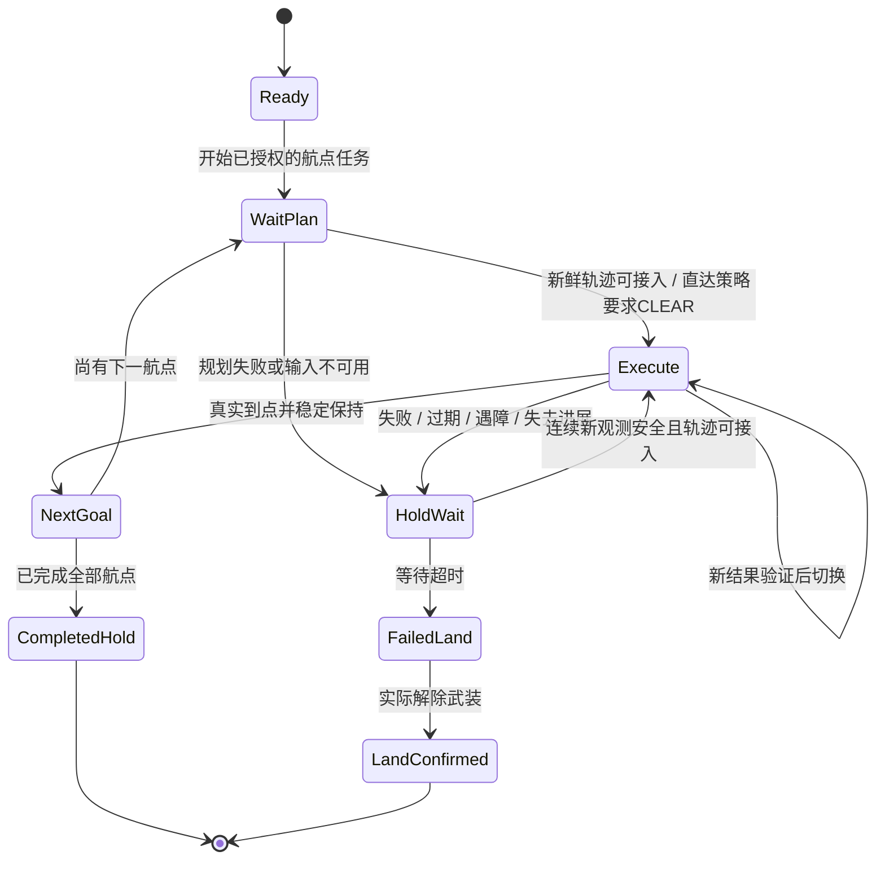

<!-- Task35 配套实施计划：仅为未来实施与验收设计，不表示已获本次移植、部署或飞行授权。 -->
# Task35：ROS2 独立避障规划器与本项目集成实施计划

日期：2026-09-23。依据：[分析评估报告](report-2026-09-23-task35-obstacle-avoidance-assessment.md)。
本次只交付计划，不执行以下源码修改、仓库创建、部署或实验。

## 1. 交付目标与范围

完整交付必须同时满足：

1. 新建独立仓库，建议名 `dyn-small-obs-avoidance-ros2`，只包含 `path_searching`、`path_planning` 两个功能包及必要测试、配置、文档；可脱离本项目、Odin、MAVROS、ArduPilot 使用。
2. 在飞机上运行约 10 Hz 规划；当前 FCU 实测状态为出发状态，下一任务航点为目标，直接执行规划器的带时间轨迹，不走当前本项目的空间插值生成器。
3. 自动避障执行可验证的绕行轨迹；遇障悬停策略仅在直达通道可用时前进，发现阻挡则悬停，不执行绕行轨迹。
4. 任一规划失败进入有界等待，恢复条件满足后继续同一任务；超时终止任务并原地 LAND，失败与落地结果分开确认。
5. 原有机载唯一 PD+DOB、租约、人工接管、起降、航点到达/抓拍、视频故障隔离保持有效。规划器断开或崩溃不能阻塞 100 Hz 控制。

本计划不迁移 FAST-LIO、Livox 驱动或上游演示控制器，不实现其他 TODO，不引入动态障碍预测作为隐含必做项。若达不到 Odin 观测或动态场景要求，应如实报告限制并重新决策，不能私自把完整需求缩减为静态障碍演示。

## 2. 仓库与进程边界

### 2.1 独立算法仓库

```text
dyn-small-obs-avoidance-ros2/
  LICENSE                      # 保留上游 GPLv3 许可与来源
  README.md                    # 输入/输出、约束、复现与性能边界
  THIRD_PARTY_NOTICES.md        # 来源提交、保留组件与修改说明
  path_searching/
    include/path_searching/    # 无 ROS/MAVROS/Odin 类型的核心接口
    src/                      # 搜索、局部 KD-Tree、碰撞与时序轨迹
    test/
    CMakeLists.txt
    package.xml
  path_planning/
    msg/                      # 必要的通用请求/结果/分段轨迹定义
    src/                      # ROS2 调度、输入验证、输出与诊断
    config/
    launch/
    test/
    CMakeLists.txt
    package.xml
```

接口定义可由 `path_planning` 包内 rosidl 生成，首版不为此增加第三个功能包。核心库可用普通 C++ 数据结构独立测试；ROS2 wrapper 使用 rclcpp、sensor/nav/geometry/trajectory/diagnostic 等实际所需消息。保留 Eigen、PCL KD-Tree/filters，清掉未用 cv_bridge、rospy、octomap 等声明；具体依赖以构建审计为准。

目标平台明确为 Ubuntu 24.04 / ROS2 Jazzy / amd64 与 aarch64。先完成这两个平台的原生验证，不把“支持 ROS2”泛化为所有发行版兼容。不引入 ROS1 bridge 作为最终方案。

### 2.2 本项目适配

建议新增 `src/obstacle_avoidance_adapter/`，职责只包括 Odin 点云归一化、时钟关联、extnav/FCU 坐标版本与输入质量检查。规划节点和适配节点可由一个独立避障 unit 编排，保持与飞控控制 unit 分开的生命周期；无需增加更多常驻服务。

机载内部增加 `avoidance_executor` 小模块，负责请求身份、结果验证、100 Hz 求值、等待/恢复/失败转换。不得将 KD-Tree 或搜索实现复制进 `onboard_control_node.cpp`。

部署依赖单向：本项目依赖独立规划接口；独立仓库不引用 `guided_interfaces`、`correction_interfaces`、Odin SDK 或本项目路径。规划节点没有解锁、起飞、模式切换或 setpoint 权限职责。机载 LAND 仍通过当前权威路径执行。

## 3. 通用接口契约：先定语义，再定文件名

以下是最小字段组，不要求照搬为多层抽象。可将状态和轨迹放在同一个结果消息，避免跨话题拼接出不一致的结果。

| 消息/数据 | 必须表达的内容 | 作用 |
| --- | --- | --- |
| 输入点云快照 | 测量 stamp、接收单调时刻、规划 frame、地图/变换 epoch、有效点与观测覆盖信息 | 区分空闲、未观测、断流和旧地图 |
| 请求 | requester/session、goal revision、request id；同系同时间的起点 p/v/a、终点 p/v；预算与策略所需的直达查询标志 | 取消旧任务并追踪结果来源；不暴露本项目机型语义 |
| 规划结果 | 对应 request id、goal revision、input/map epoch、求解耗时、测量年龄、结果有效期、状态码 | 阻止晚到结果覆盖新目标；明确失败原因 |
| 可执行轨迹 | 各段时长、p 的系数（恒加速度段/三次段），总时长、终端状态 | 100 Hz 直接求值 p/v/a，不重新生成空间路线 |
| 直达检查 | CLEAR/BLOCKED/UNKNOWN、最近距离或命中位置、覆盖范围与数据年龄 | 独立支撑遇障悬停策略 |
| 诊断 | 规划尝试数、有效结果数、超时/无路/过期数、CPU/RSS、地图点数 | 10 Hz 不仅统计定时器触发次数 |

结果至少区分：`OK_REACHED`、`OK_PARTIAL`、`NO_PATH`、`TIMEOUT`、`NO_MAP/STALE_INPUT`、`FRAME_CHANGED`、`INVALID_STATE/TRAJECTORY`、`CANCELLED`。其中 `OK_PARTIAL` 只表示有可用安全前缀，不能直接投影为任务航点完成。

轨迹终端若不是目标，须带可安全停车/持续重规划的语义；不满足停车余量的前缀不能执行。无进展反复 PARTIAL 要进入失败等待，不能无限以“规划成功”重置超时。

轨迹曲线系数直接来自搜索原语和 shot，不在控制器中另拟合、优化或切角。若另提供 `MultiDOFJointTrajectory` 定时 p/v/a 或 `nav_msgs/Path`，作为通用消费/可视化输出也必须与这份权威曲线一致，不能只发布没有时标的点阵。段边界和最后一个终点必须准确保留。

yaw 由明确的航点/传感器朝向约束产生并限速。不能让空间路径有效而姿态朝向导致感知区域失效；该冲突在输入验证阶段确定处理方式。

请求与轨迹优先采用 VOLATILE、小队列、显式有效期，不将 ROS1 latched 路径机械转换成永久可执行的 transient-local 结果。离线 RViz 可有独立的保留路径话题，控制端不消费它。QoS 匹配按 [Jazzy 官方说明](https://github.com/ros2/ros2_documentation/blob/jazzy/source/Concepts/Intermediate/About-Quality-of-Service-Settings.rst) 核验。

## 4. 执行与故障状态机



附加规则比图中状态名称更重要：

1. **触发即锁定悬停点一次**，关闭旧参考推进，保留本次任务目标/索引。之后继续保持该点，不把每个控制周期的新位置再次写作悬停目标。
2. 等待计时用机载单调时钟；初始候选 `obstacle_wait_timeout=5 s`。至少 3 个不同新观测周期均安全、位置速度允许接入才恢复，不能把同一帧上的 3 次搜索计作 3 个感知证据。数值需台架验证后定稿。
3. 明确失败在下一个控制周期切到 HOLD；正在预算内计算新结果不算失败，但执行中的旧轨迹只有在地图与有效期仍满足要求时才可继续。预算耗尽、旧轨迹失效或新的障碍证据到达立即 HOLD。
4. 规划失败期间不触发 waypoint arrival retry，不推进航点、不抓拍；任务成功只来自真实位置、速度与停留条件。局部路径点不转成业务航点。
5. 任务超时时先发布原任务 FAILED 终态，再以机载 failsafe 身份执行 LAND；保证每张票据只有一个终态，避免 cancel/failed/succeeded 混发。LAND ACK、模式 LAND 和实际落地分别记录。
6. 等待中用户取消应终止恢复资格；新任务、外部模式切换、FCU 重启、Odin session 变化均使旧结果失效。LAND 后规划恢复不能重新激活航点。
7. 定位失效、FCU 断链、租约丢失、人工接管等仍执行当前更高优先级规则；避障不得延长或复位既有超时。
8. 障碍超时降落一经锁存，不允许迟到 GUI/上位机组合命令自动发起返航或覆盖为新航点；保留人工接管和现有 LAND 幂等重发能力。对当前实机异常处理的其他 TODO 不做扩展。

等待中规划器持续运行；若它已崩溃/卡死，机载自身 watchdog 同样完成倒计时与 LAND。进程重启是运维恢复，不是自动恢复旧飞行任务的授权。

## 5. 分阶段工作、工作量与退出条件

估算均为人日，1 人日按约 8 小时有效工程时间；各行包含必要单元测试与文档。完整方案 31～49 人日，推荐另留约 25% 余量，约 39～62 人日。阶段依赖为 P0→P1→P2→P3→P4→P5→P6；允许在依赖已确定后穿插文档，不以并行日历天数冒充人日减少。

| 阶段 | 工作内容与交付 | 人日 | 通过条件 / 不通过的处理 |
| --- | --- | --- | --- |
| P0 输入与约定验证 | 核实 new 实际 source/install；录制 Odin、extnav、FCU 同时序数据；静态/移动障碍、坐标、FOV、时钟和机体包络证据 | 3～5 | 点云保留必要障碍且延迟可用，坐标能独立验证。若不通过，评估 Odin raw 或其他输入处理，停止承诺后续实飞 |
| P1 独立仓库与 ROS2 基础 | 固定来源与许可证；提取两包；ament/消息/launch/install；去掉飞控和传感器硬耦合；amd64/ARM64 构建 | 3～5 | 仅两功能包可在无 MAVROS/Odin 的环境启动、收输入、给确定状态；不把编译通过写成避障完成 |
| P2 核心修复和有界规划 | 修复评估表缺陷；统一边界/限幅；有限地图；未知空间与扫掠碰撞；搜索预算/取消；时间轨迹导出 | 5～8 | 回归、ASan/UBSan、独立碰撞复验通过；无解和缺数据返回明确状态，内存不无限增长 |
| P3 通用 ROS2 行为与 Jetson 离线基准 | 10 Hz 从当前状态请求；完整/部分路径语义；直达查询；版本与有效期；确定性回放与热稳态负载测试 | 4～6 | 标准场景满足约定时延，10 Hz 有实际有效输出；两包可脱离主项目复现；未通过不能宣称通用可用版本 |
| P4 本项目最小接入 | 新输入适配包；onboard 外部参考与 HOLD 状态；机载超时 LAND；状态协议/GUI/组合流程协调 | 6～9 | 数据链与故障闭环完全在机上，自动避障与遇障悬停语义不同且正确；STRAIGHT 回归通过 |
| P5 隔离 SITL 完整验收 | 构造与 SITL 位置一致的障碍点云；完整巡检/上位机/抓拍流程；故障注入与多负载 | 4～6 | 碰撞真值、任务终态、人工接管、模式切换及超时 LAND 均通过，未出现双 setpoint 发布者 |
| P6 机载影子运行和用户实飞验收 | 带版本部署/回退；未武装观察；用户手动起飞的低速场景逐级验证；正式报告 | 6～10 | 原始日志和物理真值满足要求；未飞部分明确标未验收；实机解锁与起飞始终只由用户操作 |

P0～P3 合计 15～24 人日，是“可复用独立规划器”的交付边界；P4～P6 另 16～25 人日。P1 的 3～5 人日是基础迁移工作量，不能单独承诺完整功能。若 Odin raw 路线需要新的逐点去畸变/遮挡处理，或单点云不足以提供所需观测覆盖，应在 P0 后更新估算，不藏进原预算。

## 6. P0 必须先解决的现场细节

### 6.1 基线与采样

- 按别名连接并再次确认 IP、机体、外设、HEAD、现场差异和 install；本次 new 是 `192.168.112.169`，不能永久用旧 MEMORY 的名称/IP 对应代替核实。
- 本次服务已停，后续采样需按新的实施授权和现场状态启动必要组件。不要为拿点云启动整套会写飞控的流程；也不要覆盖本次发现的 source/install 差异。
- 采集 cloud_slam、raw（若实际开放）、同设备时钟 odometry、extnav 最终输出/修正版本、MAVROS local pose/velocity、接收单调时刻。高频录制本身可能丢样，必须记录录制质量。
- 记录静态平面、最小目标障碍、移动障碍进入/移出、遮挡、侧后方、空帧、断流、Odin 重启。量化检出/消退延迟，区分厂家内部地图残影与本地累积残影。
- 物理量测机体含桨包络，指定最小障碍尺度与最大相对速度；任务未给出这些数值，不擅自宣称达到论文 20 mm 指标。

### 6.2 坐标及时钟验收

复用评估报告中的坐标推导，制作独立实测点集：已知方位/距离的障碍，在至少多个飞机位置和 yaw 下验证同一障碍变换后保持固定；不能用同一变换程序生成输入与真值自证正确。

分别检查 correction valid=false、valid=true、apply/clear、Odin session 变化和 FCU 重启。环境点只做世界坐标变换；IMU→FCU 杆臂只作用于机体参考点，禁止让静态障碍随姿态漂动。最后对齐到 MAVROS EKF 实际控制系，并确定允许残差、残差超限时的 HOLD 规则。

设备时间用于同源同步；主机 steady clock 用于任务超时。应测量/估计测量时间到接收时间的关系及不确定度；仅使用接收年龄不能证明传感器内部延迟为零。没有可靠映射时限制运行包线并标注延迟上界未知，不通过重新打时间戳伪造新鲜数据。

若点云覆盖无法证明下一航点直达通道已观测，输出 UNKNOWN。可以采用已验证的局部可见安全前缀滚动前进，但必须有停车距离和明确覆盖边界；这是一项需要设计和验收的能力，不能隐含在“空 KD-Tree 表示安全”中。

## 7. 必须修改的项目位置（未来清单）

| 位置 | 最小必要变化 |
| --- | --- |
| `src/guided_interfaces/srv/ExecuteWaypoints.srv` | 从占位改为真实策略语义；未知策略明确拒绝；保留现有业务航点接口 |
| `src/guided_interfaces/msg/ControlStatus.msg` | 实际生效策略、规划可用性/版本、避障子状态、数据年龄、等待剩余时间、失败原因；只传必要摘要 |
| `ground_station_core/config.py`、接口及机载 package.xml | 按实际协议变化更新版本；现为 3.3，新增不兼容状态结构时建议升级 3.4 并同步全链 |
| `src/onboard_control/include` 与 `src/onboard_control/src` | 抽出避障执行小模块；独立订阅/快照；控制 tick 中只有有界校验与轨迹求值；任务失败＋LAND |
| `src/onboard_control/config/control.yaml` | 等待、输入/轨迹时效、恢复门槛等机载权威参数；规划参数留在规划配置，避免 GUI 复制 |
| `src/obstacle_avoidance_adapter/` | Odin/extnav/FCU 时序、坐标、epoch 与观测输入适配；独立 launch |
| `ground_station_core/models.py`、`ros_controller.py`、Qt 航点/状态面板 | 移除占位警告；新旧能力门控；避障策略下显示外部规划参考；展示阻挡/未知/超时与等待 |
| `ground_station_core/qt_ui/main_window.py` 的组合流程 | 对避障失败降落停止自动返航/继续任务；保持当前实机其他异常 TODO 的原边界 |
| 机载 build/setup/install 与 README/部署文档 | 获取独立仓库固定版本、原生编译顺序、unit、参数位置、版本校验与回退 |
| `tests/`、机载 C++ 测试及隔离集成测试 | 策略语义、控制故障、到点抓拍、上位机组合回归 |

不要在每次重规划时调用 `ExecuteWaypoints` 上传密集采样点：这会改变业务航点含义，增加票据/到达/拍照副作用，也仍走现有插值器，违背需求。规划结果应通过独立内部参考通道消费。

避障模式需明确跟踪控制配置。建议启用现有轨迹 PD+DOB 分支消费 p/v/a，使用经过闭环验证的增益；不能在航点已武装周期中默默切换。STRAIGHT 继续支持原来的参考/跟踪组合。

## 8. 验收矩阵与量化建议

下列数值是**首轮实施验收目标**，不是本次测量结果。P0 用真实包络、感知和制动数据定稿；若需改变，应记录原因及对需求的影响。

| 类别 | 最低场景集 | 通过判据 |
| --- | --- | --- |
| 核心确定性 | 非零 xyz 速度、起终点重合、非法参数、零/极短时长、节点池耗尽、远目标、不同高度 | 无未定义行为、NaN/Inf、空路径越界；失败码确定；特殊情况不会挂死 |
| 路径边界 | 起点/终点在障碍内、窄通道、薄杆、上下边界、shot 超限、曲段中部碰撞 | 搜索与最终曲线均经独立扫掠复验；所有速度/加速度/高度限制一致 |
| 地图语义 | 空点云、从未收到点云、有效无回波、覆盖外区域、旧帧、时间倒退、重复帧、长残影 | 明确区分 CLEAR/BLOCKED/UNKNOWN；不因树空或点过期就放行 |
| 自动避障 | 直线无障碍、需左右/上下绕行、封闭目标、动态障碍移入/移出 | 目标仍为原下一航点；绕行不穿包络；失败 HOLD、恢复同一目标、超时 LAND |
| 遇障悬停 | 直达阻挡但存在绕路、算法超时但直达未知、障碍短暂遮挡后清除 | 有绕路仍不绕行；正确给出阻挡/未知原因；恢复条件与等待超时正确 |
| 版本与乱序 | 迟到旧航点结果、重复消息、规划器重启、Odin 重启、修正切换、FCU 重启 | 旧结果零次被激活；等待/LAND 状态不会被晚到成功覆盖 |
| 控制衔接 | 10 Hz 连续重规划、计算期间机体运动、p/v/a 跳变、yaw 约束 | 不从旧索引跳接；超出接入门槛即 HOLD；记录实际跟踪误差而非只看参考曲线 |
| 等待闭环 | 多次失败、临界时间恢复、连续重复成功、用户取消、新任务、服务崩溃 | 首次失效到 HOLD 指令目标≤一个10 ms控制周期加调度实测误差；等待倒计时不被失败重置；恢复需要新证据 |
| LAND | 规划失败超时、LAND 服务暂拒、外部模式接管、落地消息延迟 | 超时后机载独立请求 LAND；不会误报任务成功；解除武装才算落地确认 |
| 性能 | sparse/dense 点云、有路/无路、录像并行、地图窗口稳态 | 10 Hz 实际规划尝试且有效场景能持续输出；初始目标全链 P95≤80 ms、P99≤100 ms；超时可控并输出失败 |
| 稳定性 | ≥30 min Jetson 热稳态；短时过载与输入突发 | RSS/点数有界无持续增长；不牺牲100 Hz控制；记录所有超时和安全事件 |
| 既有功能 | STRAIGHT、手动、悬停、取消、失联、LAND、起飞后任务、到点抓拍、上位机巡检 | 无新增双 setpoint；任务终态/进度/照片与真实业务航点一致；实机其他 TODO 不被实施 |

控制周期的评估不能只看平均 100 Hz：需在相同负载下做启用前后对照，记录 P99 周期、max jitter、deadline miss 次数/比例。当前已有非实时调度风险；新增规划导致明显退化时不通过，不得用既有风险为新增退化开脱。初始建议预算为控制周期 P99≤15 ms、miss 比例不高于匹配基线；若基线本身未达标，先定位再决定上线标准，不能报告已满足。

资源预算可先将规划＋适配 RSS 目标设为≤1 GiB、地图点数与输出长度硬上限可配置；CPU 使用按单核百分比、整机余量和温度/降频一起记录。此数值是工程限额草案，实际配置应从点云分辨率和工作区域推导，不能靠过度滤波删除细障碍来达标。

飞行安全距离验收必须来自实测机体包络、最大跟踪误差、定位误差、端到端延迟和制动距离的预算；没有这些测量，不填造固定“安全间距”。最大飞行速度由感知距离和停车距离共同决定，不从上游 2 m/s 或当前键盘速度直接继承。

## 9. 测试与部署顺序

### 9.1 离线与 SITL

先做纯 C++ 核心回归和独立几何碰撞检查，再做 ROS2 回放、消息乱序/过期/故障注入。SITL 使用本项目固定 domain 231 / localhost 隔离，点云生成器应根据仿真机体真值、障碍几何、FOV 和测量延迟产生输入；额外保留未经过规划器滤波的场景真值检查碰撞。

不能只在空场景跑通航点就算避障验收，也不能用规划器自己的 `isSafe()` 作为唯一碰撞真值。必须覆盖有路、无路、动态改变和规划器进程中止。约 10 Hz 下的算法输出、100 Hz 参考、真实飞机轨迹和独立障碍几何应能按时间对齐复盘。

### 9.2 飞机影子运行

先部署为只订阅、只规划、只记录的影子模式，机载控制不采用输出；核实源代码、install、进程接口版本、实际配置、topic/QoS 和内存负载。复用实际 Odin 观测走完整规划链，记录所有预期 HOLD/LAND 事件，但不实际发飞行命令。

影子模式通过不等于可实飞。真实接入前再验证状态与故障闭环；实机解锁、起飞必须由用户手动完成。单独验证“正常低速直线→固定大障碍→狭窄通道→移动障碍→不可达目标”的逐级场景，任何阶段失败保留原始数据并暂停提升难度。

### 9.3 版本、配置与回退

- 主项目按既有默认 main 同步；独立仓库确定所有者、可见性与许可证后再创建。本次不创建。
- 固定独立算法提交/标签，禁止部署脚本每次无记录地拉最新 main。主项目记录经验证的规划器版本、参数与控制协议兼容表。
- 新依赖写入 setup/build/deploy 说明；新 unit 支持 install-only，不在安装时自动启动整条飞控链。规划单元退出不停止 Odin/MAVROS/onboard。
- 两台飞机分别维护源码、install、实际配置和验证版本。先部署用户指定 new；另一台未同步时明确标记欠账，不以本机通过代替另一台验收。
- 版本不兼容或规划器缺失时拒绝启动避障航点任务，仍显示实际策略；不能自动退回 STRAIGHT。
- 回退只在任务终止且已落地状态下恢复已备份版本；保留现场日志/配置，不用 reset/clean 覆盖用户改动。运行中不能以卸载/停止规划器代替有序的任务终止。

## 10. 需要在实施前冻结的参数与决策

| 决策 | 建议起点 | 何时定稿 |
| --- | --- | --- |
| 输入源 | 优先 cloud_slam；确认动态证据后使用，必要时评估 raw | P0 |
| 支持场景 | 明确障碍尺度、相对速度、可见范围、盲区和机体含桨尺寸 | P0 |
| 等待/恢复 | 候选等待5 s；至少3次不同新观测安全，且可平稳接入 | P2/P4 台架 |
| 观测失效策略 | UNKNOWN 不当作清空；禁止未验证盲区轨迹 | P0/P2 |
| 轨迹与 yaw | 原搜索多项式直接输出；航点 yaw 与传感器朝向约束显式协调 | P2/P3 |
| 部分路径 | 只有具备安全前缀、停车余量和持续进展判据时可执行 | P2/P3 |
| 跟踪方式 | 避障模式采用现有轨迹 PD+DOB，增益与切换按武装周期规则 | P4/P5 |
| 速度/膨胀/窗口 | 从实测检测距离、制动能力、机体及误差推导 | P0 到 P6 |
| 仓库与分发 | 独立保留 GPLv3、来源和变更；公开分发按实际组合审查 | P1 前 |

这些决定不需要为了完成本次报告先向用户逐项询问；它们是下一次实施任务的明确输入与验证工作。输入证据不成立、核心修复后仍达不到时延、或直接轨迹跟踪无法通过碰撞/稳定性验收时，应报告具体失败指标并停止推进实飞，不通过删减场景或降低指标宣布完成。

## 11. 本计划的完成定义

独立仓库能够在无本项目依赖下复现规划与失败结果；本项目两种策略均按上述状态机运行；飞机上全链约 10 Hz 与原控制时序有数据证明；SITL 故障矩阵通过；用户操作下的实机验收与未覆盖范围均如实记录；部署与回退可复现。只有这些证据齐备，后续实施任务才可以报告“完成集成”。

本次 Task35 的完成范围是**交付本计划与评估报告**。当前生产基线仍然没有避障能力。
