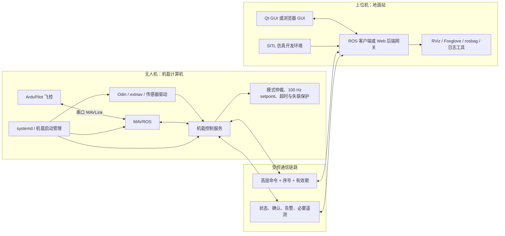

# 机载端—地面站解耦与 GUI 技术选型调研报告

> 文档目的：评估将 ROS/飞行控制部署在无人机、将地面站部署在上位机的可行性，并重点比较 Qt/PyQt 桌面 GUI 与浏览器 GUI。本文只讨论架构、实施路径、工作量和技术选型，不追查现有代码中的具体缺陷。

日期：2026-08-06
项目：`ros2-ardupilot-sitl-hardware`
环境基线：Ubuntu 24.04、ROS 2 Jazzy、MAVROS、ArduPilot

## 1. 执行结论

### 1.1 架构拆分方向合理，而且建议优先实施

将飞控、MAVROS、定位/传感器驱动、飞行控制循环留在无人机，将操作界面、任务编辑、可视化和日志查看放到上位机，是更合理的工程边界。它符合 ArduPilot 的“飞控 + 伴随计算机”部署方式：伴随计算机通过 MAVLink 与飞控通信并运行更高层算法，而地面系统负责操作和监控。

但这里有一个不能妥协的安全前提：**不能把当前持续发布的高频姿态、推力或速度设定点直接搬到上位机，再依赖 Wi-Fi/数传链路逐帧发送给无人机。** 无线链路存在抖动、丢包、漫游和短时中断，高频控制闭环必须在机载端自行维持。上位机应发送“起飞、降落、进入悬停、速度意图、航点任务”等高层命令；机载端负责命令校验、模式仲裁、100 Hz 输出、超时保护和失联处置。

因此，目标不是简单地把 `ground_station.py` 复制到另一台电脑，而是把当前地面站中混合的三类职责真正拆开：

1. 机载运行与安全控制；
2. 跨机通信与命令协议；
3. 上位机人机界面和开发工具。

### 1.2 GUI 的近期建议：优先 Qt 桌面路线，但实现时更建议 PySide6

如果近期目标是单架无人机、单台 Ubuntu 上位机、研发人员本地使用，并希望尽快稳定替换 Tkinter，那么 **Qt 桌面 GUI 是风险更低的选择**。现有项目的飞控模式和 ROS 控制逻辑已独立成 Python 模块，Qt 迁移主要集中在约 789 行的 GUI 层，复用率明显高于 Web 方案。

用户提出的是 PyQt。就界面能力而言，PyQt6 与 PySide6 都是 Qt 6 Python 绑定；但 PyQt 免费版本是 GPLv3，非 GPL 分发需要 Riverbank 商业许可，而官方 Qt for Python（PySide6）提供 LGPLv3/GPLv3/商业许可。因此，若没有必须采用 PyQt API 的历史包袱，本项目实际落地建议是 **PySide6 + Qt Widgets（或局部 Qt Quick）**。本文后续的“PyQt 路线”泛指 Python + Qt 桌面路线，许可决策处会单独区分二者。

### 1.3 GUI 的长期建议：满足多终端或产品化条件时再选 Web

如果明确需要以下能力，浏览器方案更有长期价值：

- 手机、平板、Windows/macOS/Linux 无安装访问；
- 多人或多终端只读监控；
- 多机队管理、远程运维、集中升级；
- 丰富的地图、图表、视频和业务页面；
- 将地面站逐步发展为可部署的产品，而不仅是研发工具。

Web 方案不是“把按钮改成网页”这么简单。它至少增加浏览器前端、Web 后端/ROS 网关、实时 WebSocket 协议、身份认证与部署四类工作。对当前项目，Web GUI 的首版工作量预计约为 Qt 路线的 1.8～2.3 倍。

### 1.4 控制环路专项复核结论

进一步检查当前源码后，可以确认：**现在并非所有控制环路都由 C++ 实现。** 当前实际运行路径中，地面站 Python 进程包含名义 100 Hz 的模式输出调度、位置 PD、DOB 扰动观测器、姿态/推力计算和航点推进。仓库虽然保留了一个 C++ `keyboard_vel_controller`，但现有仿真和实机初始化流程都没有启动它。

因此，当前部署边界与“地面站只发送指令，控制器/观测器放在机载 ROS 与飞控中”的目标不一致，需要调整。这里的关键不是强制所有代码都改成 C++，而是让所有持续控制和安全状态都脱离 GUI 生命周期、在机载端独立运行。对于本项目的 100 Hz 自定义 PD+DOB 外环，建议采用独立的机载 ROS 2 C++ 控制节点；ArduPilot 继续负责姿态、角速度和电机等更内层控制。

## 2. 当前系统的架构判断

当前代码已经完成了初步的内部模块化：GUI、ROS 控制器、三种飞行模式、环境初始化和进程管理分别位于不同模块。但从部署视角看，它们仍属于同一个“地面站进程域”：

- Tk GUI 同时创建并持有 ROS 控制器；
- GUI 能启动和关闭 SITL、MAVROS、RViz、Odin 与 extnav 等外部进程；
- 起飞、降落、键盘、航点与持续 setpoint 发布均由同一个地面站侧 ROS 控制器承担；
- 仿真初始化与实机初始化复用同一套界面入口和进程管理逻辑。

这种结构适合单机开发验证，但在真实无人机上会形成几个维护问题：

- GUI 生命周期与机载关键进程生命周期相互影响；
- 上位机无法独立重启、升级或调试界面；
- 无人机必须携带桌面图形环境和相关依赖；
- “关闭界面”和“关闭飞行控制/ROS 环境”之间的安全边界不够清晰；
- 后续更换 GUI 技术时，容易再次触及飞行控制代码。

因此，应先建立稳定的机载服务边界，再替换 GUI。反过来先重写界面，通常会导致 Qt/Web 新界面继续复制现有耦合关系，后续还要二次改造。

## 3. 控制环路实现位置专项检查

### 3.1 “所有控制环路都是 C++ 实现的吗？”

答案是：**不是。当前系统同时存在三层控制实现，而且真正由地面站使用的是 Python 外环与 ArduPilot 内环，仓库中的 C++ 外环当前处于未启用状态。**

| 层级/功能 | 当前实现位置 | 当前是否实际参与地面站流程 | 判断 |
|---|---|---:|---|
| GUI 按钮、航点编辑、状态显示 | `ground_station_core/gui.py`，Python | 是 | 属于合理的界面职责 |
| 模式仲裁、命令队列、状态快照 | `ground_station_core/ros_controller.py`，Python | 是 | 逻辑本身可保留，但不应与 GUI 同进程、同生命周期 |
| 名义 100 Hz 模式输出调度 | `GroundStationRosController._spin()`，Python | 是 | 属于持续控制调度，应迁到机载控制服务 |
| 悬停位置 PD、DOB、姿态/推力计算 | `ground_station_core/dob_controller.py`，Python | 是 | 明确属于控制器/观测器，应迁到机载端 |
| 航点推进、到达保持、PD+DOB 跟踪 | `ground_station_core/flight_modes/waypoint_flight.py`，Python | 是 | 任务执行与持续控制均在地面站，应迁到机载端 |
| 方向键速度控制 | `keyboard_control.py` 直接发布 MAVROS `Twist`，Python | 是 | 未经过项目 PD+DOB；依赖 ArduPilot 对速度 setpoint 的内部控制 |
| 起飞/降落 | Python 调用 MAVROS 服务，ArduPilot 执行 | 是 | 飞控内环在 ArduPilot；命令编排仍与地面站生命周期耦合 |
| `keyboard_vel_controller` | `src/guided_sim/src/keyboard_vel_controller.cpp`，C++ | 否 | 能构建，但当前初始化流程不启动；不能把“仓库里有 C++”等同于“当前由 C++ 控制” |
| 姿态、角速度、电机混控、飞控 EKF 等内环 | ArduPilot 固件，主要为 C++ | 是 | 位置正确，应继续留在飞控 |

证据链如下：

1. GUI 的起降、方向、悬停和航点按钮只调用 `GroundStationRosController` 的 Python API，界面回调本身没有执行数学控制计算。
2. `GroundStationRosController` 在地面站进程内创建 `/mavros/setpoint_velocity/cmd_vel_unstamped`、`/mavros/setpoint_position/local` 和 `/mavros/setpoint_raw/attitude` 发布器，并循环调用当前飞行模式的 `publish()`。
3. `DobPositionController` 在 Python 中计算 PD 加速度、更新一阶 DOB、将总加速度转换为期望四元数与归一化推力，最后直接发布 `AttitudeTarget`。
4. `WaypointFlightMode` 在 Python 中维护当前航点、到达距离、保持计时和下一航点切换，并逐周期调用同一个 Python DOB 控制器。
5. 方向键分支构造 `geometry_msgs/Twist` 后直接发布到 MAVROS；只有悬停分支和航点分支调用 Python `DobPositionController`。
6. C++ `keyboard_vel_controller.cpp` 自己具备 `rclcpp::Rate(control_frequency)`、PD/DOB 和姿态推力发布，但当前 `EnvironmentInitializer` 只启动 SITL、MAVROS、RViz，或 Odin、MAVROS、extnav；`visualize.launch.py` 也只启动可视化相关节点。

### 3.2 当前有哪些架构上不合理的问题？

#### 问题 A：控制器和观测器属于地面站进程

虽然 PD/DOB 没有直接写进 Tk 按钮回调，但它与 Tk GUI 同属一个 Python 应用。关闭 GUI、Python 进程异常、上位机重启或网络中断，都会让自定义控制输出消失。将来把 GUI 迁到另一台电脑后，如果原样保留这一结构，高频姿态/推力控制也会随之跨过无线链路，这正是应避免的部署方式。

结论：**不合理，属于最高优先级的拆分项。**

#### 问题 B：所谓 100 Hz 不是独立的固定周期控制任务

Python 代码将 `period = 1 / 100` 作为 `rclpy.spin_once()` 的最大等待时间，但 `spin_once()` 在有回调就绪时可以提前返回；每轮前还可能处理服务命令。因此它不是由固定周期 timer 驱动的严格 100 Hz 控制任务，实际周期会受到订阅回调、服务等待、Python 调度和同进程负载影响。DOB 虽然使用真实 `dt`，但可变周期仍会增加分析和复现实验结果的难度。

结论：**作为开发验证可以运行，作为跨机实机的长期控制架构不理想。**

#### 问题 C：Python 与 C++ 存在两份 PD+DOB 实现，但只有 Python 在用

Python 控制器的类注释明确说明它在复刻原 C++ 实现。两份实现会造成参数、重置条件、限幅、坐标系、首帧行为和后续修复逐渐分叉。当前 YAML 参数虽然共享，但不能消除算法重复。

结论：**需要选定唯一权威实现，不能长期双份维护。**

#### 问题 D：方向键路径与“全部使用 PD+DOB”的任务目标不一致

当前上/下/左/右/前/后以及偏航方向键累加一个速度值，然后直接发布 MAVROS 速度 setpoint。悬停和航点才执行项目自定义 PD+DOB 并输出姿态/推力。因此，`agent/task/02-dob.md` 中“键盘控制模式全部使用 PD+DOB，给飞控发送期望姿态和推力”的目标，从当前实际运行路径看并未完整实现。

这里要区分两个概念：方向键并非“没有控制器”，因为 ArduPilot 仍会对速度 setpoint 使用其内部控制链；但它没有经过本项目声称的自定义 PD+DOB。这会造成同一组键盘模式在移动与悬停时切换两套不同的外环控制逻辑。

结论：**功能语义和控制架构不一致，需要明确选择并统一。**

#### 问题 E：航点任务的“执行状态”保存在地面站

航点列表副本、当前序号、到达保持计时和终点悬停目标都保存在地面站 Python 内存中。即使未来仅把 PD/DOB 移走，只要航点状态仍在上位机，短时断链仍会让任务推进逻辑中断。

结论：**航点编辑可以在地面站，航点执行状态应在机载端。**

#### 问题 F：当前命令票据只解决本进程竞态，不是跨机安全协议

现有 ticket 和飞行输入序号能防止同一 Python 进程中的旧队列命令覆盖新按键，这是有价值的；但它没有跨机身份、命令有效期、控制权租约、链路心跳和机载确认语义。拆成两台机器后不能直接把本地队列当成网络控制协议。

结论：**逻辑可借鉴，但必须升级为机载端最终裁决的命令协议。**

### 3.3 推荐的控制职责边界

不建议把所有自定义算法都直接塞进 ArduPilot 源码。更清晰、风险更低的分层是：

| 所在位置 | 应承担的职责 | 不应承担的职责 |
|---|---|---|
| 地面站 GUI | 收集操作者意图、航点编辑、显示状态、发送任务、接收反馈 | PD/PID/DOB、100 Hz setpoint、到达判定、失联后的持续控制 |
| 机载 ROS 控制服务 | 模式仲裁、命令租约、参考轨迹/航点执行、自定义 PD+DOB、100 Hz 姿态推力输出、健康与安全状态 | Tk/Qt/Web 界面、依赖人工窗口存活的控制 |
| MAVROS | ROS 2 与 MAVLink 的协议转换、飞控服务与遥测桥接 | 代替项目级任务仲裁或 GUI 权限系统 |
| ArduPilot | 姿态、角速度、电机混控、飞控状态估计与原生 failsafe | 项目 GUI、上位机业务流程；除非有充分理由，不直接侵入固件实现实验性上层 DOB |

也就是说，“控制器放在 ROS 和飞控里面”这个方向是正确的，但应进一步表述为：

- 实验性的外部位置/速度 PD+DOB：放在无人机上的独立 ROS 2 控制节点；
- 姿态、角速度、电机等内环：继续交给 ArduPilot；
- 地面站：只发送目标、任务和模式意图，不持续计算飞行控制量。

### 3.4 两种可选控制策略

在改造前必须选定一种权威策略，不能让两种路径并存并由 GUI 隐式切换。

#### 策略 1：保留项目自定义 PD+DOB（更符合现有任务要求）

- 机载 ROS C++ 节点订阅本地位姿/速度；
- 地面站发送方向意图、悬停目标或航点任务；
- 方向意图在机载端转换为速度参考或连续位置参考；
- 机载节点统一用 PD+DOB 生成期望姿态和推力；
- ArduPilot 完成姿态/角速度/电机内环；
- 地面站永远不直接发布 `/mavros/setpoint_raw/attitude`。

优点是能够保留并研究 DOB；缺点是机载自定义控制器成为飞行安全关键软件，必须严格测试频率、坐标系、限幅、模式切换和失联行为。

#### 策略 2：使用 ArduPilot 原生位置/速度控制

- 地面站或机载任务管理器只发送位置、速度或标准 MAVLink mission；
- ArduPilot 完成外环和内环；
- 删除项目重复的 PD+DOB 姿态推力生成路径。

优点是架构简单、更多利用成熟飞控能力；缺点是无法满足“全部使用项目自定义 PD+DOB”的研究目标。

结合 `agent/task/02-dob.md`，本报告建议采用策略 1，但必须让它成为**机载 ROS 中唯一的自定义外环实现**。

### 3.5 推荐修改方案

#### 第一步：先定义机载命令接口，不直接搬代码

建议至少定义以下接口语义：

- `Takeoff`、`Land`、`Hover/Cancel`：离散命令，有明确接受/拒绝和最终结果；
- `ExecuteWaypoints`：带进度反馈、可取消的任务；
- `MotionIntent`：方向/速度/偏航意图，包含来源、序号、时间戳和短有效期；
- `VehicleControlState`：当前模式、控制权持有者、目标、执行进度、failsafe 原因；
- `Heartbeat/ControlLease`：上位机失联后，机载端能独立进入预定义安全状态。

接口可以采用 ROS 2 topic/service/action，但最终接受、拒绝和模式切换必须由机载端裁决。

#### 第二步：新建干净的机载控制节点，不直接原样启动旧 C++ 大文件

现有 `keyboard_vel_controller.cpp` 约 2500 行，混合终端键盘监听、多种模式、规划路径、日志和控制算法。它可以作为算法来源和对照基线，但不适合未经拆分就作为新的机载服务。

建议形成：

- `control_manager_node`：命令接口、模式仲裁、控制权、失联状态机；
- `dob_controller` C++ 库：纯计算、显式输入输出、无 GUI/终端依赖；
- `setpoint_output`：单一固定周期 timer，统一发布姿态/推力；
- `waypoint_executor`：机载航点队列、进度和到达保持；
- `vehicle_gateway`：MAVROS 状态、模式、武装、起降服务适配。

这些组件可以先在一个进程中组合，重点是职责和测试边界清晰，不要求一开始拆成许多操作系统进程。

#### 第三步：统一方向、悬停和航点的控制路径

若采用自定义 PD+DOB：

- 方向键不再直接向 MAVROS 发布 `Twist`；
- 机载参考生成器将方向意图转换为速度参考或随时间更新的位置参考；
- 移动、悬停和航点最终都经过同一套机载控制器并输出姿态/推力；
- 进入新模式时在机载端重置/继承 DOB 状态，规则必须显式；
- 地面站只显示“目标速度/目标位置”，不保存决定飞行安全的持续状态。

#### 第四步：删除地面站的直接 setpoint 权限

改造完成后，地面站代码中不应再创建以下发布器：

- `/mavros/setpoint_velocity/cmd_vel_unstamped`；
- `/mavros/setpoint_position/local`；
- `/mavros/setpoint_raw/attitude`。

这三个 topic 在项目级应建立“单一发布者”约束：只允许机载控制服务发布。地面站可订阅聚合状态和控制器诊断，但不能绕过机载仲裁直达 MAVROS。

#### 第五步：把航点执行和起降编排移到机载端

- 上位机只上传航点列表并接收任务进度；
- 当前航点、到达保持和终点悬停由机载端维护；
- 起飞、GUIDED、武装和降落的状态检查由机载管理器执行；
- GUI 关闭后，机载端根据任务策略继续、悬停或降落，而不是因 Python 界面进程消失失去状态。

#### 第六步：用同一个机载节点覆盖 SITL 与实机

- SITL：机载控制节点与 MAVROS 可运行在上位机，但仍保持独立进程和相同接口；
- 实机：同一节点安装到无人机，由 systemd/ROS launch 管理；
- Qt/Web GUI 只连接命令接口，不关心后端是本机 SITL 还是远端实机。

### 3.6 迁移顺序与验收重点

推荐按以下顺序迁移，避免一次性替换后无法判断算法差异来自哪里：

1. 建立 Python 当前输出的可重复基线：固定输入轨迹、状态序列、姿态/推力输出和 DOB 状态；
2. 从旧 C++ 文件抽取纯 PD+DOB 计算库，与 Python 基线做离线逐样本对比；
3. 在 SITL 中让新 C++ 机载节点成为唯一 setpoint 发布者，旧 GUI 先改成薄客户端；
4. 验证方向、悬停、航点、模式覆盖、起降和终点保持；
5. 注入 GUI 退出、网络断开、延迟、重复/乱序命令和机载节点重启；
6. 确认整个 ROS 图中每个 MAVROS setpoint topic 只有一个授权发布者；
7. 完成受保护的低高度实机验证后，删除 Python DOB 与废弃的直接发布路径。

专项验收指标至少包括：

- 控制周期实际频率、抖动、最大连续超期次数；
- 指令端到端延迟与过期指令拒绝率；
- DOB 状态切换时是否按设计重置；
- 上位机断开后，不再接收新意图，机载安全状态按时生效；
- Qt、Web、CLI 任一客户端退出都不终止机载控制服务；
- SITL 与实机使用相同控制节点、参数文件和命令接口；
- Python 与 C++ 双实现不再同时存在于生产控制路径。

### 3.7 对原工作量估算的影响

原报告的“架构拆分 22～38 人日”已经包含机载控制服务抽取，但专项检查表明，现有 C++ 节点不能直接启用，还需要算法抽取、Python/C++ 一致性验证和方向键路径统一。因此应按原区间的中高位安排，建议将基线修订为 **24～42 人日**；若需要新增完整的网络故障注入台架或外场验证窗口不足，还应继续预留缓冲。

这不是额外增加一套控制器，而是用一次受控迁移消除当前 Python/C++ 双实现和地面站持续控制问题。

## 4. 推荐的目标架构

### 4.1 无人机端应保留的组件

- ArduPilot 飞控与物理串口连接；
- MAVROS，作为 ROS 2 与 MAVLink 的唯一主要转换节点；
- Odin、extnav 和其他与硬件直接相关的驱动；
- 起降、键盘控制、航点执行、PD+DOB、模式仲裁；
- 姿态/推力/速度 setpoint 的固定频率发布；
- 命令有效期、重复命令去重、控制权租约、失联保护；
- 运行健康状态、版本信息和必要日志；
- 独立于 GUI 的开机自启、失败重启和关机管理。

机载端最好作为一个无图形界面的“控制服务”运行。GUI 退出、上位机重启或网络暂时中断时，它仍应按预定义策略安全运行。

### 4.2 上位机应承担的组件

- 连接状态、飞行状态、位置速度和告警显示；
- 起飞、降落、悬停、方向意图和航点任务编辑；
- 操作者确认、输入校验、任务历史和日志展示；
- RViz、Foxglove、rosbag 分析等研发工具；
- SITL 与仿真可视化环境；
- 若采用浏览器 GUI，则还包括 Web 后端/ROS 网关和静态页面服务。

上位机可以重启界面，但不应因此杀死机载 ROS 节点。硬件模式下，GUI 中的“关闭所有进程”不应再等价于远程杀死整台无人机上的 ROS 进程；应拆成“断开地面站”“停止任务”和经过明确权限控制的“维护停机”三类操作。

### 4.3 仿真与实机应形成两个部署配置

- **仿真配置**：SITL、MAVROS、机载控制服务和 GUI 可以全部运行在上位机，通过本机网络模拟真实接口；RViz 也留在上位机。
- **实机配置**：无人机上由 systemd/launch 启动 MAVROS、硬件驱动和机载控制服务；上位机只连接，不接管其进程生命周期。

两种配置应使用相同的高层命令和状态接口。这样仿真验证的不是另一套“简化版控制”，而是与实机相同的控制服务。

## 5. 跨机通信方案

### 5.1 第一阶段：受控局域网内使用 ROS 2 原生通信

对于同一受控 Wi-Fi/以太网内的一架无人机和一台上位机，可先采用 ROS 2 DDS：

- 两端使用一致的 ROS 2 Jazzy、接口包和 `ROS_DOMAIN_ID`；
- 只交换高层命令、状态、告警和必要遥测；
- 无线网络发现不稳定时，采用静态 peer 或 Discovery Server，而不依赖不可控的全网组播；
- 遥测采用“小队列、取最新、必要时 best effort”，命令与确认采用 reliable，并验证 QoS 兼容；
- 图像、点云等大带宽数据单独限频、压缩或按需订阅，避免挤占控制和状态链路；
- 两端做时间同步，记录单调时钟时间戳和链路延迟。

ROS 2 官方文档说明 QoS 可在可靠传输与 best effort 之间选择，传感器数据通常优先最新值；同时，不兼容的 QoS 会导致端点不能通信。Fast DDS 的 ROS 2 实现也支持 `ROS_AUTOMATIC_DISCOVERY_RANGE` 与 `ROS_STATIC_PEERS` 控制发现范围。它们是可用工具，但不能替代真实无线网络压力测试。

### 5.2 第二阶段：跨网段、4G/5G 或互联网使用 VPN/受控网关

不建议把 DDS 端口或 rosbridge 直接暴露到公网。跨网段时优先使用：

1. 设备 VPN/专用网络；或
2. 只暴露经过鉴权、限权和审计的应用层网关。

ROS 2 的 SROS2/DDS-Security 能提供身份认证、访问控制和加密，但官方设计文档明确说明这些功能默认并未启用。若项目进入外场、校园公共网络或互联网环境，安全配置必须成为正式交付项，而不是后续补丁。

### 5.3 保留标准地面站的 MAVLink 通道

MAVROS 支持串口、UDP、TCP，并带有面向 GCS 的代理能力。可以从机载端额外路由一份 MAVLink 遥测给 QGroundControl/Mission Planner 作为参数配置、校准、日志和应急诊断工具，但应避免两个 MAVROS 实例或多个地面站同时竞争消息频率和飞行控制权。ArduPilot 官方文档也提示：共享链路上的多个请求者可能产生消息频率冲突。

本项目自研地面站与标准 GCS 的职责应明确：自研地面站负责专项控制和任务流程；标准 GCS 保留飞控配置与独立诊断能力。

## 6. 建议的命令与安全边界

本报告不规定具体消息字段，但建议接口至少具备以下语义：

- 每个会改变飞行状态的命令都有唯一序号、发送时间、有效期和来源；
- 机载端返回“已接收、已拒绝、执行中、成功、失败”之一，而不是 GUI 单方面认为按钮已生效；
- 速度/方向控制使用短租约或按住生效，租约到期自动进入预定安全状态；
- 重复命令必须幂等，旧序号不能覆盖新模式；
- 同一时间只有一个控制权持有者，标准 GCS、自研 GUI、脚本和自动任务不能无仲裁地同时发布；
- 链路断开时由机载端执行明确策略，例如保持、Loiter 或 Land；具体策略需结合飞行场景评审；
- 遥控器/飞控原生 failsafe 始终作为更底层的最后保障，不能被 GUI 逻辑替代；
- “停止任务”“降落”“紧急停机”是不同等级的动作，界面和权限都应区分。

## 7. 实施阶段与工作量

以下估算以一名熟悉 Python、ROS 2、MAVROS 的工程师为基准，1 人日约为 6～8 小时；包含代码、单元测试、SITL 回归和基础文档，不含长时间外场审批、采购或飞行许可。

| 阶段 | 主要结果 | 估算 |
|---|---|---:|
| A. 接口与部署设计 | 确定机载/上位机边界、命令状态模型、失联策略、进程归属 | 2～4 人日 |
| B. 机载控制服务抽取 | 抽取 C++ 算法库，将模式、PD+DOB、setpoint 和 MAVROS 访问变成无 GUI 服务 | 6～10 人日 |
| C. 跨机客户端与接口包 | 上位机客户端、命令确认、心跳/租约、版本握手 | 4～7 人日 |
| D. 启动与运维拆分 | 机载 systemd/launch、仿真配置、日志与健康检查 | 3～5 人日 |
| E. 网络与 QoS 验证 | 静态发现、限频、丢包/延迟/重连测试、安全基线 | 3～6 人日 |
| F. SITL 与实机验收 | Python/C++ 对照、双机断链、重启、模式切换和飞行回归 | 6～10 人日 |
| **架构拆分小计** | 不包含新 GUI；按控制专项复核修订 | **24～42 人日** |

GUI 另计：

| GUI 路线 | 首个可替代 Tkinter 的生产可用版本 | 估算 |
|---|---|---:|
| Qt/PyQt/PySide6 | 页面迁移、线程/信号接入、状态与航点、打包、测试 | 7～12 人日 |
| 浏览器 | API/WS 网关、前端、状态管理、地图/图表基础、鉴权与部署、测试 | 15～28 人日 |

因此，一人全职的粗略日历范围为：

- 架构拆分 + Qt GUI：约 7～11 周；
- 架构拆分 + 浏览器 GUI：约 9～15 周。

若没有稳定可用的实机、网络设备或安全试飞窗口，应对实机相关工期再预留 25%～40%。多人并行可以压缩日历时间，但接口设计和实机验收不可简单按人数线性缩短。

## 8. 风险—收益评估

### 8.1 主要收益

| 收益 | 影响 |
|---|---|
| 飞行控制独立于 GUI | 上位机或界面崩溃不再直接终止机载控制循环 |
| 机载系统无桌面依赖 | 降低无人机镜像体积、图形依赖和运维复杂度 |
| 独立调试和升级 | GUI、机载控制、仿真环境可分别发布和回滚 |
| 仿真实机接口一致 | SITL 更能代表真实部署，减少“仿真通过、上机重接线” |
| 可复用的通信边界 | 后续 PyQt、Web、CLI、自动测试可共享同一接口 |
| 故障定位清晰 | 能区分飞控、机载 ROS、网络和 GUI 四类故障 |

### 8.2 主要风险与控制措施

| 风险 | 等级 | 建议控制 |
|---|---:|---|
| 把高频 setpoint 放到无线链路上 | 高 | 控制循环留机载；上位机只发高层意图和短租约 |
| 断链后继续执行过期命令 | 高 | 时间戳、TTL、序号、心跳、机载 failsafe |
| 多控制源互相覆盖 | 高 | 单一控制权租约、模式仲裁、命令来源审计 |
| DDS 发现或 QoS 在 Wi-Fi 上不稳定 | 中高 | 静态 peer/Discovery Server、QoS 设计、网络压力测试 |
| 图像/点云挤占命令链路 | 中高 | 分流、限频、压缩、按需订阅、链路优先级 |
| 机载与上位机版本不兼容 | 中 | 接口包版本化、启动握手、兼容性检查 |
| 远程进程管理误杀关键节点 | 高 | 机载 systemd 管理；GUI 只调用受限维护接口 |
| 网络暴露带来未授权控制 | 高 | 受控 LAN/VPN、SROS2 或应用层鉴权、最小权限与审计 |
| 首次拆分导致集成周期变长 | 中 | 保留当前单机基线，按阶段双轨验证，不一次性同时更换全部层 |

总体判断是：**收益长期且确定，风险可控，但安全收益只有在控制闭环留机载、失联策略落地之后才能兑现。** 如果只是把现有 GUI 移到上位机并继续远程逐帧控制，不能视为完成了合理解耦。

## 9. PyQt 与浏览器 GUI 重点对比

### 9.1 两种方案在本项目中的真实形态

**Qt/PyQt 路线**

上位机运行一个桌面应用。它可以直接作为 ROS 2 客户端，也可以通过本机独立的 GCS 后端进程连接机载服务。界面用 Qt 的 signal/slot 接收状态更新。RViz 可作为独立工具启动，必要时也可嵌入/联动。

**浏览器路线**

浏览器不应直接加入 DDS 网络。上位机运行一个 Python 后端网关：一侧是 rclpy 客户端，另一侧通过 HTTP/WebSocket 向 React/Vue 等前端提供经过裁剪的状态和命令 API。ROS Jazzy 已提供 `rosbridge_suite`，Foxglove Bridge 也能高性能地把 ROS 2 数据提供给可视化客户端；但对有飞行控制权限的自研界面，更建议使用带业务校验和白名单的专用网关，而不是把任意 ROS topic/service 原样暴露给页面。

Foxglove 很适合快速补充遥测、TF、图像和日志诊断，可与两种自研 GUI 并存，但它不是本项目全部任务流程和控制权管理的直接替代品。

### 9.2 对比表

| 维度 | Qt/PyQt/PySide6 | 浏览器（Web） |
|---|---|---|
| 与现有 Python/ROS 代码复用 | **高**；可直接复用控制客户端和数据模型 | 中；ROS 逻辑可复用，但必须增加后端 API 和前端模型 |
| 首版迁移成本 | **较低** | 较高，至少维护前后端两层 |
| ROS 2 接入 | **直接**；rclpy + Qt 线程/信号 | 间接；必须通过自建网关、rosbridge 或 Foxglove Bridge |
| UI 现代化能力 | 高；Qt Widgets 稳定，Qt Quick 动效更强 | **很高**；响应式布局、图表、地图和业务组件生态丰富 |
| 多平台 | Linux/Windows/macOS，但需分别打包 | **最好**；现代浏览器即可，后端仍需部署 |
| 手机/平板 | 一般，需单独适配/打包 | **天然适合**响应式页面 |
| 多用户/远程访问 | 较弱，需要额外网络服务 | **强**，但随之增加身份、权限和并发控制责任 |
| 本地离线与低延迟 | **强**，运行边界简单 | 强，但多一层序列化与 WebSocket；实际控制仍应留机载 |
| 原生桌面交互 | **强**；键盘、窗口、系统托盘、文件和进程集成自然 | 中；受浏览器权限和焦点模型限制 |
| 图表/地图/视频生态 | 可实现，但组件选择相对少 | **强**；WebGL、地图、视频和图表选择丰富 |
| 自动化测试 | Qt 测试可做，GUI 测试成本中等 | **前端测试生态强**，但端到端系统测试范围更大 |
| 发布升级 | 每台上位机安装/更新 | 页面可集中更新；后端仍需版本管理，缓存也需控制 |
| 攻击面 | 较小，尤其是只在本机运行时 | **更大**；需处理认证、WSS/TLS、Origin、会话、权限和审计 |
| 团队技能要求 | Python + Qt + ROS | Python/ROS 后端 + TypeScript/前端 + Web 运维 |
| 长期产品化 | 适合单机专业工具 | **适合多终端、远程、机队和业务平台** |
| 许可 | PyQt 为 GPLv3/商业；PySide6 可 LGPLv3/GPLv3/商业 | 框架多为宽松开源许可，但仍需逐项审查依赖 |

### 9.3 安全性并不是“桌面一定安全、Web 一定危险”

Qt 客户端如果直接加入整个 ROS 域，也可能拥有过大的 topic/service 权限；浏览器如果只连接本机网关并由网关执行命令白名单，反而能形成清晰的权限边界。关键在于接口设计：

- 页面不得直接构造任意 ROS 服务调用；
- 所有飞行动作必须经过后端输入校验、状态检查、权限检查和审计；
- 单机使用时 Web 服务默认只绑定 `127.0.0.1`；
- 局域网开放时使用 HTTPS/WSS、身份认证、Origin 白名单和单操作者控制权；
- 任何 GUI 都不能成为唯一 failsafe。

### 9.4 “先进”应由能力和架构衡量

Tkinter 的问题主要是组件风格、复杂布局能力和大型界面维护体验有限。Qt 和 Web 都能显著改善。是否先进，不取决于页面是不是浏览器，而取决于：

- 状态是否单向、可追踪；
- 命令是否有确认、超时和错误反馈；
- UI 与飞行控制是否真正解耦；
- 是否支持自动测试、主题、可访问性和清晰的信息层级；
- 网络断开、后台重启和版本不兼容时是否表现可预期。

## 10. 推荐决策

### 10.1 与当前需求最匹配的路线

建议采用“两步走”：

1. **先完成机载控制服务与上位机客户端的边界拆分，暂时不让 GUI 技术决定通信协议。**
2. **首版新 GUI 采用 PySide6/Qt。** 如果项目许可政策明确接受 GPLv3 或已购买商业许可，也可使用 PyQt6；否则不建议默认选择 PyQt6。

理由如下：

- 当前需求强调的是分开调试、方便维护，而不是多用户 SaaS 或机队平台；
- 项目现有核心为 Python/rclpy，Qt 路线复用程度最高；
- 单台 Ubuntu 上位机、本地键盘飞控、进程与日志操作更符合桌面应用；
- 可以用较小增量先把架构安全边界验证清楚；
- 只要高层命令接口保持稳定，未来 Web 后端可复用同一个上位机客户端或接口包。

### 10.2 直接选择浏览器方案的触发条件

如果以下条件中至少有两到三项已经是确定需求，而非可能性，建议跳过 Qt 首版，直接建设 Web：

- 同时支持电脑、平板和手机；
- 多个只读观察者与一个控制者；
- 跨网络远程访问；
- 多架无人机/机队页面；
- 需要大量地图、视频、报表和任务管理；
- 有长期前端/后端开发和 Web 安全运维能力；
- 希望通过服务端集中发布 UI，而不是逐台安装桌面包。

若直接选 Web，推荐技术边界为：

- 前端：TypeScript + React 或 Vue；
- 上位机后端：Python + FastAPI（HTTP + WebSocket）+ rclpy 客户端；
- 诊断可视化：Foxglove Bridge/Foxglove 或 RViz，独立于控制 API；
- 飞行控制：始终留在机载控制服务；
- rosbridge：可用于原型或只读数据接入，不作为无约束的飞行控制接口。

## 11. 推荐实施顺序与验收门槛

### 阶段 1：冻结现有单机基线

- 保留现有 SITL 起飞、悬停、航点、降落和清理回归；
- 记录消息频率、CPU、链路带宽和模式切换行为；
- 不在此阶段重写 GUI。

### 阶段 2：抽取机载控制服务

- 在同一台电脑上运行“机载服务 + 薄客户端”，先用本机通信；
- GUI 退出后，机载服务仍存活并按策略处理当前飞行状态；
- 所有持续 setpoint 只由机载服务发布。

### 阶段 3：双机局域网运行

- 无人机与上位机分机启动；
- 验证发现、重连、延迟、带宽、重复命令和版本不匹配；
- 注入丢包、100～500 ms 抖动和短时断链，确认没有过期命令继续生效。

### 阶段 4：替换 GUI

- Qt 路线：先等价迁移，再改善视觉与信息架构；
- Web 路线：先定义 API/WS schema 和权限，再写页面；
- 新旧 GUI 在同一 SITL 基线上对比，不改变飞行算法验收标准。

### 阶段 5：实机安全验收

至少覆盖：

- 上位机 GUI 崩溃/重启；
- Wi-Fi 断开与恢复；
- 命令超时和乱序；
- 两个客户端争夺控制权；
- 机载单节点异常重启；
- 遥控器接管、飞控 failsafe 和安全降落；
- 标准 GCS 与自研地面站同时在线但不互相抢占；
- 日志能够还原每条飞行动作的来源、时间和结果。

只有上述门槛通过后，才应把“上位机地面站 + 机载控制服务”作为默认实机部署。

## 12. 参考资料

1. [ArduPilot Companion Computers](https://ardupilot.org/dev/docs/companion-computers.html) — ArduPilot 对伴随计算机与 MAVLink 通信的官方说明。
2. [MAVROS ROS 2 README](https://github.com/mavlink/mavros/blob/ros2/mavros/README.md) — MAVROS 串口/UDP/TCP 与 GCS proxy 能力。
3. [ArduPilot Requesting Data From The Autopilot](https://ardupilot.org/dev/docs/mavlink-requesting-data.html) — 消息频率配置以及共享链路请求冲突提示。
4. [ROS 2 Quality of Service settings](https://docs.ros.org/en/jazzy/Concepts/Intermediate/About-Quality-of-Service-Settings.html) — reliable/best effort、队列、兼容性等 QoS 机制。
5. [ROS 2 rmw_fastrtps](https://github.com/ros2/rmw_fastrtps) — `ROS_AUTOMATIC_DISCOVERY_RANGE`、`ROS_STATIC_PEERS` 等发现配置。
6. [ROS 2 DDS-Security integration](https://design.ros2.org/articles/ros2_dds_security.html) — ROS 2 身份认证、访问控制、加密以及默认关闭状态。
7. [rosbridge_suite Jazzy documentation](https://docs.ros.org/en/jazzy/p/rosbridge_suite/index.html) — 浏览器通过 JSON/WebSocket 接入 ROS 的官方包说明。
8. [Foxglove ROS 2 documentation](https://docs.foxglove.dev/docs/getting-started/frameworks/ros2) — Foxglove Bridge 的 ROS 2 实时可视化方式。
9. [FastAPI WebSockets](https://fastapi.tiangolo.com/advanced/websockets/) — Python Web 后端的 WebSocket 支持。
10. [Riverbank PyQt introduction and licensing](https://riverbankcomputing.com/software/pyqt) — PyQt6 平台能力及 GPLv3/商业双许可。
11. [Qt for Python / PySide6](https://doc.qt.io/qtforpython-6/) — 官方 Qt Python 绑定及 LGPLv3/GPLv3/商业许可。

## 13. 最终判断

- **架构方向：合理，建议实施。**
- **安全关键：高频闭环和 failsafe 必须留在无人机，地面站只发高层命令。**
- **当前实现：并非所有控制环路都在 C++；实际启用的 PD+DOB、航点执行和控制调度位于地面站 Python 进程，C++ 控制器当前未被启动。**
- **一致性问题：方向键直接发布 MAVROS 速度 setpoint，未经过项目自定义 PD+DOB，与“键盘控制全部使用 PD+DOB”的任务目标不一致。**
- **实施难度：中高；主要难点是控制权、失联和部署边界，不是把窗口移到另一台电脑。**
- **收益：高；能明显改善安全隔离、调试效率、发布维护和后续 GUI 演进。**
- **当前 GUI 推荐：PySide6/Qt 优先；若坚持 PyQt，先确认 GPL/商业许可。**
- **长期 Web 推荐：当多终端、远程、多用户、机队或丰富业务可视化成为确定需求时采用。**

最稳妥的工程策略是：先把“谁负责飞行安全”划清，再决定“操作者通过什么窗口看见它”。
