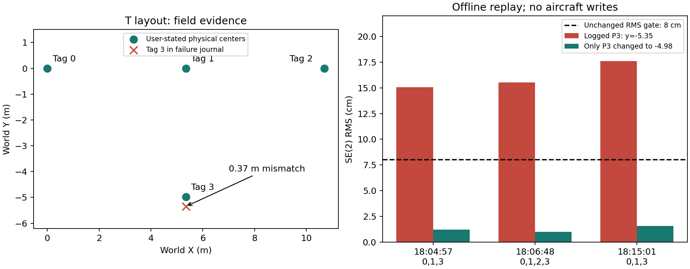
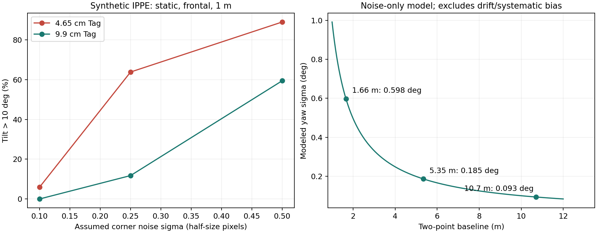

<!-- Task34：只读源码审计、refresh/hp-desktop 现场日志取证、生产求解器离线复算及有条件的误差估算。 -->
# Task34：AprilTag–Odin 滑窗标定检查与现场失败分析

检查日期：2026-09-20。对应任务：`agent/task/34-odin-tag-full-check.md`。

本次仅新增报告与分析附件，没有修改业务源码、测试、相机/Tag 配置、MEMORY.md 或两台远端设备；没有启动相机、重启服务、应用/清除修正、操作飞控。离线分析脚本和下载的过程材料保存在 `agent/codex/task34/`。

## 1. 先给结论

| 问题 | 检查结论 |
| --- | --- |
| 1：后续 Tag 的偏航角是否必要？ | **中心点 SE(2) 精标不需要第二个及之后 Tag 的世界偏航角。** 当前求解器也没有使用它。首次粗标需要单 Tag 姿态；后续仍有完整空间修正 tilt 门，不能说后续完全不受图像姿态估计影响。 |
| 2：T 字形 Tag3 为什么失败？ | 找到三次与描述高度吻合的现场失败。**失败时运行配置是 Tag3=(5.35,-5.35)，不是任务给出的 (5.35,-4.98)，相差37厘米。** 用原始点对、原权重、原门限重放可复现失败；仅把 Tag3 的 Y 改成 -4.98，三次配准全部通过。不是 T 字形不能解，也没有证据证明标签贴歪。 |
| 3：4.65厘米 Tag、约1米高度为什么慢且误差大？ | 半分辨率检测时每边仅约22像素，正视平面 PnP 的倾斜估计很敏感。日志证明首次任务有138接受/201拒绝，其中153帧 tilt>10°，另外接受帧长期卡在**首次偏航离散度**门。短基线放大航向不确定度。此外，实验日志 Tag1=-1.635m，与任务说的 -1.66m 不一致。 |
| 4：长基线能否消除未知非线性漂移？ | **不能。** 固定 SE(2) 只能校准一个公共平移和公共偏航角，不能消除尺度、形变或随时间变化的任意位置/姿态漂移。仅在刚体近似成立时，增加有效空间跨度才有降低随机航向误差的好处。三次与两次谁优，必须看漂移、权重、空间分布和评价位置。 |
| 5：新点会不会被旧窗口拒绝？窗口越长越好吗？ | **会被拒绝；并非越长越好。** 先检查新点在旧保存模型下的残差是否超过0.5m，再检验旧N点+新点，最后才 FIFO。即使淘汰最旧点后的新窗口合格，也可能在淘汰前被拦下。当前不是维护“最佳N点”，也不是能自主跟踪任意漂移的滤波器。 |

关键限制：现场记录日期是 **2026-09-18**，本次检查是9月20日；所检查路径未找到9月20日的新校准日志。以下把“日志中已证实的事实”和“任务提供的现场真值”分开，不把两者日期/尺寸差异自动消解。报告形成时，小 Tag 实际中心距1.635m/1.66m及日志与用户所述实验的对应关系仍待用户确认。

## 2. 证据范围与可信度

### 2.1 检查了哪些环境

- 开发机仓库 HEAD：`6d63f72`，分支 `main`。
- `ssh drone-refresh`：主机名 `localhost.localdomain`，工作区 `/home/nvidia/ros2-ardupilot-mavros-control`，HEAD `b6920763a50e04e5398691001459af4eb7aaa5fa`。有现场未提交改动，未覆盖。
- refresh 的 `window.py / geometry.py / estimator.py / node.py / detector.py`：**开发机、飞机源码、飞机 install 三份 SHA-256 分别一致**。因此不能仅凭飞机 Git HEAD 较旧就认定本次审计的算法不是其安装版本。历史日志没有逐文件源码哈希，仍不能把当前一致性当成全部历史运行版本的严格证明。
- 检查时 refresh `odin-correction.service` 为 inactive，没有发现修正节点进程。没有为了检查而启动它。
- `ssh hp-desktop`：主机名 `scq`，工作区 `/home/scq/ros2-ardupilot-mavros-control`。检查项目日志和 `~/.ros/log` 后，没有找到本次校准的独立非空 GUI 事件记录；项目 `log/` 主要是构建/测试日志。`ground_station_core/event_log.py` 使用内存 deque，不是默认落盘日志。本报告主要依据**机载权威 JSONL**，不声称已从地面机交叉确认每一帧。

### 2.2 保留下来的材料

- [现场证据摘录](assets/task34/field-evidence.json)：三个 Tag3 失败任务的开始事件、原始P/Q点对、拒绝事件，以及小 Tag 两个任务的统计和冻结窗口。
- [离线结果](assets/task34/analysis-results.json)：原配置复现、改正坐标的反事实复算、小 Tag 基线复算、噪声模拟与漂移反例。
- 原始下载日志：开发机 `agent/codex/task34/refresh/log/`；现场相机/门限配置快照：`agent/codex/task34/refresh/config/`。
- 本地复算脚本：`agent/codex/task34/analyze.py`。只导入数学/配置/检测模块，不创建 ROS 节点。

以下结论分三类：**实证**指日志及可复算数值；**数学结论**指算法公式的必然能力/限制；**条件估算**指明确给定噪声等假设的数值，不能当作实机验收精度。

## 3. 当前算法到底在估计什么

设 `T_AB` 表示把B系坐标变到A系；W为Tag世界系，O为Odin局部系，I为Odin IMU中心，C为相机，T为Tag中心坐标系。

逐帧计算：

```text
T_OT = T_OI · T_IC · T_CT
Q_i  = translation(T_OT).xy       # 观测得到的Tag中心，在原始Odin系内
P_i  = tag_pose.csv中的(x_i,y_i)  # 已知世界Tag中心

C_full = T_WT · inverse(T_OT)
首次：从C_full直接取 x/y/yaw，经过稳健采样后保存粗修正。
后续：用窗口内原始(P_i,Q_i)整体重算SE(2)，不累加上次修正。
```

PnP输出的OpenCV Tag系先经过固定基变换；该变换无平移。Task32的方向修复在当前源码中保留。

后续目标为：

```text
min_(ψ,t) Σ_i w_i || P_i - (Rz(ψ) Q_i + t) ||²
w_i = clip(1 / σ_i², 16, 1,000,000)

P̄ = Σw_i P_i / Σw_i，Q̄ = Σw_i Q_i / Σw_i
a = Σw_i (Q_i-Q̄)·(P_i-P̄)
b = Σw_i [(Qix-Q̄x)(Piy-P̄y) - (Qiy-Q̄y)(Pix-P̄x)]
ψ = atan2(b,a)，t = P̄ - Rz(ψ)Q̄
```

只有三个自由度：一个yaw、两个水平平移。**无尺度、无剪切、无镜像、无随时间变化的漂移项，也不修改Odin内部里程计状态。** extnav在下游应用最后确认的公共变换，再转换至FCU参考中心；MAVROS EKF输出还经过其自身融合过程。

“最小二乘”只表示找这个模型的最佳折中，不能使不属于该模型的误差消失。并且这里是**不确定度加权最小二乘+硬门限**：帧内有MAD筛选，空间keyframe层没有自动RANSAC删除某个Tag。

## 4. 问题1：第二个及以后的Tag贴歪偏航角是否影响

### 4.1 理想数学上不需要后续Tag世界偏航角

单个Tag中心无法独立确定公共yaw，所以首次用单Tag完整姿态定一个粗方向。两个不同中心形成向量后，中心连线在O/W两系的方向差就能给出yaw；无需两个Tag图案各自朝向。

`solve_weighted_se2()`只读世界XY、Odin XY、位置sigma及一致性元数据，不读`single_tag_yaw_rad`。`CorrectionEstimator(first_calibration=False)`用Qx/Qy筛选与收敛，**不要求后续单Tag yaw 标准差≤0.35°**。从两点精标起，第一个Tag的单Tag yaw也不作为姿态约束参加配准；首点留下的中心Q仍参加配准。

若Tag绕自身法线旋转、中心和边长不变，理想PnP的平移`t_CT`不变，而

```text
Q = p_OI + R_OI · (t_IC + R_IC · t_CT)
```

不包含Tag自身旋转矩阵。因此后续Tag的纯偏航安装误差本来就不应直接改变中心约束。离线检查实际调用生产几何函数：改变配置yaw、改变理想Tag观测的面内旋转，Q均不变；修改所有keyframe的`single_tag_yaw_rad`也不改变SE(2)结果。

### 4.2 哪些间接影响仍然存在

- **首次Tag**：其世界yaw配置或安装朝向错误会影响首次粗方向与平移。后续精标虽不沿用该yaw约束，第二点仍先被旧粗模型检查；粗方向差太大可能在精标修正它之前就被0.5m旧模型残差门拒绝。例如5.35m基线、粗yaw偏6°，旋转造成约`2L sin(3°)=0.56m`偏差，可被提前拦下。这是另一个真实的初始化能力限制，不是本次Tag3失败的直接原因。
- **后续图像**：转动小Tag会改变像素栅格、亚像素角点质量、遮挡与PnP噪声，实际估计中心未必完全不变。这是测量误差，不是公式必须使用Tag世界yaw。
- **roll/pitch安装误差**：所有Tag被配置为水平面，代码不支持逐Tag roll/pitch。明显倾斜会改变平面法线并影响tilt门和PnP观测；不能把“yaw无需精确”推广为任意三轴姿态均无关。
- **纯配置yaw错误本身不会改变tilt值**：`tilt=acos(C_full.R[2,2])`；左乘世界Z轴旋转不改变第三行。因此不能把后续tilt超限直接解释为Tag面内偏航贴歪。

结论：不必为第二个及以后的Tag精测世界偏航来满足当前中心点精标数学；仍要正确识别ID、尺寸、中心位置，保持可信平面和图像测量。首次基准方向另行对待。

## 5. 问题2：T字形Tag3失败的实际原因和全部关键门限

### 5.1 日志证实的运行配置差异

三个失败任务的`job_started.tag_map`和`new_keyframe.P_world_m`均记录：

```text
Tag0 = (0,0)          size=0.099m
Tag1 = (5.35,0)       size=0.099m
Tag2 = (10.7,0)       size=0.099m
Tag3 = (5.35,-5.35)   size=0.099m   ← 实际加载值
用户给定Tag3真值 = (5.35,-4.98)    ← 相差0.37m
```

这证明**失败时程序拿到的Tag地图与任务描述不一致**。不能由此断定是用户填错、未重启加载，还是后来修改了配置；程序在节点构造时`load_config()`一次，编辑磁盘CSV不会使已有进程自动热加载。

检查当日的磁盘CSV已经是Tag3=-4.98，但它的修改时间是9月18日18:38:13，且小Tag服务18:38:23开始事件已记录新值。仅查看现在的CSV，会漏掉18:04～18:15失败时的旧运行值。

现场序列也需更正：日志第一轮为`0→1→3失败→2成功→3失败`，第二轮为`0→1→3失败→2成功`。这与“不同顺序下只有Tag3不通过”相符，但不是严格只有两次Tag3尝试。

### 5.2 用原始点对重放，复现失败并做单变量验证

使用当前生产`solve_weighted_se2()`，保留每个Q、sigma、点顺序和所有门限。原RMS与日志误差小于`1e-12m`。第二次复算**仅改变新Tag3的P_y=-4.98**，没有调整噪声、删除旧点或放宽阈值。

| 日志结束时间（9月18日）/job | 审查点集 | 原RMS | 原最大残差 | 改正P3后RMS | 改正后最大残差 | 改正后配准 |
| --- | --- | ---: | ---: | ---: | ---: | --- |
| 18:04:57 / `a4e8652820f7` | 0,1,3 | 15.070cm | 20.642cm | 1.215cm | 1.701cm | 通过 |
| 18:06:48 / `e9ccbf747c19` | 0,1,2,3 | 15.513cm | 26.837cm | 0.982cm | 1.330cm | 通过 |
| 18:15:01 / `9acdfe678b25` | 0,1,3 | 17.618cm | 24.245cm | 1.550cm | 1.932cm | 通过 |



三次**首先触发的都是RMS>0.08m**。最大残差也超过0.15m，但代码先返回RMS失败。新点旧模型残差分别约0.344、0.358、0.397m，均小于0.5m，不是旧模型预检拦下的。Tag3三次都是24接受/0拒绝，tilt中位数约7.46°、6.57°、6.73°，因此本组不是帧级tilt拒绝。

只看Tag1→Tag3的Odin中心间距，三次约5.006m、4.997m、4.953m，都更接近4.98m，而不是5.35m。与37cm地图差异的解释一致。

**可确立的归因**：若任务给出的实际物理坐标为真，这三次失败已有充分解释——运行Tag地图错误/未更新。无需假定Tag贴偏37cm，也无需假定T字形算法退化。离线通过仅证明修正地图后这批点符合原SE(2)质量门，**不等于已经在飞机上重新采样、应用或通过独立绝对精度验收**。

### 5.3 判断逻辑不是“贴歪多少米/多少度”

程序没有独立尺子或姿态真值来测“实际贴歪量”。它只能比较**配置的中心P**与**相机+外参+Odin得到的中心Q**是否能被同一个刚体变换解释。

| 层级/实际顺序 | 当前条件 | 实际含义 |
| --- | --- | --- |
| 入口 | 已配置Tag、同session、窗口revision正确；当前窗口不能有同ID | 防止混会话/重复空间锚点；窗口非空时锁定长度 |
| 单帧 | 拒绝同帧多Tag；预期ID存在；PnP有效 | 检测合法性，不是安装精度评估 |
| 单帧 | 重投影RMS≤2px | **缩小到0.5倍后的像素单位**，不是原图2px |
| 单帧 | 完整空间修正tilt≤10° | `acos(C_full.R[2,2])`，是世界↔Odin所需非平面旋转，不是飞机独立俯仰真值，也不是Tag世界yaw |
| 同步 | header误差≤20ms；不同epoch时arrival_history≤30ms | 找历史Odin样本，不取检测完成时最新位姿 |
| 停留段 | 至少24个稳健内点、跨度≥2s；滚动最多60个**已接受帧** | 不是“累计检测到24帧就成功” |
| 停留段 | Q二维位置离散度≤2.5cm、逐轴最大范围≤12cm | 稳定性；拒绝帧不进入这个窗口 |
| 停留段 | ≥5个0.25s时间块；有效sigma≤25cm；速度×同步误差≤3cm | 不确定度/运动同步门 |
| 首次额外门 | 粗修正XY离散度≤2.5cm、范围≤12cm；yaw离散度≤0.35°、范围≤2° | 后续不再以单Tag yaw统计作为精标门 |
| 停留段发散 | 至少12帧后，首次原始XY/Q范围>0.6m或yaw范围>12°；后续Q范围>0.6m | 与上述收敛门独立的发散判断 |
| 新点预检 | 在上次**保存候选**下残差≤0.5m | 注意不一定是上次已应用active；dry-run也会保存候选 |
| 所有点对 | O/W两侧基线均≥1m | **每一对**不同Tag都要求，不是只检查最长基线 |
| 所有点对 | `abs(Lw-Lo)/max(Lw,Lo)≤15%` | 比较长度，不是角度；不估计/补偿尺度 |
| 全窗口拟合 | 加权RMS≤8cm | 单一刚体模型的平均不一致程度 |
| 全窗口拟合 | 每点最大欧氏残差≤15cm | 不因某点不利而自动删除它 |
| 全窗口拟合 | 模型yaw标准差≤1° | `1/sqrt(Σw||Q-Q̄||²)`，是模型估算，不是观测yaw偏差 |
| 时间 | 相邻keyframe间隔≤600s，总窗口跨度≤1800s | 过期时要求清空重采，不会先淘汰再救活 |
| 保存后应用 | 候选年龄≤300s，新鲜raw/session/revision/杆臂一致；FCU中心跳变≤1m、yaw跳变≤45° | 这是应用门，不能和SE(2)拟合门混为一谈 |

### 5.4 能否换算成“安装误差上限”

不能给出统一“贴偏X厘米就失败”的值：各点权重、几何布局、误差方向及其它门同时作用。两个等权点时有一个清晰特例：最优旋转对齐连线，剩余每点残差为`|Lw-Lo|/2`，所以RMS 8cm相当于两段长度差最多16cm；还要满足15%长度比例门等条件。多点不能直接沿用这个换算。

纯面内Tag角度没有这里的“一律X度失败”门；10°是完整修正tilt，1°是模型不确定度，45°是应用跳变，三者都不是后续Tag安装yaw容差。

距离会**间接**影响：相机离Tag更高/更远时，像素尺寸更小、深度与姿态观测变差；Tag偏离画面中心时，深度偏差更容易变成水平中心偏差；Odin姿态/外参误差经长视线杆臂放大。Tag之间的基线则直接决定配准几何。二者不是同一个距离。

### 5.5 是否存在因果倒置

**“Tag坐标是真值，所以残差大就应认定Tag贴错”是不成立的。** 若配置已核实无误，剩余不一致应从Odin漂移、相机测量、外参、同步或模型不适用去分析。当前代码没有改写Tag坐标，也没有偷偷拟合尺度；保留旧窗口并拒绝不一致模型本身合理。问题在于：错误消息不足以做根因归属，且恢复逻辑不能处理真实漂移。

本次是另一层事实：物理Tag可完全贴准，但**运行配置不是这组物理真值**。优先核对实际加载值，而不是放宽质量门。建议后续界面显示已加载的Tag坐标、尺寸、配置指纹，避免只检查磁盘CSV就以为运行进程已更新。

## 6. 问题3：小Tag、高度、收敛与每1.6米约1厘米误差

### 6.1 当前成像条件的量级

refresh快照：UQ212，1920×1080，`fx=942.1241px, fy=942.3490px`，原生120fps，发布30fps，检测限10Hz，`image_scale=0.5`。外参平移`(0.04657,0.02897,-0.06726)m`，配置为竖直下视。以下1米指**相机光心到Tag平面的光轴距离**；“飞机离地1米”若参考IMU/FCU/机脚，实际距离会不同。

正视中央附近，Tag边长投影近似`l_px=f·s/Z`：

| Tag边长 | 1m处原图每边 | 检测图每边 | 检测图每个编码/黑边格（36h11共8格宽） | 当前亚像素精修半径 |
| --- | ---: | ---: | ---: | ---: |
| 4.65cm | 43.81px | 21.90px | 2.74px | 1px |
| 9.9cm | 93.27px | 46.64px | 5.83px | 2px |

Tag仍可能解码，但可用于估计平面倾斜的透视细节很少。边长放大2.13倍，或把4.65cm Tag的距离从1m降到约0.47m，可以获得相近像素边长；是否实际可用仍须检查视野、机械距离、曝光及焦点。

简单敏感度：1个**检测图**像素在1m附近约对应2.12mm横向射线偏移；若整条边测长偏差0.25px，小Tag深度比例偏差约`0.25/21.90=1.14%`，即约11.4mm，9.9cm Tag约5.4mm。这里边长误差不是单角点sigma，不能直接当标准差相乘。

当Tag偏离光轴0.20m时，1.14%深度比例误差可带来约2.3mm横向误差。更需要注意：Odin姿态或外参倾斜误差若达到1°，长度约1m的观测射线旋转可带来约17.5mm量级的水平误差；这个角度误差不同于Tag PnP自身旋转的误差传播。

### 6.2 为什么完全静止还会tilt抖动

`detector.py`调用`cv2.solvePnP(..., SOLVEPNP_IPPE_SQUARE)`，仅使用返回的一组位姿，没有枚举两个候选并利用独立平面/重力约束消歧。平面目标很小或接近正视、投影接近仿射时，倾斜姿态可以高度不确定；低重投影误差不保证倾斜正确。这一性质与实物是否移动无关。依据：[IPPE作者说明](https://github.com/tobycollins/IPPE)、[OpenCV PnP文档](https://docs.opencv.org/4.12.0/d5/d1f/calib3d_solvePnP.html)。

代码计算`C_full=T_WT·inverse(T_OT)`后，对`acos(R[2,2])`统一设10°门。因此小Tag法线估计跳动，足以让静止场景频繁拒绝。**日志中的tilt不是独立测得的飞机俯仰角**，也不只是pitch分量，包含完整空间修正的非平面倾斜。

对后续精标来说，最终真正需要的是Tag中心Q，不是Tag法线；继续使用无不确定度区分的PnP tilt硬门，可能拒绝中心仍然可用的样本。这属于测量质量门与最终观测需求未充分解耦的问题。不过不能直接删除tilt门：它也能发现真实外参/平面不一致，中心是否仍可信需要额外证据。

### 6.3 对应小Tag现场日志

首次任务`6bd55f1dab91`：2026-09-18 18:39:17开始，18:40:04结束，约46.6s。

- 总计**138接受+201拒绝=339个处理帧**。
- 拒绝日志153条，全为`完整空间修正 tilt=…deg 超限`，范围10.034°～28.578°。
- 其余48帧按当前代码唯一不逐帧落盘的拒绝路径，为未检测到Tag；不是153条日志等于全部201次拒绝。
- 接受帧tilt范围1.555°～9.879°。这是**已被10°门截断后的分布**，不能用其中位数5.25°证明相机真实倾斜5.25°。
- 34条`keyframe_progress`中7条“样本数不足”，27条“粗修正偏航离散度过大”。最后冻结yaw标准差约**0.3483°**，刚低于0.35°门。
- 最终有效帧时间跨度13.69s，34个独立时间块；滑动窗口最多60个已接受帧，138是累计接受数，不是最终把138帧全部平均。
- 相机健康日志发布约29.9～30.2Hz，无stale/nonmonotonic丢弃。没有出现重投影或历史同步失败拒绝记录，不能把该轮慢收敛直接归因为相机没发帧或同步失败。

后续Tag1任务`a42fd2ecc672`：24接受、18拒绝，18条均是tilt>10°，范围10.139°～23.860°。后续没有首次yaw离散度门，因而更快获得合格中心。

可证实的是**tilt拒绝+首次yaw稳定性门**造成慢收敛。由于没有保存该轮原始图像、角点及全部PnP候选，不能最终区分实际模糊/曝光、角点量化、镜头标定误差、平面双解各占多少。自动曝光读回为3，但这不足以证明自动曝光就是根因。已有小Tag亚像素修复的磁盘/install修改时间为18日16:47，早于该轮；也没有证据把本轮问题全部归给旧固定7px窗口。

### 6.4 固定随机种子的噪声实验：可解释现象，不冒充实测精度

条件：当前K/D及0.5倍尺度；光心正对中心、平面完全水平、距离1m；理想投影四角各坐标叠加独立零均值高斯噪声；每组3000次，种子340920；调用生产`AprilTagDetector._estimate_pose()`，OpenCV4.6.0。不模拟图像解码、角点相关误差、运动、Odin漂移或内外参偏差。

| 边长 | 假设角点sigma（检测图px） | 估计tilt中位数 | tilt 95分位 | tilt>10°占比 | 重投影RMS 95分位 |
| --- | ---: | ---: | ---: | ---: | ---: |
| 4.65cm | 0.10 | 7.00° | 10.16° | 5.97% | 0.109px |
| 4.65cm | 0.25 | 11.17° | 16.02° | 63.87% | 0.277px |
| 4.65cm | 0.50 | 15.82° | 22.78° | 89.03% | 0.589px |
| 9.9cm | 0.10 | 4.79° | 6.95° | 0% | 0.133px |
| 9.9cm | 0.25 | 7.51° | 10.98° | 11.77% | 0.271px |
| 9.9cm | 0.50 | 10.83° | 15.48° | 59.47% | 0.531px |

**真值tilt全部为0°**，依然可出现大量>10°结果，而重投影误差远小于2px门。证明当前几何条件足以产生这类现象；没有从现场失败率反向选定某个sigma后宣称“已测出像素噪声”。模拟中央Tag的平移可能仍很准，也恰好说明法线差和中心差不能混为一谈。



### 6.5 两点1.66m基线的航向误差估算

忽略相关误差且两个中心每轴等sigma时：

```text
σ_yaw ≈ sqrt(σ_Q0² + σ_Q1²) / L ≈ sqrt(2)·σ / L   （弧度）
```

当前sigma不是从Tag像素尺寸严格传播而来。它由时间块中心波动、Odin噪声下限、Tag世界测量sigma、外参sigma及同步运动项合成，再设下限：

```text
σ_eff = max(0.012,
  sqrt(max(0.005,block_std/sqrt(B))² + 0.005² + 0.010² + sync_sigma²))
```

理想静止时已约`0.012247m`。按**代码模型**得到：

| 基线 | 两点模型yaw标准差 | 在离参考位置1.6m处的旋转误差量级 `1.6·σ_yaw` |
| --- | ---: | ---: |
| 1.66m | 0.598° | 16.7mm |
| 5.35m | 0.185° | 5.2mm |
| 10.70m | 0.0927° | 2.6mm |

这些是模型标准差与小角度传播量，不是误差上限、95%置信保证或现有设备实测精度；还忽略了平移协方差、相关系统误差及漂移。更长基线与更大Tag同时变化，不能把两组实验的改善只归因于其中一个。

现场小Tag最终窗口实际为：

```text
P0=(0,0),             Q0=(0.1091286844,-0.2698502670)
P1=(0,-1.635),        Q1=(0.0909082077,-1.9136821742)
Odin中心基线=1.6439328833m，配置世界基线=1.635m
RMS=4.465mm，最大残差=4.567mm
修正yaw=+0.635049°，模型yaw标准差=0.610616°
```

**+0.635°是拟合得到的修正量，不是残余航向误差；0.611°是模型不确定度，不是实测偏航真值。** 两点拟合天然缺少独立核验信息，低RMS不能证明地图外测量精度。

若物理中心距确实是1.66m，运行配置少了25mm（1.506%）。但SE(2)不拟合尺度，**不能说它就把所有位移缩短1.506%**。用同一Q仅把P1改为-1.66，拟合yaw完全不变，Y平移由0.273192变为0.260409m，相差12.783mm；RMS从4.465mm变为8.032mm，仍合格。说明这种坐标误差会被平移折中并且可能悄悄通过，必须先澄清中心距。

### 6.6 “每沿Y走1.6米误差1厘米”应如何判读

必须知道误差是哪一轴、比的是哪一个参考中心、是独立尺量还是GUI同链路结果。

- 如果沿Y走而**横向X**偏1cm，小角度对应`atan(0.01/1.6)=0.3581°`残余yaw；在短基线当前模型不确定度范围内，完全可能。
- 如果实际走Y=1.6m而**Y读数**少/多1cm，这是0.625%的纵向增益/累计漂移现象，不能直接解释成0.358°yaw。纯yaw若单独造成这一级纵向损失需约6.41°，同时还应产生约17.9cm横向偏差，若没有这种偏差就不支持纯yaw解释。
- 若只是一次相对世界坐标差1cm，可能是平移偏置，不等于每米持续增长。杆臂参考点、相机/IMU/FCU中心和MAVROS滤波结果也要区分。

当前日志保存的是标定P/Q和候选，**没有这段1.6m运动的独立真值轨迹**，所以不能给“每1.6m差1cm”的唯一物理根因。可以确立的因素是短基线航向不确定度较大、小Tag姿态估计敏感，以及实际加载间距与题述不符；若沿程尺度/非线性漂移存在，当前SE(2)本来不能完全消除。

## 7. 问题4：长基线、未知累计漂移、三点与两点

### 7.1 “基线越长越好”仅在模型成立时成立

若整个窗口满足`P_i=R Q_i+t+零均值小噪声`，有效空间展开量`S=Σw||Q-Q̄||²`越大，代码估计的yaw不确定度`1/sqrt(S)`越小。二维刚体yaw可由两个不同点确定；**三点共线并不会自动导致SE(2) yaw不可观测**。非共线点的好处是更能暴露不同方向的形变、错误对应或漂移，而不是让原本不可解的yaw突然可解。

一旦基线变长同时意味着更长移动时间/路程、Odin漂移变大或跨越不同误差区间，“测量随机噪声/基线”的改善可能被“变化的漂移/基线”抵消。没有只看米数就能给出的最佳基线。

以观测误差`d_i`写成：

```text
P_i = R* Q_i + t* + d_i
```

若`d_i`不能被一个公共刚体变换吸收，就会留下残差或使拟合变成对不同时刻的折中。横向误差差值会污染基线方向，纵向误差差值会改变基线长度；尺度、剪切、弯曲以及位置相关的漂移，都不是一个固定SE(2)能精确修好的。

### 7.2 对题目0→10→20米例子的直接回答

题目写在真实10m处Odin“x=2cm”，在20m处“x=6cm”，存在两种语义：

1. **若这是绝对读数**：10m被读成0.02m、20m被读成0.06m，基线会低于1m并严重违反长度比例门；当前系统根本无法完成这样的第二次精标。
2. **若指位置误差**：可理解为实际读数`(10.02,0.01)`、`(20.06,0.015)m`。下文按这个更通常的含义说明，但不能偷偷把第一种写法替换成第二种当成已确认事实。

严格复算实际系统还需要每个停留段的完整raw位姿、相机相对Tag平移及外参，因为keyframe的Q是**Tag中心**，不是飞机raw位置本身。仅给飞机位置误差和yaw三个数，不足以唯一算出生产Q。下面将这些数字明确作为Tag中心误差来构造简化反例，不冒充该场景实机输出。

等权重、真值中心`(0,0),(10,0),(20,0)`，观测中心`(0,0),(10.02,0.01),(20.06,0.015)`；调用生产求解器：

| 使用点 | 校准yaw | X/Y平移 | RMS | 最后20m点的残余位置误差 |
| --- | ---: | --- | ---: | --- |
| 0,10,20 | -0.042843° | (-26.670,-0.836)mm | 24.974mm | (+33.336,-0.836)mm |
| 0,20 | -0.042843° | (-30.003,0)mm | 30.003mm | (+30.003,0)mm |
| 10,20 | -0.028534° | (-40.004,-5.010)mm | 20.001mm | (+20.001,≈0)mm |

三种都能通过，不代表任何一种消除了未知漂移。三点优化的全局RMS较低，但本例最后一个点的误差反而略大于直接0→20。最后两点在当前点较好，却不保证旧区域或后续运动更准。

如果Odin在三个**真实yaw=0°**的停留处分别报告1°、2°、5°，首次粗校准可能给约-1°，此时后两个位置的姿态误差仍约1°、4°。后续应用任意一个公共yaw修正，只能同时给三者加同一个角；它们相互差1°、3°的关系不会被消除。中心基线拟合的角度也不等于“最新Odin姿态误差的负值”。若仅示意采用上表-0.042843°，三个yaw仍约0.957°、1.957°、4.957°；这不是完整生产场景的数值预测，而是说明公共旋转的能力边界。

### 7.3 三次与两次谁更合适

- **固定刚体+可信独立噪声**：多点通常改善平移估计、提供一致性检查，改善yaw的程度取决于新增点距离加权质心多远。0、10、20中的正中点，在理想等权对称情形不增加yaw展开量，所以三点yaw信息量可与两个端点几乎相同。
- **中间时刻有额外误差**：中间点可能把解拉偏或让整个窗口失败。把上述中点Y误差改成20cm，三点RMS变成9.411cm而被拒绝，两个端点仍通过；这不自动证明端点解的未来精度更好。
- **早期旧点已经过时、当前区域近似局部刚体**：近期有足够空间跨度的点更适合估计当前局部变换；保留很久以前的点可能降低当前定位质量。

所以不能回答“采三次一定优于两次”或相反。当前任务首先要决定优化目标：整个厂区的固定地图一致性，还是飞机**当前时刻/当前区域**的定位准确性。对未知任意非线性漂移，不存在靠选择两点或N点就无条件正确的方法。

## 8. 问题5：新点、旧窗口、FIFO与两点重标

### 8.1 大漂移新点确实可能被判不合格

实际执行链：

```text
新停留段帧级/稳定性通过
    ↓
新点在上次保存候选下的残差 >0.5m？ 是 → 拒绝，保留旧窗口
    ↓ 否
对“旧N点+新点”求SE(2)并检查全部门
    ↓ 通过
仅保留时间顺序最后N点（FIFO）
    ↓
再次求SE(2)并检查全部门
    ↓ 通过
冻结候选；成功保存/应用事务提交后才替换窗口
```

因此，新点相对旧模型变化大，既可能在0.5m预检被拒绝，也可能在全窗口RMS/最大残差/长度比例门被拒绝。它没有能力根据残差自动辨认“这是Tag异常”还是“这是Odin终于漂了很多”。失败后仍保留旧active/旧窗口；重复测到同样可靠的新点，可能重复失败。

这里的**预检有循环依赖风险**：用旧模型决定允许哪些新真值参与修正旧模型。它原本用于防止错误Tag/错误对应污染窗口，但若目标包含持续纠正累计漂移，则不能把旧模型当永久真理。这是用户担忧的真实设计限制。

### 8.2 淘汰前审查会阻止本来可行的滑窗更新

另做生产函数的合成反例，窗口长度2，等权点：

```text
旧点：P0=(0,0), Q0=(0,0)
      P1=(5,0), Q1=(5,0)
新点：P2=(10,0),Q2=(10,0.4)
```

旧模型下新点残差0.4m，能过0.5m预检；但旧0、旧1、新2一起拟合，RMS=9.434cm>8cm，**被拒绝**。若只对FIFO后应保留的1、2拟合，RMS=0.799cm，模型yaw sigma=0.198°，其它配准门也通过。

代码确实先全量拒绝，不会走到FIFO。这个例子证明“保留旧点直到新点兼容”会阻断局部更新；并不证明应该直接采用后两点，因为后两点会给出约-4.574°修正，究竟反映真实局部航向还是瞬时测量误差仍需判断。另一个新点偏0.6m的例子在旧模型门就会失败，符合题目长距离累计漂移的担忧。

### 8.3 窗口不是最佳N点，也不是越长越好

- 默认N=5，最大20；本次现场任务请求**N=4**。最多保存N个成功keyframe，临时审查可能是N+1个。
- 按成功插入顺序FIFO，不优化点的空间分布、朝向跨度、年龄或信息量；权重影响拟合，不影响按谁最旧来淘汰。
- 已在窗口中的Tag ID不能再次采集更新；必须等被淘汰或显式清空。对于回访同一个可信Tag纠正漂移，这是现有操作限制。
- 多个近点会累计很大的总权重，把加权质心和解拉向旧区域；其信息不是自动因“旧/近/已漂移”而降低。
- `effective_sigma`包含单段波动和固定误差下限，但没有随路程/时间增加的Odin漂移项，没有跨keyframe相关误差模型。许多同源偏差的点可能被当成多份独立信息，模型yaw sigma可能过于乐观。
- 多点可发现单一SE(2)不一致，也会在真实非刚体漂移时更容易拒绝；“没通过”可能是正确地发现模型不适用，而不是优化代码算错。
- N增大还增大时间跨度、包含近距离点对或同ID限制的机会；过期不会自动优化保留子集。

### 8.4 每次独立两点重标是否更稳定

| 条件 | 多点窗口 | 独立近期两点 |
| --- | --- | --- |
| 全局刚体关系稳定、测量噪声主导 | 通常更平滑，并可检查多点一致性 | 方差较大，一个坏点即可显著影响方向 |
| 老历史受漂移影响、近期局部关系稳定 | 旧点造成偏置或拒绝 | 可以摆脱旧历史，当前区域可能更准 |
| 两点间本身已有明显尺度/非线性漂移 | 可能暴露不一致 | 同样无法修好；可能拒绝，也可能低残差却方向偏了 |
| 两点基线短或小Tag质量低 | 多个有跨度的点通常有益 | 航向噪声放大、结果切换更抖 |
| 需要检验一个单独异常点 | 多点有一定诊断能力 | 两点很难定位哪一个错，无法保证稳健 |

**把N设置为2不等于独立两点重标**：仍有旧模型预检、旧2+新1的淘汰前审查和重复Tag限制。真正每两点重建，需要显式清空并重新first/next；当前first又回到易受小Tag姿态影响的粗标阶段。清空窗口本身不清除extnav已应用变换，因此流程设计还要明确何时替换active，不能默认“清窗=导航回零”。本次未执行这些操作。

适合未知漂移场景的目标是“用近期可信绝对观测纠正当前误差，同时评估局部模型是否成立”，不是单纯把N改大或改成2。任何新方案都应分别报告当前点误差、未参与拟合的检查点误差及时间变化，不只看拟合RMS。

## 9. 问题分类与建议解决方法（仅建议，未实现）

### 9.1 优先解决可确定的配置问题

1. 按实际中心测量核实Tag3=-4.98，以及小Tag Tag1=-1.66还是-1.635；同时确认边长测的是**编码黑边外沿**，不是整张纸或额外印刷外框。
2. 修改配置后明确加载时机；在下一轮任务开始事件/面板核对已加载tag_map、边长和指纹。当前代码只在服务构造时加载，重启独立修正服务后须重采窗口，不能复用旧地图keyframe。
3. 对本次T字形，不建议先改RMS/残差门，更不应为“让Tag3过关”加入尺度拟合。三次日志已证明正确地图可通过原门。

### 9.2 小Tag测量链：优先增加信息，再改门控

1. 在允许的视野和台架距离内使用更大Tag或更近拍摄；评估全分辨率检测/原图角点精修，以增加有效像素，同时实测Jetson CPU和处理时延，不能只改一个缩放参数就宣称精度提高。
2. 保存少量拒绝与接受样本的原图、角点、两组PnP候选/误差、raw姿态、t_CT及平面法线，才能诊断真正的歧义与角点偏差。
3. 考虑`solvePnPGeneric(IPPE_SQUARE)`枚举候选，结合已验证的外参、水平面/重力约束和时间连续性选择；不能只用重投影误差或平滑就声称双解已可靠消除。外部方向约束的误差也必须计入。
4. 对后续中心精标，把“中心估计是否可信”和“单Tag法线是否可信”分开：可采用中心不确定度门、经验证的平面约束中心估计，或把低可观测法线明确标为不确定；保留能发现真实几何错配的检查。不要盲目把tilt从10°放到更大以掩盖退化。
5. 先在静止、已知外参/真值条件下比较接受率与**中心/航向偏差**，再决定是否修改首次初始化。用更多被同一偏差污染的帧平均，不能消除系统误差。

### 9.3 让窗口适合累计漂移：建议最小分层改法

当前代码符合“同一Odin会话内近似固定刚体配准”的目标，没发现T形SE(2)闭式计算公式的实现错误。若产品目标要求随运动持续处理漂移，需要承认目标超出了当前模型假设。

建议先保持现有全局标定路径，单独定义“重新建立局部修正”的明确流程：

1. 把旧模型残差作为**创新量/漂移告警**，不要仅凭它把新绝对真值认定为异常；ID、尺寸、角点、同步、停留稳定性继续独立校验。
2. 连续获得足够的新鲜绝对点后，在影子窗口中拟合近期局部SE(2)，按年龄/路程/信息量限制旧点参与；不能先要求新点兼容全部旧点再允许淘汰旧点。
3. 若新局部模型通过独立观测和跳变检查，再显式替换active；失败保留旧active并报告“当前漂移无法由已验证模型修正”，而非静默宣称精度仍可靠。
4. 支持同一Tag回访生成新的时间观测，但不要把短时间同位置重复采样伪装为独立空间基线；yaw可观测性仍要靠足够的空间分布或额外姿态观测。
5. 给sigma加入时间/里程相关漂移或协方差传播，至少区分随机帧噪声与共享系统误差；不要把`1/sqrt(S)`当成完整的真实航向精度。

这可缓解历史点阻塞，但依然不能保证任意非线性漂移都可修复。若要求持续跟踪，需要估计随时间变化的`C(t)`，例如用明确过程噪声的状态估计/局部优化融合绝对Tag观测与Odin相对运动；若实测主要是尺度误差，可另行诊断尺度，但不能未经验证就在本方案中把SE(2)偷换成Sim(2)。若要求同时纠正任意yaw漂移，只有点中心轨迹往往不足以独立观测瞬时姿态，需可靠姿态/运动学约束。框架选择应由实测误差与验收目标决定，不在本只读任务里擅自实现。

### 9.4 日志和错误信息的改进建议

- 把“SE2不通过”细化为：旧模型创新过大、长度不一致、RMS超限、最大残差超限、yaw可观测性不足，并展示实测值/阈值/相关Tag ID。
- 显示运行Tag地图而不是只给CSV文件入口；保存完整K/D、检测参数或可回溯配置快照和代码版本。当前指纹证明配置集合不同，但不足以仅凭哈希还原历史每一项值。
- 大残差提示应为“配置/观测/漂移/模型不一致，待核查”，不要自动归因Tag安装错误。
- 审计字段`prior_model_residual_m`在提交精标窗口时被替换成新拟合残差（`node.py:1328`），名称与后续实际含义不一致；建议拆成“新点旧模型创新”和“本次拟合残差”，避免离线误读。这是日志语义问题，不是本次拟合失败原因。

## 10. 验证、源码定位与未完成指标

### 10.1 已完成验证

- 三个Tag3原配置RMS复现，误差均<`1e-12m`；单改P3_y后三个生产SE(2)结果全部合格。
- 生产几何函数确认：纯配置yaw/理想Tag面内旋转不改变中心Q与tilt；生产求解器不使用`single_tag_yaw_rad`；理想T形点集可零残差求解。
- 18,000次固定种子四角噪声实验，使用当前生产PnP及内参，不修改生产配置。
- 合成例证确认：新点在旧模型下未超0.5m，也可因淘汰前审查被拒绝；拟FIFO后的两点可单独通过。
- 已运行相关现有回归：`test_correction_window.py`、`test_correction_tag_orientation.py`、`test_correction_detector_border.py`，**38 passed**。
- 首次测试命令没source ROS，结果37通过/1失败，失败为`ModuleNotFoundError: rclpy`；source ROS与本工作区后重跑38项全部通过。未把环境失败当成算法故障，也没有修改测试使其通过。

复现命令（开发机，项目Python）：

```bash
.venv/bin/python agent/codex/task34/analyze.py
source /opt/ros/jazzy/setup.bash
source install/local_setup.bash
PYTHONPATH="$PWD/correction_service:$PYTHONPATH" QT_QPA_PLATFORM=offscreen \
  .venv/bin/python -m pytest -q \
  tests/correction/test_correction_window.py \
  tests/correction/test_correction_tag_orientation.py \
  tests/correction/test_correction_detector_border.py
```

分析脚本的时间门以日志采集结束时刻替代未保存的单调创建时刻；三次现场间隔远离600/1800s阈值，不影响其几何复算结论。反事实仅改变离线数据，不写入真实配置；也没有复演ROS事务、应用跳变或FCU/EKF响应。

### 10.2 主要源码位置

| 文件/函数 | 本报告使用的事实 |
| --- | --- |
| `correction_service/correction_service/geometry.py:137` `compute_planar_correction` | 完整SE(3)、Q中心、首次x/y/yaw及tilt |
| `correction_service/correction_service/detector.py:133` `_estimate_pose` | IPPE_SQUARE、单候选、缩放坐标下重投影 |
| `correction_service/correction_service/estimator.py:147` `snapshot` | 首次与后续不同特征/MAD/收敛门 |
| `correction_service/correction_service/estimator.py:338` `_effective_sigma` | 时间块、误差下限和权重来源 |
| `correction_service/correction_service/window.py:159` `solve_weighted_se2` | 所有点对基线门、闭式SE(2)、RMS/最大残差/模型yaw sigma |
| `correction_service/correction_service/window.py:289` `build_temporary_window` | 淘汰前全量检查，再FIFO，再检查 |
| `correction_service/correction_service/node.py:190` | 构造时加载配置，非逐任务热加载 |
| `correction_service/correction_service/node.py:593` `_on_start` | N范围/锁定、重复Tag、窗口过期与first/next限制 |
| `correction_service/correction_service/node.py:1100` `_process_image` | 同帧多Tag/重投影/同步/tilt门与日志 |
| `correction_service/correction_service/node.py:1240` `_freeze_candidate_locked` | 首次粗标、旧候选0.5m预检、临时窗口及拒绝审计 |
| `correction_service/correction_service/node.py` `_evaluate_candidate_apply_locked` | 与配准分离的应用门 |
| `correction_service/config/general_settings.yaml` | 本报告列出的当前门限 |
| `correction_service/extnav_patch/extnav_to_vision_pose.py` | 公共修正在下游应用，不反馈修改Odin内部轨迹 |

### 10.3 尚不能宣称完成的指标

- 没有获得独立物理坐标量测记录；报告把任务给出的Tag位置视为本次分析真值，但没有亲自确认物理贴设。
- 没有小Tag该轮原始图像和角点，无法把倾斜噪声最终归因到某一镜头、角点或曝光因素；没有把合成噪声实验替代实测。
- 没有独立真值的1.6m移动轨迹，未证明用户描述误差究竟是横向航向误差、纵向尺度/漂移，还是固定平移/参考中心差。
- 没有验证绝对航向0.1°或0.2°、全场厘米精度、长期非线性漂移可被消除；配准通过/38项测试通过均不能替代这些验收。
- 没有修改算法或部署建议方案，两个远端设备保持检查前状态；任务要求的“检查而不修改原项目”已遵守。

### 10.4 五个关键原始日志的SHA-256

```text
31e64fc8843e39a55c1a23e474a563fda454bb89acd5c8202065b71412f05801  job-20260918-180451-a4e8652820f7.jsonl
37a1e6bc3564143a93ef1176b91e14c8e028b23443043bd4e3cc30b07f6138a9  job-20260918-180641-e9ccbf747c19.jsonl
c4b68d722d252b5857559a9a10f62ce9f2e2632c75cacb6de2e55a102dc7659f  job-20260918-181454-9acdfe678b25.jsonl
20ae0464abb76af06bb9a2385e6e0fe0b3de9c3599e610d83b91a4a0469bdb24  job-20260918-183917-6bd55f1dab91.jsonl
aaa4853bb5e4ec40279d7933ffcabeb96a026cf0ed376071ed20aa6862f29a55  job-20260918-184051-a42fd2ecc672.jsonl
```
