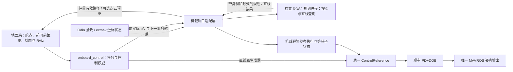

<!-- Task38 实施前评估：基于当前源码、本地专项复核和历史台架证据；未实施避障功能或操作飞机。 -->
# Task38：机载避障集成可行性详细分析报告

日期：2026-10-08。需求：[38-dyn-inte.md](/home/nvidia/scq/projects/ros2-ardupilot-sitl-hardware/agent/task/38-dyn-inte.md)。
主工程 HEAD：`51e118a`；独立规划库 HEAD：`4119937`，距离策略代码已包含 `01b3785`。

## 1. 结论与实施判断

**Task38 可以实施。建议启动软件集成、SITL 和未解锁台架阶段；当前条件不足以直接接入实飞并宣布验收完成。**

你的核心设想成立：**用避障算法生成的带时间轨迹，替换现有航点参考生成器的输出，继续复用现有 PD+DOB 跟踪控制器。**
现有架构不需要重写飞控控制器，也不需要在地面站运行规划，更不需要新增 MAVROS 控制输出。
但是，这项工作不只是“把一组位置点换成另一组位置点”：必须同时处理速度、加速度、时间原点、坐标、重规划衔接和任务暂停恢复。

对两种策略分别判断：

| 项目 | 可行性结论 | 实施前必须明确的条件 |
| --- | --- | --- |
| 直线模式保持原行为 | 可行，可以保留原有数值控制路径 | 直线任务不等待规划器，不执行避障门控；独立进程的资源竞争仍须对照实测 |
| 遇障悬停、消失后恢复、超时 LAND | 可行 | 增加直线通道判断、障碍消失判据和独立等待状态；不能用 A* 成功与否代替直线判断 |
| 自主避障轨迹执行、失败等待、恢复或 LAND | 可行，集成难度较高 | 明确运动状态、轨迹时序、接入条件、飞行包线和失效规则 |
| 起飞前选择、起飞后禁止更改 | GUI 已有基础，可以沿用 | 保留选择冻结和机载配置锁；没有必要实现空中策略切换 |
| 当前 RViz 显示规划轨迹 | 可行，新增工作较小 | 统一显示坐标；显示真实有效轨迹，失败或断流时撤销有效标记 |
| 局域网显示点云 | 降采样预览有实施空间；原始点云是否可用尚未确认 | 历史原始云在约 10 Hz 下仅载荷就约 46 Mbps，必须验证当前无线链路和整机负载 |
| 当前规划器直接实飞 | 尚不具备验收条件 | 连续净空回归仍有失败，运动中坐标/速度、制动和轨迹跟踪未完成验证 |

建议按“独立规划进程 + 小型项目适配层 + 机载参考执行模块”实现，避免建立复杂插件框架。
完整工作量估计 **20–35 人日**；预留约 20%–30% 调试余量后约 **24–46 人日**。
这是含验证、部署适配和用户操作下现场验收的工程估算，不是已经完成的工作，也不等于日历工期。

## 2. 评估依据与本次复核结果

本次读取了 Task38、`MEMORY.md`、机载控制和参考生成源码、地面站门控/航点/ROS 代码、RViz 配置、extnav 修正代码，以及独立规划库的消息、配置、节点和搜索核心。
历史 Task35/Task37 报告仅作为对应版本的证据，未把历史飞机状态当作当前状态。

本次没有连接飞机、申请控制租约、发布目标、启动飞行节点、停止服务、部署、解锁、起飞或发送 LAND。
只生成本报告；没有修改功能源码、配置或 `MEMORY.md`。工作区已有任务/报告归档改动，本次未处理这些改动。

### 2.1 本地实际执行的专项检查

本轮运行本地已有专项测试，并对相应 CMake 测试目标进行构建检查；构建检查均成功，没有新增编译工作。结果如下。

| 检查项 | 本轮结果 | 能证明的范围 |
| --- | --- | --- |
| `test_dob_controller` | 6/6 通过 | 现有 PD+DOB 基础、限幅、增益配置与加速度前馈分支 |
| `test_reference_generator` | 5/5 通过 | 四种现有参考方法的基础行为及相应运动学约束 |
| `test_waypoint_arrival_tracker` | 5/5 通过 | 现有启动/到达计数和稳定停留判定 |
| 独立库 `test_search` | 19 项中 18 通过、1 失败 | 当前搜索核心仍存在已知连续净空问题 |
| ROS `Path` 的 CDR 序列化测量 | 成功 | 标准消息的载荷大小；没有测无线吞吐 |
| 历史点云事件记录检查 | 找到实际 `point_step=16`、`height=1` 的原始和过滤云 | 为点云带宽估算提供真实消息布局 |

失败用例为 `Search.CollisionBetweenPrimitiveEndpoints`：自定义 `safe_distance=0.1 m` 场景，独立密采样最小距离为 `0.099990361693828175 m`，比阈值少约 **9.64 μm**。
该结果不能扩大解释为默认 0.45 m 场景已经发生碰撞；也不能因差值小就宣称严格连续净空检查通过。
本次没有放宽、跳过或修改断言。

本轮只运行上述专项测试，**未重跑全部 Python/ROS 测试，未运行集成 SITL、机载负载或实飞测试**。
历史完整回归的当前距离版本是 33 个逻辑用例中 32 通过、1 失败；它与本次 19 项核心测试的统计口径不同。

### 2.2 已有基础可以复用到什么程度

- 独立规划库已完成 ROS2 Jazzy 移植、amd64/ARM64 原生构建、输入校验、有界搜索和输出失败清空。
- `PlanResult` 已有状态、目标版本、输入时标、原始三次多项式分段和采样 p/v/a，具备轨迹执行的基础数据。
- 机载已有统一的 `ControlReference` 和轨迹 PD+DOB 分支，且生产姿态输出只有一个入口。
- 地面站已有策略枚举、上传字段和起飞后禁用选择的逻辑。
- new 飞机在最新 0.45 m 距离设置下，历史短时观察收到 163 次 `REACH_END` 和 162 条非空路径。

最后一项仅证明“静止台架能输出轨迹”，没有证明飞机会正确执行轨迹。
当前主工程收到非直线策略后仍会警告并回退为直线；Task38 的两种策略尚未实现。

## 3. 如何落实“替换路径生成器，复用控制器”

### 3.1 当前实现实际生成的是连续参考

现有生成器不是先生成一个无时间的点列表再逐点发送，而是每个控制周期调用 `update(dt)`，输出：

```text
ControlReference = {position, velocity, acceleration, yaw}
GeneratedReference = {ControlReference, yaw_rate, phase, finished}
```

机载约 100 Hz 使用该参考计算 PD+DOB，并发布 `/mavros/setpoint_raw/attitude`。
轨迹 PD+DOB 在同一控制器中加入参考加速度前馈；位置 PD+DOB 使用现有不带加速度前馈的分支。

因此，适合替换的边界是 **`reference_` 的生成来源**，不是业务航点列表。
源码入口：[统一参考](/home/nvidia/scq/projects/ros2-ardupilot-sitl-hardware/src/onboard_control/include/onboard_control/dob_controller.hpp:40)、[参考生成接口](/home/nvidia/scq/projects/ros2-ardupilot-sitl-hardware/src/onboard_control/include/onboard_control/reference_generator.hpp:102)、[航点执行器](/home/nvidia/scq/projects/ros2-ardupilot-sitl-hardware/src/onboard_control/src/onboard_control_node.cpp:1894)。

### 3.2 推荐直接执行多项式

规划器每段给出时长和三轴系数。以单轴为例：

```text
p(t) = c0 + c1*t + c2*t² + c3*t³
v(t) = c1 + 2*c2*t + 3*c3*t²
a(t) = 2*c2 + 6*c3*t
```

机载保存已接受轨迹，在 100 Hz tick 中根据执行时间选择分段，减去此前分段累计时长，按本段局部时间求值，再写入统一参考。
这一计算量很小，搜索、点云转换和 KD-Tree 更新继续在独立进程中完成。
已有采样输出约 0.02 s 一点，并不妨碍 0.01 s 控制周期按多项式精确取值。

| 接入方法 | 判断 | 原因 |
| --- | --- | --- |
| 直接求值规划器的多项式 | 推荐 | 保留规划器验证的空间曲线及 p/v/a，不必重新拟合 |
| 按时间消费采样的 p/v/a | 可选 | 必须明确插值方式，并复核插值后的动力学和碰撞条件 |
| 把规划位置点上传为一批小航点 | 不适合 | 会再次进入原生成器，并改变进度、到点停留和拍照语义 |
| 再套梯形/S 曲线/滤波器“平滑”规划输出 | 不能直接采用 | 会改变已经检查过的轨迹；需要重新验证改变后的曲线 |

任务到点仍以**原业务航点**的实际位置、实际速度和停留条件为准。
规划器的一个采样点不是一个任务航点，`REACH_END` 也只是计划到达，不能直接计为飞机已经到达。

### 3.3 控制器与 yaw 的处理

自主避障优先采用已有轨迹 PD+DOB；原位置 PD+DOB能消费位置和速度参考，但是否满足避障跟踪误差要求需要验证。
应在起飞前明确允许的组合，并回读实际生效配置。无需改写 PD+DOB 算法或偷偷在飞行中切换操作者选择的控制器。

避障模式下，原“命令生成器”选项应显示为规划器提供参考或禁用无效选择；直线和遇障悬停仍可沿用现有生成器。
规划器没有 yaw 规划，输出采样姿态为单位四元数，**不能把它当作飞机 yaw 目标**。
航点 yaw、转向限速、停留以及传感器朝向，应由项目继续明确管理。若传感器覆盖有方向限制，必须一起验证。

## 4. 建议架构与原功能独立性



最小合理实现包括：独立库补通用查询和执行契约；项目添加一个适配节点或模块；`onboard_control` 添加一个小型轨迹执行/等待模块。
适配层究竟作为单独节点还是放在独立规划包装节点旁，取决于坐标变换和消息依赖；不必为此新增多个抽象层。

“不影响直线模式”需同时满足：

1. **逻辑独立：** 直线分支走现有生成器和控制路径，完全不等待规划成功、点云新鲜或规划服务在线。
2. **控制独立：** 规划器不申请飞行控制权，不发布 setpoint，不负责起降；任务取消、租约和人工接管仍由现有机载端处理。
3. **运行独立：** 规划服务失败不连带停止核心机载服务；避免把规划服务设成原服务必须成功的启动依赖。
4. **计算独立：** 不把 PCL、地图更新或搜索放入 100 Hz tick，不在控制互斥锁内处理大消息。
5. **依赖明确：** 可以使用轻量消息编译依赖，但不能由此把 PCL/搜索链接进控制器；独立库未安装时仍应有明确的直线部署路径。
6. **资源验证：** 单独进程仍会竞争 CPU、内存、缓存和网络。直线模式优先让规划重负载不激活；需要实测启用前后控制周期，不能只凭进程独立就承诺零影响。

避障任务在组件不可用时应拒绝或进入规定等待行为，**不再静默回退为直线**。
建议使用项目私有的规划目标/结果命名空间，避免生产航点与独立调试 `/goal` 混用。

## 5. 两种策略的真实实现要求

### 5.1 遇障悬停必须直接判断直线通道

每轮以飞机当前实际位置 `p` 为起点，以正在飞往的业务航点 `g` 为终点，检查闭线段 `[p,g]`。
障碍判断需要考虑飞机和跟踪误差对应的通道宽度，而不是要求障碍点恰好落在数学直线上。
既定距离规则为距存储体素质心 **严格小于 0.45 m 才拒绝**；此前用户明确取消附加半径，实施时不能擅自恢复旧补偿。

建议独立库提供 `CLEAR / BLOCKED / UNKNOWN` 的通用线段查询，复用地图快照。
可使用候选障碍点到闭线段的距离判断；若仍用离散点采样，必须说明它的漏检条件，不能声称精确通道检查。
无需为此在主控制器中复制一套 PCL 地图。

- `CLEAR`：在约定观测有效范围内、输入新鲜且通道可用，原生成器继续执行。
- `BLOCKED`：通道存在障碍，制动、锁定悬停位置并等待。
- `UNKNOWN`：无新鲜观测、坐标不一致或不能确认通道；进入等待，不能当作安全通行。

**A* 找到绕路不代表直线通道无障碍；A* 失败也不一定代表直线有障碍。**
因此，遇障悬停不需要执行绕行搜索结果，也不应承担全部 A* 搜索成本。
需求要求检查“当前位置到目标点的直线”，不能为了减负就偷偷改成只检查前方很短的一段。
若整段超出可信观测范围，应报告 UNKNOWN，或者在实施前明确获准的环境假设。

### 5.2 自主避障执行当前状态到当前航点的轨迹

起点应包含**实际当前位置和实际速度**，终点是尚未完成的业务航点，通常要求终端速度为零。
当前独立节点已经调用实际 p/v 的搜索，而不是以原航段起点重复搜索；但目前订阅的是 Odin IMU 参考点，仍需要第 7 节的适配。

`REACH_END` 且完整身份、时效、坐标、运动学和接入校验通过时，可由机载执行轨迹。
`NO_PATH / TIMEOUT / NODE_LIMIT / NO_MAP / STALE_INPUT / FRAME_MISMATCH / INVALID_INPUT`、断流及不可接入轨迹，都应使飞机制动等待。
等待期间继续获取输入并尝试恢复；任务仍停留在同一业务航点。

`REACH_HORIZON` 是部分路径，终点不一定是目标，也不保证停止。
首版建议在尚未实现可停车前缀和连续接续验证时把它视为“不能直接执行的部分结果”，显示明确原因并等待。
这不妨碍实施完整 `REACH_END` 执行链；如果任务必须支持超出规划视界的远距离航点，再增加部分路径执行验证。

### 5.3 障碍消失后的恢复存在地图时效缺口

**当前双树累积不能直接满足及时、可控的“障碍消失后恢复”。**
每棵树累积 50 个已接受点云更新，旧点约在 50–100 次更新后才完全淘汰。
在实际接受速率为 10 Hz 时，障碍残影可能持续约 5–10 s；搜索阻塞、降频或丢帧时可能更久。
这是按帧累积，不是按真实时间过期，也不是动态障碍预测。

若直接设一个较短等待超时，障碍已经移走仍可能因历史残影进入 LAND。
仅把 `tree_period` 调小不能证明正确：它也可能因暂时遮挡把仍存在的障碍过早删除。

实施必须明确：新观测确实覆盖原阻挡区域时，怎样确认障碍已经离开；历史地图怎样退役；等待超时如何与观察/退役时间配合。
可先用最新观测复核直线通道，并为规划地图增加明确的过期/更新规则，保留地图与通行判据的一致性。
不能仅凭“最新一帧没有这个点”就推断障碍消失，也不能仅等历史帧数耗尽就认为空间已被观察为空。
这属于 Task38 恢复行为的必要工程工作，不能省略。

## 6. 制动、等待、恢复和超时降落

建议避障航点任务内部使用 `EXECUTING → BRAKING → WAITING → EXECUTING` 的子状态；超时进入不可被迟到结果撤销的 LAND 流程。
保留原任务身份和航点索引，不把避障等待混同为用户主动取消任务或地面站失联。

| 阶段 | 应做的事 |
| --- | --- |
| 首次阻挡/规划失败 | 立即启动制动与独立等待计时，撤销不再有效的飞行参考 |
| 制动 | 用现有控制器建立可验证的减速/保持行为；不假设速度可以瞬间归零 |
| 稳定等待 | 悬停位置一次锁定；保持任务和航点，暂停到点计数、停留计时和拍照 |
| 恢复 | 输入新鲜、结果属于本任务、通道/轨迹稳定有效且可接入后，再继续同一航点 |
| 等待超时 | 发布任务失败，复用机载 LAND；不绕去起点或机库，不被迟到成功重新激活 |
| 取消、人工接管、外部模式切换 | 服从原有控制权和任务规则，旧规划立即失效 |

本轮建议等待时间使用机载独立参数，例如 `avoidance_wait_timeout_seconds`；具体数值目前未由 Task38 指定。
开始计时建议以首次进入阻挡/失败状态为准，包含制动时间；恢复需经过稳定条件后结束该次等待。
不能每收到一次失败或一帧成功就重置超时，也不能借用或重置现有失联 LAND 的 10 s 计时。
恢复稳定窗口、容许结果年龄、制动速度阈值等参数应在实施和验收前冻结，报告中不把示例参数当作已经批准的配置。

当前 `enter_hover()` 会清空参考生成器、重置航点参考状态并切回位置控制配置；`MODE_HOVER` 下也不运行 `update_waypoint_executor()`。
因此，**简单调用现有悬停入口不能形成完整暂停/恢复闭环**。
应单独维护等待子状态，在悬停控制期间继续检查恢复和超时；恢复原直线参考时从制动后的实际状态重新建立航段，不能把生成器暂停时间算成飞机仍在前进。
相关入口：[悬停](/home/nvidia/scq/projects/ros2-ardupilot-sitl-hardware/src/onboard_control/src/onboard_control_node.cpp:1253)、[控制周期](/home/nvidia/scq/projects/ros2-ardupilot-sitl-hardware/src/onboard_control/src/onboard_control_node.cpp:1799)、[失败到 LAND](/home/nvidia/scq/projects/ros2-ardupilot-sitl-hardware/src/onboard_control/src/onboard_control_node.cpp:1363)。

定位失效、FCU 断链、失联、人工接管、外部飞控模式变更等原保护优先于避障恢复。
避障超时 LAND 后，还必须验证上位机低电量/异常返航组合不会覆盖该降落。
LAND 请求成功与实际落地分开报告；现有代码以实际解除武装确认终态，可继续复用。
ArduPilot LAND 是尝试垂直下降的模式，水平保持依赖有效定位，不能因此承诺任何状态下精确原地落点或降落通道无障碍。[官方 LAND 说明](https://www.ardupilot.ardupilot.org/copter/docs/land-mode.html)

### 制动距离不能由 0.45 m 阈值替代

一个仅用于说明的近似关系为：

```text
停车所需前向距离 ≈ v * 全链反应延迟 + v² / (2 * 实际可实现减速度)
                   + 定位/跟踪/机体等所需余量
```

假设延迟 0.3 s、减速度 0.4 m/s²：1.0 m/s 时前两项约 1.55 m；0.3 m/s 时约 0.203 m。
这些是计算示例，**不是实测制动距离**；0.4 m/s² 是现有梯形参考配置中的减速度量级，不证明飞机必然实现同样减速度。
0.45 m 是地图障碍距离阈值，不能直接当作任何速度下都能及时停车的保证。

## 7. 需要先解决的输入和飞行执行问题

### 7.1 坐标系、参考中心与高度

规划器 Odin 入口使用 `/odin1/cloud_slam`、`/odin1/odometry` 和 `odom`。
控制器使用 MAVROS 本地位置/速度，业务航点为本地 ENU；现有 RViz 固定坐标是 `map`。
生产 extnav 还含 Tag 平面修正、session/revision、IMU 到 FCU 中心杆臂和特殊高度分支。

不能仅改 `frame_id`，也不能只拿当前两个位置做一次平移后永久使用。
应明确规划系与控制系的变换，把**控制器当前 FCU 中心 p/v**和业务目标转换到规划系，再把规划参考转换回控制系。
障碍点只做世界坐标变换，不能把机体姿态相关的 FCU 杆臂逐点加到整片环境云上。
如果使用固定世界变换，p 应旋转和平移，v/a 只旋转；变换版本必须在本次轨迹有效期内保持一致。
参考中心差异、角速度杆臂速度项、高度分支和 EKF 残差需另行验证。

Odin 重启、时标回退、修正版本变化或控制坐标重置时，旧轨迹立即失效。
若点云已转换后累积，变换变化时也必须清理对应旧地图；原始 Odin 世界地图能否保留，应按 session 和变换关系决定。
依据：[extnav 中心与速度转换](/home/nvidia/scq/projects/ros2-ardupilot-sitl-hardware/correction_service/extnav_patch/extnav_to_vision_pose.py:649)。

### 7.2 速度坐标语义仍需运动数据核验

ROS `Odometry` 规定 pose 位于 `header.frame_id`，twist 位于 `child_frame_id`。[Jazzy 官方消息定义](https://github.com/ros2/common_interfaces/blob/jazzy/nav_msgs/msg/Odometry.msg)
规划器默认 `odometry_twist_in_body=true`，会用 pose 姿态旋转线速度；Odin launch 没有覆盖此项。
当前生产 extnav 明确按世界系线速度解释高频 Odin 输入。

这构成需要核验的语义不一致，**本次不能定性为已确认的驱动 Bug**：未读取飞机当前驱动，也未证明低频和高频话题使用完全相同语义。
需要用非零平移速度、不同 yaw 和原地转动数据检查，不能用静止时接近零的速度证明正确。
若确为世界系，规划器就不应再旋转一次；若低频确为机体系，则保留正确旋转，并明确输入适配后的契约。

### 7.3 动力学参数不能照搬台架配置

独立库默认每轴最大速度 2.0 m/s、最大加速度 2.0 m/s²；三维合速度可达约 3.46 m/s，水平合速度约 2.83 m/s。
现有梯形/S 曲线参考配置为水平速度 1.0 m/s、垂直速度 0.2 m/s、水平加速度 0.35 m/s²、垂直加速度 0.15 m/s²。
两者并不等价；控制器输出限幅为 4 m/s²，也不证明飞机可以可靠跟踪任意 2 m/s² 规划轨迹。

自主避障需要单独的机载规划配置，先在已验证低速包线内运行。
当前搜索只有统一的每轴标量上限，如需要保持水平/垂直不同限制，应增加通用轴向约束或提供经过验证的保守配置。
不能简单降低参数后就假设原加速度格、时间步长和空间哈希仍能稳定找到路径，搜索成功率须重测。
不能在执行端单独削减 v/a 而保留原 p/t；那会破坏轨迹一致性和碰撞检查的对象。

规划空间默认为 `[-50,-50,0.2]` 到 `[50,50,10]`，Odin 台架入口将 z 下界改为 -2 m。
主工程航点允许 Z 为 0.1–50 m。这些边界并未自动对齐。
应在避障模式中明确校验经过坐标转换的目标和起点；不改变直线模式已有可接受范围，也不通过静默裁剪目标伪造到达。

### 7.4 当前时间戳不是充分的执行时间契约

`PlanResult.header.stamp` 是规划尝试开始时间；曲线起点来自此前接受的里程计。
Odin launch 使用接收时间新鲜度，因为输入可能为设备运行时间，不能直接和 ROS 墙钟相减。
因此，不能把 header 当作精确状态采样时刻，再简单跳过“现在减 header”的曲线时间，就认为轨迹已补偿延迟。

需要明确状态采样/接收、求解开始、结果发布和控制接入的时间关系，并用同机可靠时基管理年龄。
规划周期设置为 10 Hz，但搜索预算为 0.3 s，输出构造预算另为 0.1 s，地图更新和 DDS 排队还不包含在内。
它们是合作式预算，**不是全链 0.4 s 的硬实时保证，也不是每 100 ms 必有有效轨迹**。

结果接入时必须检查飞机与曲线对应状态的 p/v 误差、结果年龄及前馈加速度变化。
不能每次新结果都从第一个点重新开始，也不能无条件跳到旧轨迹中段。
不合适的轨迹进入制动等待；若另建接续曲线，必须验证接续段本身。
规划多项式 C1 连续但加速度可能跳变，不应要求保留所有曲线的同时又宣称已经具备 C2/限 jerk 性质。

此外，持续重规划可能让当前 `generated.finished` 永远被重新置为 false。
自主避障的到点判定应独立处理终端保持/完成语义，保持原业务到点和停留规则，避免“飞机已到航点却永远不推进”。

### 7.5 任务身份和失效契约需要补齐

现有 `sequence/goal_revision` 为进程内计数，节点重启从零开始；目标 `PoseStamped` 不携带业务任务身份，且节点不消费目标 orientation/stamp。
不能只比较目标坐标或局部序号，就接受取消后迟到的结果、相同坐标的下一任务或重启前结果。

需要一个小型请求/结果契约，包含或等价保证：

- 当前业务任务身份与航点版本；
- 规划进程 session 和单调结果序号；
- 输入状态/坐标版本；
- 明确的时间原点、有效期和起始状态。

只保留必要字段，不建设通用任务中间件。
`/plan_result` 是结果有效性的权威；`/kino_path` 仅保留最后成功预览，不能作为执行输入。

### 7.6 观测覆盖、净空和盲区仍有边界

当前算法表示“已有障碍点”，没有自由空间观测证明和移动障碍预测。
名称中的 dynamic 或搜索的时间维度，不等于具备动态障碍预测。
有限点云中不存在障碍点，也不自动证明遮挡区、未扫描区或超范围区域可通行。

首轮验收可以限定在明确观测条件下的低速固定障碍和受控障碍移走场景；这仍需验证两种策略的全部行为。
若要求任意高速移动障碍或任意未观测区域的可靠避障，需要扩大感知工作范围，不能以现有搜索器代替该能力。

当前 0.45 m 规则面向体素质心和离散曲线检查，不等价于原始障碍点、完整机体包络及连续飞行净空。
应在保持既定距离策略的前提下修复/验证碰撞检查，尤其是本次复现的失败，不能改大半径或改松测试后声称原要求满足。
台架曾启用 0.5 m 盲区球，删除球内所有点；它不是机体识别，也会删除真实近身障碍，不能直接搬作实飞默认。
雷达外参、含桨机体包络、近身感知和跟踪误差需形成实际证据。

## 8. 起飞前策略选择与现有业务兼容

地面站已在未解锁、待机状态允许选择策略，解锁后禁用策略/生成器/跟踪器下拉框，可沿用。
上位机巡检组合也已在起飞前保存选择，起飞后上传相应航点任务。
依据：[UI 配置门控](/home/nvidia/scq/projects/ros2-ardupilot-sitl-hardware/ground_station_core/qt_ui/state.py:155)。

机载当前在首次航点上传时锁定本武装周期配置，并拒绝后续改组合。
但起飞命令本身没有策略字段，因此不能宣称机载已经在起飞时知道并冻结起飞前 UI 选择。
按 Task38 约定，可继续使用现有 GUI 冻结和首次任务机载锁，**无需实现空中策略切换**。
如果另要求机载在解锁瞬间就验证起飞前选择，则需要增加起飞前配置同步；这是更强的服务端约束，不应不加说明地扩大本次范围。

需要补充实际策略、规划可用性、执行/制动/等待状态、等待剩余时间和失败原因的回读。
`ControlStatus` 目前没有实际飞行策略及避障子状态字段，仅靠 UI 已选值不能确认飞机正在采用哪种策略。
协议字段变化应同步版本、生成接口和各设备安装产物，并删除当前“尚未实现，按直线执行”的提示和行为。

到点抓拍仍由原业务航点到达事件触发；等待、重规划和绕行点不触发额外拍照。
原起降、手动运动、显式悬停、租约保护、上位机巡检/返航及异常恢复，都需要回归。
任务结束后保持末点的现有语义应保留；Task38 没有要求把手动运动、起飞和降落全过程也改成自动避障，不应混入额外功能。

## 9. RViz 路径与局域网点云可视化

### 9.1 规划路径可以集成到当前 RViz

当前 RViz 已有业务航点 Marker/Path，固定坐标为 `map`，地面预览模型使用独立 TF。
新增规划路径显示可以复用现有 RViz 窗口，不需要新 GUI 或第二个可视化窗口。

建议适配层发布独立的规划预览 Path，与业务航点连线使用不同颜色，并注明“规划轨迹”或“已接受执行轨迹”。
显示坐标必须经过真实 `odom → 控制 ENU/map` 转换；不覆盖当前 TF，也不把原始 `odom` 标签直接换成 `map`。
路径预览可使用显示时标；曲线的执行时间由执行契约保存，不应让设备时钟或未来曲线时标无意进入需要当前 TF 的显示链。

失败、取消、坐标变化或结果过期时，发布空的当前有效路径/状态，地面端另有超时撤销机制。
如果保留历史轨迹，应明确变灰或标为历史，不能继续以有效绕行路径展示。
不直接把现有“仅在成功时发布”的 `/kino_path` 加到 RViz 就结束任务，否则失败后仍可能看到旧成功路径。

现有业务 Path 使用 Transient Local，而规划器 Path 使用 Volatile；复制原显示项时必须匹配 QoS。
Volatile 发布者不能满足要求 Transient Local 的订阅者，Best Effort 发布者也不能满足 Reliable 订阅者。[ROS2 Jazzy QoS 官方说明](https://repo.test.ros2.org/en/jazzy/Concepts/Intermediate/About-Quality-of-Service-Settings.html)

### 9.2 本轮路径序列化测量

使用项目 `.venv/bin/python` 和 Jazzy `rclpy.serialization.serialize_message()`，构造 `frame_id=map` 的标准 Path 测得：

| 路径点数 | CDR 字节数/帧 | 2 Hz 载荷 | 10 Hz 载荷 |
| --- | ---: | ---: | ---: |
| 193 | 13,924 | 0.223 Mbps | 1.114 Mbps |
| 200 | 14,428 | 0.231 Mbps | 1.154 Mbps |
| 500 | 36,028 | 0.576 Mbps | 2.882 Mbps |
| 10,000 | 720,028 | 11.520 Mbps | 57.602 Mbps |

193 点对应历史目标投递观察中的最后一条轨迹点数量；这里测的是标准消息构造，**不是重放该条实际 Path 的精确网络包长**。
消息布局和 frame 字符串会影响长度；表中也不含 RTPS、UDP/IP、无线重传等开销。

因此，几百点的路径以 2–5 Hz 供显示，带宽通常比原始点云小很多。
不能无条件把规划器允许的 10,000 点全量上限以 10 Hz 发给地面站。
规划参考在机载保持完整，**仅预览路径可以抽稀/降频**，不改变飞机实际执行的轨迹。
地面站无需为了画线订阅含全部 p/v/a 的完整 `PlanResult`。

### 9.3 原始点云带宽有真实数据依据

历史事件文件中的原始云记录：35,862 点、`point_step=16`、`row_step=573792`、`height=1`。
过滤云记录：35,869 点、同样每点 16 字节、`row_step=573904`。
`PointCloud2.data` 的长度由 `row_step × height` 决定，而不是一律按 XYZ 的 12 字节估算。[Jazzy 官方消息定义](https://github.com/ros2/common_interfaces/blob/jazzy/sensor_msgs/msg/PointCloud2.msg)

原始帧仅 data 载荷约 **0.574 MB**；按 10 Hz：

```text
573792 bytes/frame × 10 frames/s × 8 ≈ 45.90 Mbps
```

按 1/2/5 Hz 转发同样原始云，分别约 4.59/9.18/22.95 Mbps，不含协议开销。
上述基于历史点数和假设发送频率，不等于当前网络吞吐或当前传感器精确帧率。
本次没有连接飞机或地面机，也没有 iperf/DDS 实传、并发视频及无线距离测试，不能给出“当前 Wi-Fi 一定能承载”的结论。

### 9.4 推荐先实现可关闭的低负载点云预览

优先发送最新一帧的局部点云预览，约 1–2 Hz，并限制点数；可只保留 XYZ，按显示需要裁剪/抽稀。
例如 **10,000 点 × 紧凑 XYZ 12 字节 × 2 Hz ≈ 1.92 Mbps**；若沿用 16 字节点布局则约 2.56 Mbps。
这两个数是设计载荷预算，不是已有运行成绩。

点云显示建议 Best Effort、Volatile、Keep Last 1，关闭 RViz 显示/无订阅时停止预览加工和发送。
ROS 传感器 QoS 本来就优先最新数据而使用 Best Effort 和小队列。[官方传感器 QoS 说明](https://repo.test.ros2.org/en/jazzy/Concepts/Intermediate/About-Quality-of-Service-Settings.html)
DDS 配置仍需实测，不能因为使用 Best Effort 就假设大型消息一定不影响发布线程或其他流量。

避免同时向地面端发送原始云、过滤云和完整累计地图；现有 `/filtered_cloud` 是过滤后的输入帧，不是双树全部地图，显示名必须准确。
不为显示额外构建第二套大地图；若必须查看累计规划地图，只做受控诊断出口。

验收顺序为“只画路径 → 开低频点云 → 并发视频和机载服务 → 温度/负载/链路变差条件”。
一旦影响控制周期或关键状态传输，先降低/关闭点云预览，保留路径显示。
**点云预览是可选项，不应成为避障飞行的依赖。**

## 10. 最小合理改动范围

| 范围 | 必要改动 | 应保留的边界 |
| --- | --- | --- |
| 独立 `path_searching` | 线段通道查询、地图更新/过期规则、必要碰撞检查修复和轴向约束 | 不引入 MAVROS、Odin SDK 或本项目业务协议 |
| 独立 `path_planning` | 通用身份/时序契约、直线结果、失败与重启语义 | 只规划和查询，不输出飞行控制 |
| 项目机载适配 | 坐标/速度/参考中心转换、请求结果关联、轻量可视化出口 | 点云处理在控制周期之外 |
| `onboard_control` | 策略分派、轨迹求值、制动等待恢复、超时 LAND、状态回读 | 保留唯一控制器和 setpoint，保留原直线分支 |
| `guided_interfaces` 与地面端映射 | 实际策略/避障状态/能力回读，协议版本配套 | 无空中策略切换流程 |
| 地面 UI / RViz | 清除占位说明、无效组合门控、规划路径显示和可选点云 | 复用现有窗口与业务航点显示 |
| 构建与部署 | 独立规划工作区、环境 overlay、可独立启停的服务、逐机版本核验 | 不让原机载服务强依赖规划服务，不覆盖逐机配置 |

重点现有文件：[机载节点](/home/nvidia/scq/projects/ros2-ardupilot-sitl-hardware/src/onboard_control/src/onboard_control_node.cpp)、[参考生成器](/home/nvidia/scq/projects/ros2-ardupilot-sitl-hardware/src/onboard_control/src/reference_generator.cpp)、[控制配置](/home/nvidia/scq/projects/ros2-ardupilot-sitl-hardware/src/onboard_control/config/control.yaml)、[航点协议](/home/nvidia/scq/projects/ros2-ardupilot-sitl-hardware/src/guided_interfaces/srv/ExecuteWaypoints.srv)、[状态协议](/home/nvidia/scq/projects/ros2-ardupilot-sitl-hardware/src/guided_interfaces/msg/ControlStatus.msg)、[RViz 配置](/home/nvidia/scq/projects/ros2-ardupilot-sitl-hardware/src/guided_sim/rviz/quadcopter.rviz)。

refresh 尚未同步独立库及 Task37 后续修改；new 已有对应独立库同步记录。
实际部署选哪台飞机时，应先核对当前版本和配置，再逐台记录同步结果，不能认为两机基线相同。
地面机若生成接口变化也需重建；文档和启动脚本必须随新增工作区/服务一起更新。

## 11. 实施顺序与验收标准

### 11.1 分阶段实施

1. **输入与配置核验。** 冻结坐标、参考中心、速度语义、飞行包线、观测假设和等待规则；保留 0.45 m 距离要求。先关闭输入不一致问题。
2. **补独立库与适配契约。** 直线查询、障碍消失、任务/session/坐标版本、轨迹时序和碰撞回归形成可验证接口。
3. **机载执行模块与离线验证。** 接入统一 p/v/a 参考，维护等待子状态，完成取消/超时/迟到结果等行为，不改原直线参考算法。
4. **SITL 完整闭环。** 使用有真实几何意义的障碍点云/场景与独立碰撞检查，分别验收两种策略及原业务回归。
5. **机载影子运行和未解锁台架。** 使用实际输入但不让规划结果控制飞机，核验参数、坐标、资源和可视化；比较既有服务并发负载。
6. **用户操作下限定包线实飞。** 无障碍、固定障碍、阻挡悬停、移走恢复、不可达超时降落，逐级验证。

任务实施可以从前四步开展，不需要等所有现场条件具备。
第六步的实机解锁和起飞只能由用户人工完成，代理不得自行操作。

### 11.2 必须覆盖的场景

| 场景 | 期望结果 |
| --- | --- |
| 直线任务，规划器未安装/未启动/退出 | 原直线及非避障功能照常工作，无规划等待 |
| 直线任务，规划器和点云预览并发满负载 | 控制周期、deadline miss、关键遥测/租约保持满足既定验收指标 |
| 直线通道被阻挡但有绕路 | 遇障悬停保持等待；自主避障执行绕路，证明两者行为不同 |
| 全部路线不可达/目标处有障碍 | 同一航点制动等待，超时失败并 LAND |
| 障碍实际移走且区域被重新观察 | 在约定恢复窗口内继续，历史残影不造成无解释的超时降落 |
| 障碍仅被遮挡/云丢帧 | 不误判为已经消失 |
| 点云/里程计断流、搜索超时、节点重启 | 等待或原更高优先级保护，无旧路径继续执行 |
| 同坐标不同任务、乱序/迟到结果、坐标修正改变 | 旧结果无权恢复当前任务 |
| 高余速开始/重规划 p/v 不可接入 | 先制动或拒绝接入，不发生参考跳变和未验证接续 |
| 接近目标持续重规划 | 仍能到点、停留、推进任务，拍照次数正确 |
| 等待时取消/用户悬停/手动接管/租约失效 | 服从原命令和故障规则，不自动恢复被取消的任务 |
| 超时 LAND 后收到成功/返航组合 | 降落锁存不被覆盖；实际解除武装才确认落地 |
| 飞行中尝试变换策略 | GUI 禁用；已锁定任务配置的机载拒绝路径有效 |
| RViz 失败/断流/新会话 | 撤销有效旧路径，坐标与飞机/航点一致 |
| 点云预览关闭、降频或网络变差 | 不影响机载规划和控制，关键状态流量优先 |

所有检测都应记录实际生效参数、源码/安装产物/运行接口版本、任务身份、结果状态和控制参考。
路径碰撞复核应采用独立几何检查，不能只看规划器自己返回成功或 RViz 曲线看似绕开。
性能要记录控制周期 P99/最大值、deadline miss、CPU/RSS、温度和传输延迟；既有最大抖动/平均频率状态不足以替代完整分布。
建议至少进行 30 分钟并发热稳态验证；这是拟议验收步骤，本次没有完成。

通过门槛应在实施前确定，并与同机相同场景直线基线对照。
不能把“10 Hz 定时器”“服务 ACK”“发现话题”或“静止台架有路径”作为全链实时或可实飞结论。

## 12. 工作量、主要风险与立项建议

| 工作项 | 预计人日 |
| --- | ---: |
| 坐标、参考中心、速度、时钟及飞行包线核验 | 2–4 |
| 直线查询、地图恢复语义和规划执行契约补齐 | 2–4 |
| 轨迹执行、制动/等待/恢复、故障与业务协调 | 6–10 |
| 地面状态、起飞前门控、协议/部署配套 | 2–3 |
| RViz 路径及可关闭点云预览 | 1–2 |
| SITL、故障注入和原功能回归 | 3–5 |
| 机载负载/台架及用户操作下实飞验证 | 4–7 |
| **合计** | **20–35** |

一人日约 8 小时有效工程工作。前六项软件闭环约 16–28 人日；现场阶段还受设备、环境和用户人工操作可用性影响。
前次一般集成评估的 18–30 人日未单列 Task38 的 RViz/点云工作，也没有充分展开障碍消失后的地图语义；本次按明确需求重新拆分。
上述估算不重复计算已完成 ROS2 移植，也不包含任意高速动态障碍预测、完整自由空间建图或自动降落通道规划。
若运动数据核验发现 extnav/驱动基础坐标错误，或要求扩大到上述场景，应重新评估工期。

最高优先级风险依次是：

1. 坐标/速度/参考中心错误导致规划几何与实际控制不一致；
2. 旧状态求解结果在运动中无法接入，制动距离不足；
3. 历史残影与缺少观测覆盖妨碍可靠恢复或造成错误通行判断；
4. 离散质心净空和未通过连续净空测试不能支撑严格飞行净空声明；
5. 规划/可视化重负载影响原控制和租约传输；
6. 等待、取消、LAND 与原上位机任务组合互相覆盖。

**立项建议：实施 Task38，但先完成契约与隔离闭环，再接机载跟踪。**
复用现有控制器是合适的方向，改动主要集中在“参考来源 + 避障等待子状态 + 输入结果适配”，有条件保持代码简洁。
当前没有发现必须替换现有飞控架构的障碍；仍未解决的问题足以阻止“直接把路径接进去就实飞”的做法。
最终交付必须逐项区分软件实现、SITL、台架、负载和实飞成绩；未通过或未测试指标继续如实保留。

## 13. 关键证据与复现入口

- [现有机载占位分支](/home/nvidia/scq/projects/ros2-ardupilot-sitl-hardware/src/onboard_control/src/onboard_control_node.cpp:947)
- [PD+DOB 与加速度前馈](/home/nvidia/scq/projects/ros2-ardupilot-sitl-hardware/src/onboard_control/src/dob_controller.cpp:73)
- [独立库 PlanResult](/home/nvidia/scq/projects/dyn_small_obs_avoidance-ros2/path_planning/msg/PlanResult.msg)
- [独立库多项式契约](/home/nvidia/scq/projects/dyn_small_obs_avoidance-ros2/path_planning/msg/PolynomialSegment.msg)
- [独立库 ROS 包装节点](/home/nvidia/scq/projects/dyn_small_obs_avoidance-ros2/path_planning/src/path_planning.cpp)
- [独立库配置](/home/nvidia/scq/projects/dyn_small_obs_avoidance-ros2/path_planning/config/planner.yaml)
- [双树累积及距离规则](/home/nvidia/scq/projects/dyn_small_obs_avoidance-ros2/path_searching/src/kinodynamic_astar.cpp:77)
- [Task37 距离对齐和失败回归](/home/nvidia/scq/projects/ros2-ardupilot-sitl-hardware/agent/report/history/report-2026-10-08-task37-ros1-clearance-parameter-alignment.md)
- [Task37 台架与旧配置性能统计](/home/nvidia/scq/projects/ros2-ardupilot-sitl-hardware/agent/report/history/report-2026-10-08-task37-refine-dyn-ros2.md)
- [最新目标投递摘要](/home/nvidia/scq/projects/ros2-ardupilot-sitl-hardware/agent/codex/task37/goal-delivery-20261008/summary.json)
- [真实点云消息布局事件](/home/nvidia/scq/projects/ros2-ardupilot-sitl-hardware/agent/codex/task37/live-20261008-standard/events.jsonl)

本轮核心复核命令（在相应仓库根目录执行；全部为本地纯数值测试，没有飞行输出）：

```bash
# 主工程已有测试目标构建检查和专项运行。
cmake --build build/onboard_control \
  --target test_dob_controller test_reference_generator test_waypoint_arrival_tracker -j2
./build/onboard_control/test_dob_controller
./build/onboard_control/test_reference_generator
./build/onboard_control/test_waypoint_arrival_tracker

# 独立规划库：当前最后一个净空用例失败，退出码为 1。
cmake --build build/path_searching --target test_search -j2
./build/path_searching/test_search
```

本轮测试先运行，随后构建检查确认测试目标没有新增编译工作；没有因构建检查宣称再次运行完整测试。
序列化测量仅导入 ROS 消息和 `serialize_message()`，未调用 `rclpy.init()` 或创建 ROS 节点。
复现路径载荷时，在项目 Python 中构造 `Path.header.frame_id='map'`，每个 PoseStamped 同为 `map`、四元数 w=1，按表中点数赋值，再计算 `len(serialize_message(path))`。
